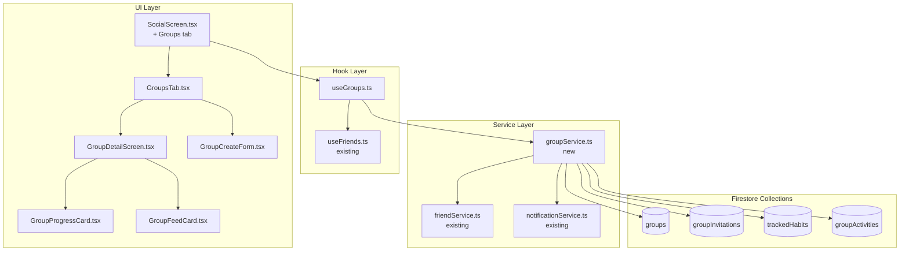

# Design Document: Accountability Groups

## Overview

Accountability Groups extends the existing Social tab with a third "Groups" tab, enabling users to form small groups (2–10 members) around shared goals. Group members link their existing habits to a group, making their daily completion progress visible to other members. Each group has a dedicated activity feed, a progress dashboard, and optional time-bounded challenges.

The feature follows the "modify, don't multiply" principle — extending existing services, types, and screens rather than creating parallel systems. The group service (`groupService.ts`) follows the same class-based Firestore pattern as `friendService.ts`. Group types are added to the existing `social.ts`. The Groups tab is added to the existing `SocialScreen.tsx` alongside Feed and Friends.

### Key Design Decisions

1. **Separate `groupService.ts`** rather than extending `friendService.ts` — groups have distinct CRUD operations, invitation flows, and feed logic that would bloat the already-large friend service. The group service follows identical patterns (class-based, Firestore collections, `writeBatch` for atomics, `onSnapshot` for real-time).

2. **Group invitations appear at the top of the Groups tab** (user decision) — not in the Friend Requests section. This keeps group and friend invitation flows separate and discoverable.

3. **Group names do NOT need to be unique** (user decision) — groups are invite-only, so name collisions are not a user-facing problem.

4. **Reuse existing reaction system** — group feed items use the same `Reactions` type and `ReactionType` ('heart' | 'flame' | 'medal') as the main activity feed.

5. **Group detail screen as a stack-navigated screen** — tapping a group in the list pushes a `GroupDetail` screen onto the existing stack navigator, keeping the tab bar visible.

## Architecture



### Data Flow

1. **Group creation**: User fills form → `useGroups.createGroup()` → `groupService.createGroup()` → writes to `groups` collection
2. **Invitation**: Admin selects friend → `groupService.inviteMember()` → writes to `groupInvitations` + triggers notification
3. **Accept invitation**: User taps accept → `groupService.acceptInvitation()` → `writeBatch` updates `groupInvitations` status + adds member to `groups` document
4. **Habit linking**: Member selects habits → `groupService.linkHabits()` → writes to `trackedHabits` collection
5. **Progress updates**: Real-time `onSnapshot` on `trackedHabits` + habit completions → `useGroups` computes daily progress
6. **Group feed**: `onSnapshot` on `groupActivities` filtered by groupId → renders in GroupDetailScreen

## Components and Interfaces

### New Types (added to `src/types/social.ts`)

```typescript
// --- Group Types ---

export type GroupStatus = 'active' | 'ended';
export type GroupRole = 'admin' | 'member';
export type GroupInvitationStatus = 'pending' | 'accepted' | 'declined' | 'expired';

export type GroupActivityType =
  | 'habit_completed'
  | 'streak_milestone'
  | 'member_joined'
  | 'member_left';

export interface GroupMember {
  userId: string;
  userName: string;
  role: GroupRole;
  joinedAt: Date;
}

export interface Group {
  id: string;
  name: string;                    // 3–50 characters
  description: string;             // 0–200 characters
  category: string;                // habit category from existing system
  adminId: string;                 // userId of creator
  members: GroupMember[];          // 1–10 members (includes admin)
  status: GroupStatus;
  createdAt: Date;
  updatedAt: Date;
  endDate?: Date;                  // optional, at least 1 day in future
  endedAt?: Date;                  // when the group was ended
}

export interface GroupInvitation {
  id: string;
  groupId: string;
  groupName: string;
  groupDescription: string;
  fromUserId: string;              // admin who sent it
  fromUserName: string;
  toUserId: string;
  toUserName: string;
  status: GroupInvitationStatus;
  memberCount: number;             // current member count at time of invite
  createdAt: Date;
  updatedAt?: Date;
}

export interface TrackedHabit {
  id: string;
  groupId: string;
  userId: string;
  habitId: string;
  habitName: string;
  habitCategory: string;
  linkedAt: Date;
}

export interface GroupActivity {
  id: string;
  groupId: string;
  userId: string;
  userName: string;
  type: GroupActivityType;
  habitId?: string;
  habitName?: string;
  habitCategory?: string;
  streakCount?: number;
  timestamp: Date;
  reactions?: Reactions;           // reuses existing Reactions type
}

export interface GroupProgress {
  userId: string;
  userName: string;
  habits: {
    habitId: string;
    habitName: string;
    habitCategory: string;
    completedToday: boolean;
    currentStreak: number;
  }[];
}

export interface CreateGroupForm {
  name: string;
  description: string;
  category: string;
  endDate?: Date;
}
```

### Service Layer: `groupService.ts`

```typescript
class GroupService {
  // Firestore collections
  private groupsCollection = collection(db, 'groups');
  private groupInvitationsCollection = collection(db, 'groupInvitations');
  private trackedHabitsCollection = collection(db, 'trackedHabits');
  private groupActivitiesCollection = collection(db, 'groupActivities');

  // ── Group CRUD ──
  async createGroup(userId: string, form: CreateGroupForm): Promise<string>;
  async getGroup(groupId: string): Promise<Group>;
  async updateGroup(groupId: string, updates: Partial<Group>): Promise<void>;
  async endGroup(groupId: string, adminId: string): Promise<void>;
  async getUserGroups(userId: string): Promise<Group[]>;
  async getUserGroupCount(userId: string): Promise<number>;

  // ── Invitations ──
  async inviteMember(groupId: string, adminId: string, friendId: string, friendName: string): Promise<string>;
  async acceptInvitation(invitationId: string, userId: string): Promise<void>;
  async declineInvitation(invitationId: string): Promise<void>;
  async getPendingInvitations(userId: string): Promise<GroupInvitation[]>;
  async getGroupInvitableFriends(groupId: string, adminId: string): Promise<Friend[]>;

  // ── Members ──
  async removeMember(groupId: string, adminId: string, memberId: string): Promise<void>;
  async leaveGroup(groupId: string, userId: string): Promise<void>;

  // ── Tracked Habits ──
  async linkHabits(groupId: string, userId: string, habits: { id: string; name: string; category: string }[]): Promise<void>;
  async unlinkHabit(groupId: string, userId: string, habitId: string): Promise<void>;
  async getTrackedHabits(groupId: string): Promise<TrackedHabit[]>;
  async getUserTrackedHabits(groupId: string, userId: string): Promise<TrackedHabit[]>;

  // ── Group Progress ──
  async getGroupProgress(groupId: string): Promise<GroupProgress[]>;
  async getGroupCompletionPercentage(groupId: string): Promise<number>;

  // ── Group Feed ──
  async createGroupActivity(groupId: string, userId: string, type: GroupActivityType, habitData?: {...}): Promise<string>;
  async getGroupFeed(groupId: string, limitCount?: number): Promise<GroupActivity[]>;
  async addGroupReaction(activityId: string, userId: string, reactionType: ReactionType): Promise<void>;

  // ── Real-time Subscriptions ──
  subscribeToUserGroups(userId: string, callback: (groups: Group[]) => void): () => void;
  subscribeToGroupInvitations(userId: string, callback: (invitations: GroupInvitation[]) => void): () => void;
  subscribeToGroupFeed(groupId: string, callback: (activities: GroupActivity[]) => void): () => void;
  subscribeToGroupProgress(groupId: string, callback: (progress: GroupProgress[]) => void): () => void;

  // ── Validation (pure functions) ──
  validateGroupName(name: string): { valid: boolean; error?: string };
  validateGroupDescription(description: string): { valid: boolean; error?: string };
  validateEndDate(endDate: Date): { valid: boolean; error?: string };
  calculateCompletionPercentage(progress: GroupProgress[]): number;
}
```

### Key Method Details

**`createGroup`**: Validates inputs, checks 5-group limit via `getUserGroupCount`, creates group document with creator as admin member using `writeBatch`.

**`inviteMember`**: Checks 10-member limit, checks for duplicate pending invitations, creates invitation document, calls `notificationService` to schedule notification.

**`acceptInvitation`**: Uses `writeBatch` to atomically update invitation status + add member to group document. Re-checks 10-member limit and 5-group limit at acceptance time (race condition protection).

**`leaveGroup` / `removeMember`**: Uses `writeBatch` to atomically remove member from group, delete their `trackedHabits` entries, and post a system event to `groupActivities`. If admin leaves or is last member, calls `endGroup`.

**`calculateCompletionPercentage`**: Pure function — takes `GroupProgress[]`, counts completed habits across all members, divides by total tracked habits, returns percentage (0–100). Returns 0 if no tracked habits exist.

### Hook Layer: `useGroups.ts`

```typescript
interface UseGroupsReturn {
  // State
  groups: Group[];
  pendingInvitations: GroupInvitation[];
  
  // Loading states
  isLoadingGroups: boolean;
  isCreating: boolean;
  isProcessingInvitation: boolean;
  
  // Group CRUD
  createGroup: (form: CreateGroupForm) => Promise<string>;
  
  // Invitations
  acceptInvitation: (invitationId: string) => Promise<void>;
  declineInvitation: (invitationId: string) => Promise<void>;
  
  // Utility
  pendingInvitationCount: number;
  error: string | null;
  refreshGroups: () => Promise<void>;
}
```

The hook sets up real-time subscriptions via `onSnapshot` for both `groups` (where user is a member) and `groupInvitations` (where user is the recipient with status 'pending'). It follows the same pattern as `useFriends` — `useEffect` for subscription setup, `useCallback` for actions, loading/error state management.

### Hook Layer: `useGroupDetail.ts`

```typescript
interface UseGroupDetailReturn {
  // State
  group: Group | null;
  progress: GroupProgress[];
  feed: GroupActivity[];
  trackedHabits: TrackedHabit[];
  completionPercentage: number;
  
  // Loading states
  isLoading: boolean;
  isLinking: boolean;
  
  // Actions
  linkHabits: (habits: { id: string; name: string; category: string }[]) => Promise<void>;
  unlinkHabit: (habitId: string) => Promise<void>;
  inviteMember: (friendId: string, friendName: string) => Promise<void>;
  removeMember: (memberId: string) => Promise<void>;
  leaveGroup: () => Promise<void>;
  endGroup: () => Promise<void>;
  updateGroup: (updates: Partial<Group>) => Promise<void>;
  addReaction: (activityId: string, reactionType: ReactionType) => Promise<void>;
  
  // Utility
  isAdmin: boolean;
  error: string | null;
}
```

### UI Components

| Component | Location | Purpose |
|-----------|----------|---------|
| `GroupsTab` | `src/components/social/GroupsTab.tsx` | Groups list + pending invitations (top of tab) |
| `GroupCard` | `src/components/social/GroupCard.tsx` | Card showing group name, member count, completion % |
| `GroupInvitationCard` | `src/components/social/GroupInvitationCard.tsx` | Invitation with accept/decline actions |
| `GroupDetailScreen` | `src/screens/GroupDetailScreen.tsx` | Full group view with Progress + Feed tabs |
| `GroupCreateForm` | `src/components/social/GroupCreateForm.tsx` | Modal form for creating a group |
| `GroupProgressCard` | `src/components/social/GroupProgressCard.tsx` | Member progress row with habit completion dots |
| `GroupFeedCard` | `src/components/social/GroupFeedCard.tsx` | Activity card reusing existing reaction UI |
| `LinkHabitsModal` | `src/components/social/LinkHabitsModal.tsx` | Modal for selecting habits to link |
| `InviteMembersModal` | `src/components/social/InviteMembersModal.tsx` | Modal showing invitable friends |
| `GroupSettingsModal` | `src/components/social/GroupSettingsModal.tsx` | Admin: edit/end group. Member: leave group |

### Navigation Changes

**`AppNavigator.tsx`** — Add `GroupDetail` screen to the main stack navigator:

```typescript
// In MainStackNavigator
<Stack.Screen
  name="GroupDetail"
  component={GroupDetailScreen}
  options={{ headerShown: true, headerTitle: '' }}
/>
```

**`SocialScreen.tsx`** — Extend `TabType` and add Groups tab:

```typescript
type TabType = 'feed' | 'friends' | 'groups';  // add 'groups'
```

Add the Groups tab button with a badge for pending invitations. The badge uses the existing `Colors.accent1` purple badge style from `FriendsTab`.

**`types/index.ts`** — Add `GroupDetail` to `RootStackParamList`:

```typescript
GroupDetail: { groupId: string };
```

## Data Models

### Firestore Collections

```
firestore/
├── groups/{groupId}                    # Group document
│   ├── name: string
│   ├── description: string
│   ├── category: string
│   ├── adminId: string
│   ├── members: GroupMember[]          # embedded array (max 10)
│   ├── memberIds: string[]            # denormalized for querying
│   ├── status: 'active' | 'ended'
│   ├── createdAt: Timestamp
│   ├── updatedAt: Timestamp
│   ├── endDate?: Timestamp
│   └── endedAt?: Timestamp
│
├── groupInvitations/{invitationId}     # Invitation document
│   ├── groupId: string
│   ├── groupName: string
│   ├── groupDescription: string
│   ├── fromUserId: string
│   ├── fromUserName: string
│   ├── toUserId: string
│   ├── toUserName: string
│   ├── status: 'pending' | 'accepted' | 'declined' | 'expired'
│   ├── memberCount: number
│   ├── createdAt: Timestamp
│   └── updatedAt?: Timestamp
│
├── trackedHabits/{trackedHabitId}      # Habit-Group association
│   ├── groupId: string
│   ├── userId: string
│   ├── habitId: string
│   ├── habitName: string
│   ├── habitCategory: string
│   └── linkedAt: Timestamp
│
└── groupActivities/{activityId}        # Group-scoped activity
    ├── groupId: string
    ├── userId: string
    ├── userName: string
    ├── type: GroupActivityType
    ├── habitId?: string
    ├── habitName?: string
    ├── habitCategory?: string
    ├── streakCount?: number
    ├── timestamp: Timestamp
    └── reactions?: Reactions
```

### Design Rationale

- **`members` as embedded array**: Groups have max 10 members, so embedding avoids extra reads. The `memberIds` string array is denormalized for Firestore `array-contains` queries (e.g., "get all groups where I'm a member").
- **Separate `trackedHabits` collection**: Allows efficient queries like "get all tracked habits for a group" or "get all groups tracking a specific habit" without reading the full group document.
- **Separate `groupActivities` collection**: Keeps group feed separate from the main `activities` collection, avoiding complex filtering and keeping the main feed performant.
- **Denormalized names**: `groupName`, `fromUserName`, etc. are stored on invitations and activities to avoid extra reads when rendering lists. Updated via batch writes when names change.

### Required Firestore Indexes

```
groups:        memberIds (Array) + status (Ascending) + updatedAt (Descending)
groupInvitations: toUserId (Ascending) + status (Ascending) + createdAt (Descending)
trackedHabits: groupId (Ascending) + userId (Ascending)
groupActivities: groupId (Ascending) + timestamp (Descending)
```

## Correctness Properties

*A property is a characteristic or behavior that should hold true across all valid executions of a system — essentially, a formal statement about what the system should do. Properties serve as the bridge between human-readable specifications and machine-verifiable correctness guarantees.*

### Property 1: Group creation input validation

*For any* string `name`, `validateGroupName(name)` SHALL return valid only when `name.trim().length` is between 3 and 50 inclusive. *For any* string `description`, `validateGroupDescription(description)` SHALL return valid only when `description.length` is at most 200.

**Validates: Requirements 1.2, 1.3**

### Property 2: Group creation produces correct document

*For any* valid `CreateGroupForm` and userId, calling `createGroup` SHALL produce a Group document where `adminId` equals the userId, `members` contains exactly one entry with `role: 'admin'` and the correct userId, and `status` is `'active'`.

**Validates: Requirements 1.4**

### Property 3: End date validation

*For any* Date `d`, `validateEndDate(d)` SHALL return valid only when `d` is at least 1 calendar day in the future relative to the current time.

**Validates: Requirements 1.6**

### Property 4: User group limit enforcement

*For any* user who is already a member of 5 active groups, attempting to create a new group or accept a group invitation SHALL be rejected with a descriptive error.

**Validates: Requirements 1.7, 1.8, 3.5**

### Property 5: Group member limit enforcement

*For any* group that already has 10 members, attempting to invite a new member or accept a pending invitation SHALL be rejected with a descriptive error.

**Validates: Requirements 2.3, 2.4, 3.4**

### Property 6: Duplicate invitation prevention

*For any* group and user, if a pending invitation already exists for that user and group, attempting to create another invitation SHALL be rejected.

**Validates: Requirements 2.5**

### Property 7: Invitation acceptance adds member correctly

*For any* valid pending invitation, accepting it SHALL add the user to the group's `members` array with `role: 'member'`, update the invitation status to `'accepted'`, and increase the group's member count by 1.

**Validates: Requirements 3.2**

### Property 8: Invitation decline updates status

*For any* valid pending invitation, declining it SHALL set the invitation status to `'declined'` and the invitation SHALL no longer appear in the user's pending invitations list.

**Validates: Requirements 3.3**

### Property 9: Habit linking round trip

*For any* group member and set of valid owned habits, linking those habits to a group and then querying `getTrackedHabits` SHALL return entries for exactly those habits. Subsequently unlinking a habit SHALL remove it from the tracked habits, and the remaining set SHALL match the original minus the unlinked habit.

**Validates: Requirements 4.2, 4.4**

### Property 10: Habit count limit per group

*For any* group member, the number of tracked habits linked to a single group SHALL be between 1 and 6 inclusive. Attempting to link habits that would exceed 6 SHALL be rejected.

**Validates: Requirements 4.3**

### Property 11: Only habit owner can link

*For any* habit and user, if the habit's `userId` does not equal the user's id, attempting to link that habit to any group SHALL be rejected.

**Validates: Requirements 4.5**

### Property 12: Group completion percentage calculation

*For any* set of `GroupProgress` entries, `calculateCompletionPercentage` SHALL return `(totalCompletedHabits / totalTrackedHabits) * 100`, rounded to the nearest integer. If `totalTrackedHabits` is 0, it SHALL return 0.

**Validates: Requirements 5.3**

### Property 13: Group feed filtering

*For any* set of group activities and a given groupId, the group feed SHALL contain only activities where `activity.groupId` equals the given groupId and `activity.userId` is in the group's `memberIds`.

**Validates: Requirements 6.1**

### Property 14: Group feed pagination

*For any* group with N activities, requesting the feed with a limit of 20 SHALL return at most 20 activities, and the activities SHALL be ordered by timestamp descending.

**Validates: Requirements 6.4**

### Property 15: Member removal cleans up all associations

*For any* group member (whether removed by admin or leaving voluntarily), after removal the group's `members` array SHALL not contain the user, and `getTrackedHabits` for that group SHALL not contain any entries for that user.

**Validates: Requirements 7.2, 8.2**

### Property 16: Ended group rejects new activity

*For any* group with `status: 'ended'`, attempting to create a new group activity SHALL be rejected.

**Validates: Requirements 7.3**

### Property 17: Admin departure ends group

*For any* group where the admin is the only remaining member, when the admin leaves, the group's status SHALL be set to `'ended'`.

**Validates: Requirements 7.5**

### Property 18: Invitation display contains required fields

*For any* `GroupInvitation` rendered in the UI, the displayed output SHALL contain the group name, group description, admin name, and current member count.

**Validates: Requirements 3.1**

### Property 19: Groups list shows required information

*For any* active group rendered in the Groups tab list, the displayed output SHALL contain the group name, member count, and today's completion percentage.

**Validates: Requirements 9.2**

### Property 20: Invitation badge count

*For any* number N of pending group invitations (N ≥ 0), the Groups tab badge SHALL display N when N > 0 and SHALL be hidden when N = 0.

**Validates: Requirements 9.4**

### Property 21: Notification settings respected

*For any* user with social notifications disabled, the group service SHALL not send any group-related notifications to that user.

**Validates: Requirements 10.4**

### Property 22: Notification rate limiting

*For any* group on any given day, the total number of group-related notifications sent SHALL not exceed 3.

**Validates: Requirements 10.5**

## Error Handling

### Validation Errors

| Error Condition | Error Message | Where Handled |
|----------------|---------------|---------------|
| Group name < 3 or > 50 chars | "Group name must be between 3 and 50 characters" | `groupService.validateGroupName` |
| Description > 200 chars | "Description must be 200 characters or less" | `groupService.validateGroupDescription` |
| End date not in future | "End date must be at least 1 day from now" | `groupService.validateEndDate` |
| User at 5-group limit | "You can be in up to 5 groups at a time" | `groupService.createGroup`, `acceptInvitation` |
| Group at 10-member limit | "This group is full (maximum 10 members)" | `groupService.inviteMember`, `acceptInvitation` |
| Duplicate invitation | "An invitation has already been sent to this user" | `groupService.inviteMember` |
| Linking non-owned habit | "You can only link your own habits" | `groupService.linkHabits` |
| Habit limit exceeded | "You can link up to 6 habits per group" | `groupService.linkHabits` |
| Action on ended group | "This group has ended" | All write operations |

### Network and Firestore Errors

- All service methods wrap Firestore calls in try/catch and re-throw with descriptive messages
- The `useGroups` and `useGroupDetail` hooks expose an `error` state that the UI displays via `Alert.alert`
- Real-time subscriptions include error callbacks that set the error state and log to console
- Optimistic updates are NOT used — all state changes wait for Firestore confirmation to avoid inconsistency with multi-user groups

### Race Conditions

- **Group fills between invite and accept**: `acceptInvitation` re-checks member count inside a `writeBatch` transaction
- **User joins 5th group between invite and accept**: `acceptInvitation` re-checks user group count
- **Group ends between invite and accept**: `acceptInvitation` checks group status before proceeding, marks invitation as `'expired'`

## Testing Strategy

### Property-Based Testing

This feature has significant pure logic suitable for property-based testing: input validation, completion percentage calculation, feed filtering, and business rule enforcement (limits, ownership checks).

**Library**: [fast-check](https://github.com/dubzzz/fast-check) — the standard PBT library for TypeScript/JavaScript.

**Configuration**:
- Minimum 100 iterations per property test
- Each test tagged with: `Feature: accountability-groups, Property {N}: {title}`

**Property tests cover**:
- Input validation (Properties 1, 3)
- Document structure correctness (Property 2)
- Limit enforcement (Properties 4, 5, 6, 10)
- State transitions (Properties 7, 8, 9, 15, 16, 17)
- Calculations (Property 12)
- Filtering and pagination (Properties 13, 14)
- Notification rules (Properties 21, 22)

### Unit Tests (Example-Based)

Unit tests cover specific scenarios and edge cases not suited for property testing:

- **UI rendering**: Groups tab appears alongside Feed and Friends (Req 9.1)
- **Empty states**: No groups + no invitations shows empty state (Req 9.5)
- **Navigation**: Tapping a group navigates to GroupDetailScreen (Req 9.3)
- **Confirmation dialogs**: Leave group shows confirmation (Req 8.4)
- **Visual styling**: Completed habits use teal (#4A90A4) (Req 5.5)
- **Activity types**: Group feed shows completions, milestones, join events (Req 6.2)
- **Indefinite groups**: No end date creates group without endDate (Req 1.5)

### Integration Tests

Integration tests verify Firestore interactions and real-time behavior:

- **Real-time feed updates**: Completing a tracked habit updates group feed for other members (Req 5.4)
- **Notification delivery**: Invitation creates notification for invited user (Req 2.6)
- **Member join notification**: New member triggers notification to existing members (Req 10.3)
- **Celebration notification**: All members completing triggers celebration (Req 10.2)
- **Reminder notification**: Incomplete habits by reminder time triggers reminder (Req 10.1)
- **Auto-end on date**: Group reaching end date is marked as ended (Req 7.4)
- **Data retention**: Ended group data remains accessible for 30 days (Req 7.6)
- **Leave group system event**: Leaving posts event to group feed (Req 8.3)
- **Reaction storage**: Reacting to group feed item stores via existing system (Req 6.3)
