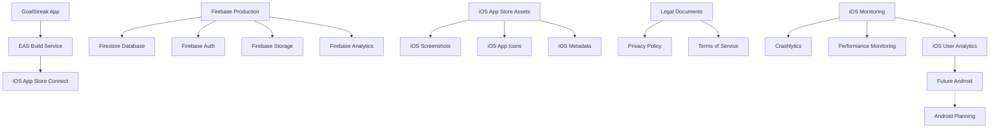
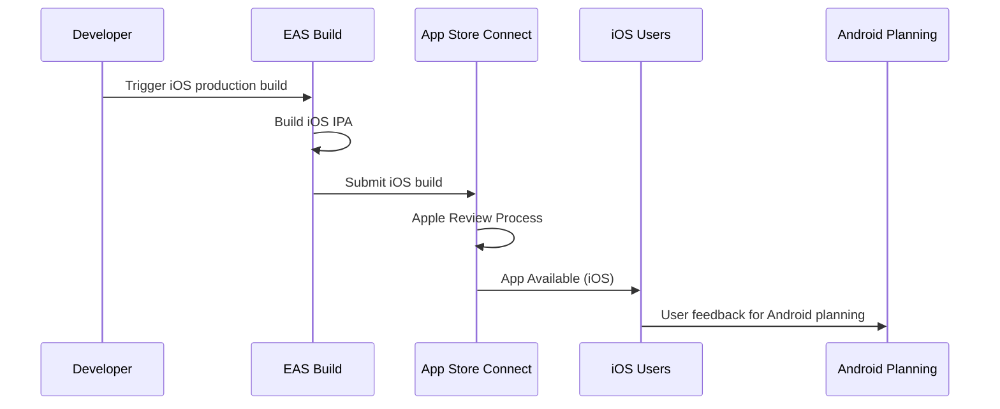

# iOS App Store Launch Design Document

## Overview

This design document outlines the comprehensive approach for launching GoalStreak to the iOS App Store as the initial platform release. The design focuses on creating a streamlined, compliant, and successful iOS launch process that maximizes app discoverability while ensuring all Apple App Store technical and legal requirements are met. This iOS-first strategy allows for gathering user feedback and optimizing the experience before expanding to Android.

GoalStreak is a production-ready social habit tracking app built with React Native (Expo SDK 54), Firebase backend, and TypeScript. The app features habit tracking, streak management, social accountability features, and comprehensive analytics.

## Architecture

### iOS Launch Infrastructure Architecture



### Build Configuration Architecture

The app will use a three-tier environment setup focused on iOS:

1. **Development Environment**: For iOS testing and development
2. **Staging Environment**: For iOS pre-production testing
3. **Production Environment**: For iOS App Store release

### iOS App Store Submission Pipeline



## Components and Interfaces

### 1. Build Configuration Component

**EAS Build Configuration (eas.json)**
```typescript
interface EASConfig {
  cli: {
    version: string;
  };
  build: {
    development: BuildProfile;
    preview: BuildProfile;
    production: BuildProfile;
  };
  submit: {
    production: SubmitProfile;
  };
}

interface BuildProfile {
  distribution?: 'internal' | 'store';
  channel?: string;
  env?: Record<string, string>;
  ios?: IOSBuildConfig;
  // Android configuration will be added in future phase
}
```

**Environment Configuration**
```typescript
interface EnvironmentConfig {
  EXPO_PUBLIC_ENVIRONMENT: 'development' | 'staging' | 'production';
  EXPO_PUBLIC_FIREBASE_API_KEY: string;
  EXPO_PUBLIC_FIREBASE_AUTH_DOMAIN: string;
  EXPO_PUBLIC_FIREBASE_PROJECT_ID: string;
  EXPO_PUBLIC_FIREBASE_STORAGE_BUCKET: string;
  EXPO_PUBLIC_FIREBASE_MESSAGING_SENDER_ID: string;
  EXPO_PUBLIC_FIREBASE_APP_ID: string;
  EXPO_PUBLIC_ANALYTICS_ENABLED: boolean;
  EXPO_PUBLIC_DEBUG_MODE: boolean;
}
```

### 2. iOS App Store Metadata Component

**iOS App Store Connect Configuration**
```typescript
interface iOSAppStoreMetadata {
  name: string; // "GoalStreak"
  subtitle: string; // "Social Habit Tracking"
  description: string; // Full app description
  keywords: string[]; // SEO keywords for iOS App Store
  category: AppStoreCategory; // "Health & Fitness"
  contentRating: ContentRating; // "4+"
  privacyPolicyUrl: string;
  supportUrl: string;
  marketingUrl?: string;
  screenshots: iOSScreenshotSet;
  appIcon: iOSAppIcon;
}

interface iOSScreenshotSet {
  iPhone67: Screenshot[]; // iPhone 14 Pro Max (6.7")
  iPhone65: Screenshot[]; // iPhone 14 Plus (6.5")
  iPhone61: Screenshot[]; // iPhone 14 (6.1")
  iPhone55: Screenshot[]; // iPhone 8 Plus (5.5")
  iPad129: Screenshot[]; // iPad Pro 12.9"
  iPad11: Screenshot[]; // iPad Pro 11"
}

// Future Android configuration will be designed in separate phase
interface AndroidPlanningNotes {
  learningsFromiOS: string[];
  adaptationsNeeded: string[];
  timelineEstimate: string;
}
```

### 3. Asset Management Component

**Screenshot Generation System**
```typescript
interface ScreenshotConfig {
  device: DeviceType;
  screens: ScreenDefinition[];
  branding: BrandingConfig;
  localization?: LocalizationConfig;
}

interface ScreenDefinition {
  screenName: string;
  title: string;
  subtitle?: string;
  highlightFeatures: string[];
  mockData?: MockDataConfig;
}

// Screenshot sequence for app stores
const screenshotSequence = [
  'onboarding-welcome', // Value proposition
  'habit-creation', // Core functionality
  'progress-tracking', // Visual progress
  'social-features', // Social accountability
  'analytics-dashboard' // Insights and data
];
```

### 4. Legal Compliance Component

**Privacy Policy Integration**
```typescript
interface PrivacyCompliance {
  gdprCompliant: boolean;
  ccpaCompliant: boolean;
  copaCompliant: boolean;
  dataCollectionDisclosure: DataCollection[];
  userRights: UserRight[];
  contactInformation: ContactInfo;
}

interface DataCollection {
  type: 'personal' | 'usage' | 'technical';
  purpose: string;
  retention: string;
  sharing: SharingPolicy;
}
```

### 5. Quality Assurance Component

**Testing Framework**
```typescript
interface QATestSuite {
  deviceTesting: DeviceTestConfig[];
  functionalTesting: FunctionalTest[];
  performanceTesting: PerformanceTest[];
  accessibilityTesting: AccessibilityTest[];
  securityTesting: SecurityTest[];
}

interface DeviceTestConfig {
  platform: 'iOS' | 'Android';
  devices: string[];
  osVersions: string[];
  testScenarios: TestScenario[];
}
```

## Data Models

### App Store Submission Data Model

```typescript
interface AppSubmission {
  id: string;
  platform: 'iOS' | 'Android';
  version: string;
  buildNumber: number;
  submissionDate: Date;
  status: SubmissionStatus;
  reviewNotes?: string;
  rejectionReasons?: RejectionReason[];
  approvalDate?: Date;
  releaseDate?: Date;
}

enum SubmissionStatus {
  PREPARING = 'preparing',
  SUBMITTED = 'submitted',
  IN_REVIEW = 'in_review',
  APPROVED = 'approved',
  REJECTED = 'rejected',
  RELEASED = 'released'
}
```

### Asset Management Data Model

```typescript
interface AppAsset {
  id: string;
  type: AssetType;
  platform: Platform[];
  dimensions: Dimensions;
  fileSize: number;
  filePath: string;
  version: string;
  createdAt: Date;
  updatedAt: Date;
}

enum AssetType {
  APP_ICON = 'app_icon',
  SCREENSHOT = 'screenshot',
  FEATURE_GRAPHIC = 'feature_graphic',
  SPLASH_SCREEN = 'splash_screen'
}
```

### Launch Metrics Data Model

```typescript
interface LaunchMetrics {
  submissionDate: Date;
  approvalDate?: Date;
  releaseDate?: Date;
  initialDownloads: number;
  crashFreeRate: number;
  averageRating: number;
  reviewCount: number;
  conversionRate: number; // Store listing to download
  retentionRates: {
    day1: number;
    day7: number;
    day30: number;
  };
}
```

## Error Handling

### App Store Rejection Handling

**Common Rejection Scenarios and Mitigation**

1. **Metadata Rejection**
   - Incomplete or misleading app descriptions
   - Inappropriate keywords or categories
   - Missing or incorrect privacy policy links

2. **Technical Rejection**
   - App crashes during review
   - Missing functionality described in metadata
   - Performance issues or slow loading

3. **Content Rejection**
   - Inappropriate content for age rating
   - Missing content warnings
   - Violation of platform guidelines

**Error Recovery Process**
```typescript
interface RejectionHandler {
  analyzeRejection(reason: RejectionReason): RejectionAnalysis;
  createFixPlan(analysis: RejectionAnalysis): FixPlan;
  implementFixes(plan: FixPlan): Promise<void>;
  resubmit(platform: Platform): Promise<SubmissionResult>;
}
```

### Build Failure Handling

**Build Error Recovery**
```typescript
interface BuildErrorHandler {
  detectBuildFailure(buildLog: string): BuildError[];
  categorizeBuildError(error: BuildError): ErrorCategory;
  suggestFix(error: BuildError): FixSuggestion;
  retryBuild(config: RetryConfig): Promise<BuildResult>;
}

enum ErrorCategory {
  DEPENDENCY_ERROR = 'dependency',
  CONFIGURATION_ERROR = 'configuration',
  PLATFORM_ERROR = 'platform',
  RESOURCE_ERROR = 'resource'
}
```

## Testing Strategy

### Pre-Submission Testing Protocol

**iOS Device Testing Matrix**
```typescript
const iOSDeviceTestMatrix = {
  iPhone: [
    { device: 'iPhone SE (3rd gen)', os: 'iOS 15.0+', screenSize: '4.7"' },
    { device: 'iPhone 13 mini', os: 'iOS 15.0+', screenSize: '5.4"' },
    { device: 'iPhone 14', os: 'iOS 16.0+', screenSize: '6.1"' },
    { device: 'iPhone 14 Plus', os: 'iOS 16.0+', screenSize: '6.5"' },
    { device: 'iPhone 14 Pro Max', os: 'iOS 16.0+', screenSize: '6.7"' }
  ],
  iPad: [
    { device: 'iPad (9th gen)', os: 'iOS 15.0+', screenSize: '10.2"' },
    { device: 'iPad Air (5th gen)', os: 'iOS 15.0+', screenSize: '10.9"' },
    { device: 'iPad Pro 11"', os: 'iOS 15.0+', screenSize: '11"' },
    { device: 'iPad Pro 12.9"', os: 'iOS 15.0+', screenSize: '12.9"' }
  ]
};

// Android testing matrix will be defined in future Android launch phase
const androidPlanningMatrix = {
  note: "Android device testing will be planned after iOS launch feedback",
  estimatedDevices: ["Pixel series", "Samsung Galaxy series", "OnePlus"],
  considerations: ["Screen size variations", "Android version fragmentation", "OEM customizations"]
};
```

**Functional Testing Checklist**
1. **Core User Flows**
   - User registration and login
   - Habit creation and management
   - Progress tracking and streak calculation
   - Social features (friend requests, activity feed)
   - Analytics and insights viewing

2. **Edge Cases**
   - Offline functionality
   - Network interruption recovery
   - Large data sets (100+ habits)
   - Long-term usage (365+ day streaks)

3. **Performance Testing**
   - App startup time < 3 seconds
   - Screen transition time < 300ms
   - Memory usage optimization
   - Battery usage optimization

### App Store Review Simulation

**Review Process Simulation**
```typescript
interface ReviewSimulation {
  testAppStoreGuidelines(): ComplianceReport;
  validateMetadata(): MetadataValidation;
  testCoreFeatures(): FeatureTestReport;
  checkPrivacyCompliance(): PrivacyReport;
  validateInAppPurchases(): IAPValidation; // Future feature
}
```

## Security Considerations

### App Store Security Requirements

**iOS Security Compliance**
- App Transport Security (ATS) enabled for all network communications
- Keychain usage for sensitive data storage
- Proper entitlements configuration for required capabilities
- Code signing with valid Apple Developer certificates
- Privacy manifest file for iOS 17+ compliance
- Proper Info.plist privacy usage descriptions

**Future Android Security Considerations**
- Target SDK version compliance planning
- Permissions strategy based on iOS learnings
- Security best practices documentation for future implementation

### Data Protection Implementation

**Firebase Security Rules**
```javascript
// Production Firestore security rules
rules_version = '2';
service cloud.firestore {
  match /databases/{database}/documents {
    // User data protection
    match /users/{userId} {
      allow read, write: if request.auth != null && request.auth.uid == userId;
    }
    
    // Habit privacy controls
    match /habits/{habitId} {
      allow read, write: if request.auth != null && 
        resource.data.userId == request.auth.uid;
    }
    
    // Social features with privacy controls
    match /activities/{activityId} {
      allow read: if request.auth != null && 
        (resource.data.userId == request.auth.uid || 
         resource.data.visibility == 'public' ||
         (resource.data.visibility == 'friends' && 
          exists(/databases/$(database)/documents/friends/$(request.auth.uid + '_' + resource.data.userId))));
    }
  }
}
```

## Performance Optimization

### App Store Optimization (ASO)

**Keyword Strategy**
- Primary keywords: "habit tracker", "habits", "productivity"
- Secondary keywords: "social", "streaks", "goals", "wellness"
- Long-tail keywords: "habit tracking with friends", "social accountability"

**Conversion Optimization**
- Screenshot sequence optimized for conversion
- App icon designed for small sizes and discoverability
- Description structured for scanning and key feature highlighting

### Technical Performance

**Bundle Size Optimization**
- Tree shaking enabled for unused code
- Image optimization and compression
- Font subsetting for used characters only
- Code splitting for non-critical features

**Runtime Performance**
- React Native performance optimizations
- Efficient Firebase query patterns
- Image caching and lazy loading
- Memory leak prevention

## iOS Launch Timeline

### Pre-Launch Phase (Week 1)
- iOS environment configuration setup
- EAS build configuration for iOS
- iOS asset creation and optimization
- Legal document finalization

### iOS Submission Phase (Week 2)
- iOS production build generation
- App Store Connect metadata configuration
- Submission to iOS App Store
- Apple review monitoring

### iOS Review Phase (Week 2-3)
- Apple App Store review process
- Address any Apple rejection feedback
- iOS resubmission if necessary
- Final Apple approval confirmation

### iOS Launch Phase (Week 3-4)
- iOS App Store release coordination
- iOS launch monitoring setup
- iOS user feedback collection
- iOS performance metrics tracking

### Android Planning Phase (Week 4+)
- Analyze iOS user feedback and metrics
- Plan Android-specific adaptations
- Prepare Android launch timeline
- Document iOS learnings for Android implementation

This design provides a comprehensive framework for successfully launching GoalStreak to the iOS App Store while setting up the foundation for future Android expansion based on iOS market feedback and performance data.