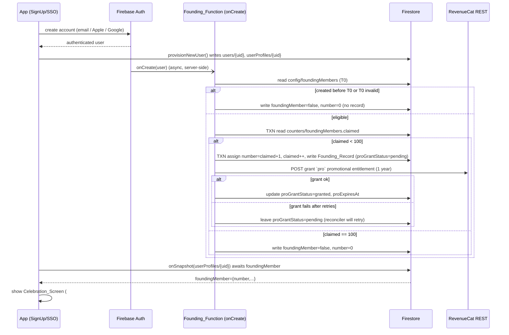

# Design Document

## Overview

The Founding Member program grants the first 100 people who create a Goalfer
account after a configured launch timestamp a permanent founding number
(1–100), one year of Goalfer Pro, and a permanent profile/feed badge. It spans
three deployable units:

1. **Firebase Cloud Functions** (`GoalStreakApp/functions/`) — the project's
   **first** server-side code. A Firebase Auth `onCreate` trigger
   (`Founding_Function`) performs eligibility evaluation, the atomic slot
   claim, and the RevenueCat promotional grant. A scheduled function
   reconciles any pending Pro grants.
2. **The React Native app** (`GoalStreakApp/`) — reads the founding record to
   show a celebration screen after signup and a permanent badge on the profile
   and social feed. No change to the existing `isPro` gating path.
3. **The landing page** (`goalfer-landing/`) — a live scarcity counter that
   reads a public counter document and switches to a sold-out state at 100.

The design's central principle is **server authority**: founding numbers,
counter increments, and Pro grants are only ever written by the Admin SDK
inside a Cloud Function. Clients (app and landing page) may **read** founding
state but can never mint a number, move the counter, or grant Pro. This keeps
"first 100" trustworthy and keeps the RevenueCat secret off every client.

A second principle is **reuse over rework**: Pro entitlement is delivered as a
RevenueCat *promotional entitlement*, so the existing
`subscriptionService`/`useSubscription`/`getHabitLimit` stack — where RevenueCat
is the single source of truth for `isPro` — works completely unchanged. The
founding perk simply makes the `pro` entitlement report as active.

### Requirements coverage map

| Area | Requirements |
|---|---|
| Eligibility, T0 boundary | R1, R2, R15 |
| Atomic claim, concurrency, contention | R3 |
| Pro grant + failure/reconciliation | R4, R5 |
| Data model, security | R6 |
| Profile badge (permanent, decoupled) | R7 |
| Social feed badge | R8 |
| Onboarding celebration | R9 |
| Landing counter + sold-out | R10, R11 |
| Pro expiry behavior | R12 |
| Deletion / re-signup | R13 |
| Non-iOS / RevenueCat-unavailable | R14 |

## Architecture

### Signup-to-celebration flow



### Component / data-flow overview

```mermaid
flowchart TB
    subgraph Server["Cloud Functions (Admin SDK, Blaze)"]
        FF[Founding_Function\nauth.onCreate]
        REC[reconcilePendingGrants\nscheduled <=24h]
    end
    subgraph FSData["Firestore"]
        CFG[config/foundingMembers\n{ launchTimestamp }]
        CNT[counters/foundingMembers\n{ claimed }]
        UP[userProfiles/uid\n{ foundingMember, foundingNumber, ... }]
    end
    subgraph App["React Native app"]
        CEL[FoundingCelebrationScreen]
        BADGE[FoundingBadge component]
        SUB[subscriptionService / isPro\n(unchanged)]
    end
    subgraph Landing["goalfer-landing (Vercel)"]
        LC[FoundingCounter]
    end
    RC[(RevenueCat REST)]

    FF --> CFG
    FF --> CNT
    FF --> UP
    FF --> RC
    REC --> UP
    REC --> RC
    CEL -. onSnapshot .-> UP
    BADGE -. read .-> UP
    LC -. public read .-> CNT
    SUB -. entitlement .-> RC
```

### Why a Cloud Function (not a client transaction)

A client-side Firestore transaction could increment the counter, but it cannot
be trusted: a modified client could assign itself number #1 or skip the T0
check, and it cannot hold the RevenueCat secret needed to grant Pro. Moving the
claim to an `auth.onCreate` function gives us one server-authoritative path that
covers **all** signup methods (email, Apple, Google) uniformly (R1.2), keeps the
secret server-side (R4.2), and lets Firestore rules forbid all client writes to
founding fields. This is the first function in the repo, so the design includes
the `functions/` project bootstrap.

## Components and Interfaces

### 1. Cloud Functions project (`GoalStreakApp/functions/`)

New directory, the first Functions codebase in the repo. Structure:

```
GoalStreakApp/functions/
├── package.json          # firebase-functions, firebase-admin, node-fetch (or global fetch on Node 20)
├── tsconfig.json
├── src/
│   ├── index.ts          # exports: onUserCreated, reconcilePendingGrants
│   ├── founding/
│   │   ├── eligibility.ts   # T0 read + UTC comparison (pure, unit-testable)
│   │   ├── claim.ts         # atomic transaction (pure logic + FS wrapper)
│   │   ├── revenuecat.ts    # REST client for promotional grant (secret-based)
│   │   └── types.ts
│   └── config.ts         # constants: FOUNDING_CAP=100, entitlement id 'pro'
└── .gitignore
```

`firebase.json` gains a `functions` block pointing at this dir with the Node 20
runtime (Blaze plan confirmed). Runtime config/secrets:

- `REVENUECAT_SECRET_KEY` — stored via Firebase **Secret Manager**
  (`firebase functions:secrets:set REVENUECAT_SECRET_KEY`), bound only to the
  functions that call RevenueCat. Never in `.env`, never in the client bundle.
- `Launch_Timestamp (T0)` — stored in Firestore at `config/foundingMembers`
  (`{ launchTimestamp: "2026-01-20T00:00:00Z" }`) so it can be changed without a
  redeploy and read by the function at evaluation time (R2.1).

#### `onUserCreated` — the Founding_Function (R1–R6)

```ts
export const onUserCreated = functions
  .runWith({ secrets: ['REVENUECAT_SECRET_KEY'] })
  .auth.user()
  .onCreate(async (user) => { /* evaluate → claim → grant → record */ });
```

Flow (all server-side, must complete evaluation within ~60s of creation, R1.1):

1. **Read T0** from `config/foundingMembers`. If absent/unparseable →
   record a config error, write a non-founding marker, stop (R2.2, R2.3).
2. **Compare** `user.metadata.creationTime` to T0 in UTC, **inclusive** at T0
   (R1.3, R1.4, R2.4, R2.5). Before T0 → non-founding, counter untouched
   (R1.3, R2.6).
3. **Atomic claim** via `claimFoundingSlot(uid)` (below).
4. On successful claim, **grant Pro** via `grantPromotionalPro(uid)`; update
   `proGrantStatus`/`proExpiresAt` (R4). On failure, leave `pending` for the
   reconciler (R5).

The function is **idempotent per uid**: if a `Founding_Record` already exists for
the uid (retry / re-invocation), it does not claim a second slot.

#### `claimFoundingSlot(uid)` — atomic transaction (R3, R6)

Single Firestore transaction over `counters/foundingMembers` and
`userProfiles/{uid}`:

```
runTransaction:
  counterSnap = tx.get(counters/foundingMembers)
  claimed = counterSnap.exists ? counterSnap.data.claimed : 0
  if claimed >= FOUNDING_CAP (100):
     return { founding: false, number: 0 }        # R3.5 sold out
  number = claimed + 1                              # 1..100 (R3.2)
  tx.set(counters/foundingMembers, { claimed: number }, {merge:true})   # R3.1
  tx.set(userProfiles/{uid}, {
      foundingMember: true,
      foundingNumber: number,
      founding: { number, grantedAt: serverTimestamp(), proExpiresAt: null,
                  proGrantStatus: 'pending' }
  }, {merge:true})                                  # R6.1, R6.2, R6.3
  return { founding: true, number }
```

- The counter read, number assignment, and increment are in **one**
  transaction, so two concurrent signups for the last slot cannot both win —
  Firestore aborts and retries the loser, which then sees `claimed == 100` and
  becomes non-founding (R3.4).
- Firestore's transaction runner retries on contention automatically; we cap
  additional explicit retries at **5** and, if still unresolved, return a
  failure response leaving `claimed` unchanged (R3.7).
- The counter is **monotonic non-decreasing** — nothing in the system ever
  decrements it, including account deletion (R3.6, R13.1).
- If the `userProfiles` write fails after the number is computed but the counter
  already advanced, the number is considered **permanently reserved** for that
  uid and is never reassigned (R6.6, R6.7); the reconciler/idempotency guard can
  complete the record on a later invocation.

#### `grantPromotionalPro(uid)` — RevenueCat REST (R4, R5)

Calls RevenueCat's promotional-entitlement grant endpoint with the secret key
(server-side only, R4.2), granting the `pro` entitlement for a **1-year**
duration. Records `proExpiresAt = grantTime + 1 year` (R4.3).

- Timeout **10s** per attempt; on failure, exponential backoff starting at
  **1s**, doubling, capped at **30s**, up to **5 attempts** (R5.1, R5.2).
- If still failing, set `proGrantStatus='pending'` with `lastAttemptAt`
  (R5.3). The number is retained regardless (R5.5, R5.7).

#### `reconcilePendingGrants` — scheduled function (R5.4, R5.5)

```ts
export const reconcilePendingGrants = functions
  .runWith({ secrets: ['REVENUECAT_SECRET_KEY'] })
  .pubsub.schedule('every 6 hours')     // <= 24h (R5.4)
  .onRun(async () => { /* query pending, re-grant, update */ });
```

Queries `userProfiles` where `founding.proGrantStatus == 'pending'`, re-requests
the entitlement, and on success sets `granted` + `proExpiresAt` (R5.4). On
failure it stays pending and retries next run (R5.5). Requires a Firestore index
on `founding.proGrantStatus`.

### 2. App components

#### `FoundingCelebrationScreen` (R9)

A new screen shown once, immediately after signup completes, before/at the start
of the existing onboarding welcome step (`useOnboarding` → `welcome`). Because
the `Founding_Function` runs asynchronously, the record may not exist at the
instant onboarding starts:

- The screen subscribes to `userProfiles/{uid}` via `onSnapshot` and waits for
  `foundingMember` to resolve (R9.4).
- If `foundingMember === true`, it displays the `foundingNumber` (R9.1, R9.2).
- If resolved `false` (or after a bounded wait with no founding record), it is
  **not** shown and the app proceeds to normal onboarding (R9.3).
- Dismissal, an **auto-timeout**, or navigating away all proceed to the normal
  post-signup screen (R9.5).

A local flag (AsyncStorage, mirroring `useOnboarding`) ensures the celebration
shows at most once.

#### `FoundingBadge` component (R7, R8, R12, R14)

A single reusable component (per the "MODIFY, DON'T MULTIPLY" steering) placed
in `src/components/common/` and consumed by profile and feed:

```ts
interface FoundingBadgeProps {
  foundingNumber?: number;   // omit/undefined → render badge without number (R8.5)
  variant?: 'full' | 'compact';  // profile vs feed density
}
```

- Visibility is driven purely by the `foundingMember` flag, read independently
  of `isPro` (R7.4, R8.4). It remains after the Pro year lapses (R7.3, R12.5).
- Badge and number render **independently**: the badge can show without a number
  if the number is unavailable, and the number can show even if the badge visual
  fails (R7.6, R8.5, R14.3).
- Styling imports from `constants/theme.ts` — uses the purple accent
  `#B771E5`, 8pt-grid spacing, and ≥44–48px touch target if tappable — per the
  UI/UX steering. No one-off hex or spacing values.
- **Profile** (`ProfileScreen` / `components/profile/`): full variant with
  "Founding Member #42".
- **Social feed** (`FeedScreen` / `components/social/` activity card): compact
  variant next to the author's name (R8.1–R8.3).

The founding fields are surfaced on the app `User`/profile type and read where
profiles are already loaded (e.g. `friendService.createUserProfile` counterpart
reads), so the feed does not incur extra per-row fetches beyond the profile data
it already displays.

#### Subscription path — unchanged (R4.4, R4.5, R12, R14)

No change to `subscriptionService`, `useSubscription`, or `getHabitLimit`.
Because the founding perk is a RevenueCat promotional entitlement:

- While active, RevenueCat reports `pro` active → `isPro === true` → habit limit
  15 (R4.4, R4.5).
- On expiry, `isPro === false` → habit limit 6; existing habits are preserved and
  only *new* creation beyond 6 throws `HabitLimitError` (R12.1–R12.4).
- On non-iOS / RevenueCat-unavailable platforms, `isPro` is already `false` and
  the limit is 6; the founding **badge** still renders from the flag (R14.1–R14.3).

### 3. Landing page component

#### `FoundingCounter` (R10, R11)

A client component in `goalfer-landing/` that reads
`counters/foundingMembers.claimed` and `config` cap via the **Firebase Web SDK**
(anonymous, read-only). Rationale for client read over a Vercel route handler:
the value is non-sensitive, the landing page already calls third-party services
directly (Loops), and a direct read gives a live value with `onSnapshot` and no
server maintenance. (A Vercel route handler with ISR caching is the documented
alternative if we later want to hide Firebase or add caching — see Design
Decisions.)

States:

- `claimed < cap` → "**{cap − claimed} of {cap} founding spots left**" (R10.2),
  updating live on change (R10.3).
- `claimed === cap` (or `cap === 0`) → keep the indicator visible showing
  **0 remaining** plus sold-out messaging "Founding spots are gone" (R10.6,
  R11.1, R11.2, R11.4).
- read fails → hide the indicator; download + waitlist remain (R10.4).
- The download CTA and waitlist form remain present in every state (R11.3),
  building on the recently shipped download-first hero.

## Components and Interfaces

The system is split across the three deployable units. Interfaces below use
TypeScript signatures; server code runs on the Firebase Admin SDK, client code
in the React Native app, and read-only code on the landing page.

### 1. Cloud Functions (`GoalStreakApp/functions/`)

This is the repository's first `functions/` project. It is bootstrapped with
the Firebase Functions SDK (v2 where possible, but the Auth `onCreate` trigger
uses the v1 `functions.auth.user().onCreate` API since Auth blocking/lifecycle
triggers remain a v1 surface). The project holds the RevenueCat secret via
Functions configuration (secret manager), never in the app or landing bundles.

#### `Founding_Function` — Auth onCreate trigger

```typescript
// functions/src/founding/onCreate.ts
export const foundingOnUserCreate = functions.auth.user().onCreate(
  async (user: UserRecord): Promise<void> => {
    // 1. Read + validate Launch_Timestamp (config/foundingMembers)
    // 2. Compare user.metadata.creationTime (UTC) vs T0
    // 3. If eligible, run claimFoundingSlot() transaction
    // 4. If a number was claimed, grantProEntitlement()
    // 5. Write Founding_Record / flags, update proGrantStatus
  }
);
```

Internal helpers (pure where possible, to maximize testability):

```typescript
// Pure eligibility decision — no I/O, fully unit/property testable
type EligibilityInput = {
  accountCreatedAtUtcMs: number;
  launchTimestampUtcMs: number | null; // null => missing/invalid config
  claimed: number;                     // current Founding_Counter value
  cap: number;                         // Founding_Cap (100)
};
type EligibilityOutcome =
  | { kind: 'eligible' }               // proceed to claim
  | { kind: 'before-launch' }          // created < T0
  | { kind: 'sold-out' }               // claimed >= cap
  | { kind: 'config-invalid' };        // T0 missing/unparseable

function evaluateEligibility(input: EligibilityInput): EligibilityOutcome;

// Pure number assignment given a pre-increment counter value
function assignNumberFrom(claimed: number): number; // returns claimed + 1

// Firestore transaction wrapper (I/O) — retries on contention
async function claimFoundingSlot(
  db: Firestore,
  cap: number,
): Promise<{ number: number } | { soldOut: true }>;

// RevenueCat REST grant (I/O) — ret/backoff, returns status
async function grantProEntitlement(
  appUserId: string,
  now: Date,
): Promise<{ status: 'granted'; proExpiresAt: Date } | { status: 'pending' }>;

// ISO-8601 UTC parse used for T0 — returns null on absent/invalid
function parseLaunchTimestamp(raw: unknown): number | null;
```

#### `reconcilePendingGrants` — scheduled function (≤ 24h)

```typescript
// functions/src/founding/reconcile.ts
export const reconcilePendingGrants = functions.pubsub
  .schedule('every 6 hours') // interval MUST NOT exceed 24h (R5.4)
  .onRun(async () => {
    // Query userProfiles where foundingMember.proGrantStatus == 'pending'
    // For each: re-call grantProEntitlement(); on success set granted + proExpiresAt
    // On failure: leave pending, retry next run. Never touch number or counter.
  });
```

### 2. React Native app (`GoalStreakApp/src/`)

No change to the existing `subscriptionService` / `useSubscription` /
`getHabitLimit` stack — `isPro` continues to derive solely from RevenueCat
active entitlements. Founding UI reads the `foundingMember` fields directly and
is fully decoupled from `isPro`.

#### `useFoundingMember` hook

```typescript
// src/hooks/useFoundingMember.ts
interface FoundingMemberState {
  isFoundingMember: boolean; // from userProfiles/{uid}.foundingMember flag
  foundingNumber: number | null; // from foundingMember.number (null if absent)
  loading: boolean;
}
// Subscribes to userProfiles/{uid}; independent of useSubscription/isPro.
function useFoundingMember(uid: string): FoundingMemberState;
```

#### `FoundingBadge` component (single component, prop variants — no new files per variant)

```typescript
// src/components/FoundingBadge.tsx
interface FoundingBadgeProps {
  foundingNumber: number | null; // when null, render badge without the number (R8.5, R14.3)
  variant?: 'profile' | 'feed';  // sizing/placement variant, same visual language
}
```

Visibility is decided by callers from the `foundingMember` flag, never from
`isPro`. The badge and the number render independently: the badge shows
whenever the user is founding, and the number shows whenever it is available
(R7.6, R8.5, R14.3).

#### `FoundingCelebrationScreen`

```typescript
// src/screens/FoundingCelebrationScreen.tsx
interface FoundingCelebrationParams {
  foundingNumber: number; // required to show the screen (R9.2)
}
// Presented only when a founding number exists (R9.1, R9.3). If the record is
// not yet available at onboarding completion, the post-signup flow subscribes
// and presents the screen once foundingMember becomes available (R9.4).
// Dismiss / timeout / navigate-away all route to the normal post-signup screen (R9.5).
```

Presentation is triggered from the post-signup onboarding flow, which uses
`useFoundingMember` to await the record via `onSnapshot`.

### 3. Landing page (`goalfer-landing/`)

#### `FoundingCounter` component

```typescript
// goalfer-landing — reads counters/foundingMembers via public read-only access
interface FoundingCounterView {
  status: 'loading' | 'available' | 'sold-out' | 'hidden';
  remaining: number; // cap - claimed, clamped to >= 0
}
// remaining spots = cap - claimed (R10.2). When claimed == cap => 'sold-out'
// showing zero remaining (R10.6, R11.1). On read failure => 'hidden', download
// + waitlist remain available (R10.4). Live updates via Firestore listener (R10.3, R11.2).
function computeCounterView(
  claimed: number | null, // null => read failed
  cap: number,
): FoundingCounterView;
```

The landing page reads only the public counter document and never holds the
RevenueCat secret (R10.5).

### Firestore Security Rules (server-authority enforcement)

```javascript
// founding fields are read-only to all clients; only Admin SDK writes them
match /counters/foundingMembers {
  allow read: if true;        // public scarcity counter (R10.1, R10.5)
  allow write: if false;      // Admin SDK bypasses rules
}
match /config/foundingMembers {
  allow read: if request.auth != null; // T0 config
  allow write: if false;
}
match /userProfiles/{uid} {
  // existing profile rules remain; founding fields are never client-writable.
  // Clients may read their own + friends' profiles as today; foundingMember
  // flag/object are validated as immutable-from-client on update.
}
```

## Data Models

### Firestore documents

#### `config/foundingMembers`

```typescript
interface FoundingConfig {
  launchTimestamp: string; // ISO 8601 UTC, e.g. "2025-02-01T00:00:00Z" (R2.1)
}
```

If absent or unparseable, all accounts are treated as ineligible and the
counter is left unchanged (R2.2, R2.3).

#### `counters/foundingMembers`

```typescript
interface FoundingCounter {
  claimed: number; // integer in [0, 100], monotonically non-decreasing (R3.6, R6.4)
}
```

Invariant: `0 <= claimed <= 100` at all times. Only ever incremented by +1
inside the claim transaction; never decremented, including on account deletion
(R13.1).

#### `userProfiles/{uid}` — founding additions

```typescript
interface UserProfileFoundingFields {
  // Boolean flag drives badge visibility, decoupled from isPro (R6.2, R6.5, R7.4)
  foundingMember?: boolean; // true for founders; false or omitted otherwise

  // Founding_Record — present only for founders (R6.1)
  foundingRecord?: {
    number: number;        // 1..100 inclusive, permanent (R3.2, R7.5)
    grantedAt: Timestamp;  // time the number was assigned (R6.3)
    proExpiresAt: Timestamp | null; // one year after grant; null while pending (R4.3)
    proGrantStatus: 'pending' | 'granted'; // reconciliation state (R5.1, R5.3)
    lastGrantAttemptAt?: Timestamp;         // last RevenueCat attempt (R5.3)
  };
}
```

> Naming note: requirements refer to the record as the `foundingMember` object
> `{ number, grantedAt, proExpiresAt }` plus a boolean `foundingMember` flag.
> Because a single field name cannot be both a boolean and an object in
> Firestore, the design keeps the boolean as `foundingMember` and stores the
> object as `foundingRecord`, extended with `proGrantStatus` and
> `lastGrantAttemptAt` to support reconciliation. The app reads the boolean for
> visibility and `foundingRecord.number` for the number.

### Founding number domain

- `Founding_Number = 0` → non-founding account (flag false/omitted).
- `Founding_Number ∈ [1, 100]` → founder, assigned in claim order as
  `claimed_before + 1` (R3.2, R15.3).
- A number, once assigned, is permanently reserved for that account even if a
  later write fails (R6.7) and is never reassigned on deletion or grant failure
  (R5.6, R13.1).

### RevenueCat promotional entitlement

- Entitlement identifier: `pro` (matches existing gating).
- Delivered as a **promotional** grant of duration one year via RevenueCat REST,
  keyed on the user's app user id.
- The app never learns of the founding perk through a special code path — it
  simply observes `pro` as an active entitlement, so `isPro` and
  `getHabitLimit(true)` behave exactly as for a paying subscriber (R4.4, R4.5).
- On expiry, RevenueCat reports the entitlement inactive; `isPro` becomes false,
  `getHabitLimit(false)` applies the free limit of 6, and existing habits are
  untouched (R12.1–R12.4).

## Data Models

### Firestore documents

**`config/foundingMembers`** — operator-controlled config (R2):

```jsonc
{ "launchTimestamp": "2026-01-20T00:00:00Z" }  // ISO 8601 UTC
```

**`counters/foundingMembers`** — the single source of truth for claims (R3, R6.4):

```jsonc
{ "claimed": 42 }  // integer, 0..100, monotonic non-decreasing
```

**`userProfiles/{uid}`** — founding fields added to the existing profile doc
(R6). Non-founding accounts carry `foundingMember: false` and `foundingNumber: 0`
and no `founding` object (R1.5, R3.5, R6.5):

```jsonc
{
  // ...existing profile fields (email, displayName, username, ...)
  "foundingMember": true,
  "foundingNumber": 42,
  "founding": {
    "number": 42,
    "grantedAt": "<Timestamp>",
    "proExpiresAt": "<Timestamp|null>",
    "proGrantStatus": "granted",      // 'pending' | 'granted'
    "lastAttemptAt": "<Timestamp|null>"
  }
}
```

> The top-level `foundingMember` boolean and `foundingNumber` are duplicated out
> of the nested object so security rules and simple reads (feed, badge) can key
> off flat fields, while the `founding` object holds the operational detail.

### TypeScript interfaces

Shared shape (app `src/types/`, and mirrored in `functions/src/founding/types.ts`):

```ts
export type ProGrantStatus = 'pending' | 'granted';

export interface FoundingRecord {
  number: number;                 // 1..100
  grantedAt: FirebaseFirestore.Timestamp | Date;
  proExpiresAt: FirebaseFirestore.Timestamp | Date | null;
  proGrantStatus: ProGrantStatus;
  lastAttemptAt?: FirebaseFirestore.Timestamp | Date | null;
}

export interface FoundingProfileFields {
  foundingMember: boolean;        // false for non-members
  foundingNumber: number;         // 0 = non-member sentinel, 1..100 = member
  founding?: FoundingRecord;      // present only for members
}
```

## Security

Security is the backbone of this feature; the trust model is "server writes,
clients read".

### Firestore rules changes (`firebase/firestore.rules`)

1. **Protect founding fields on `userProfiles`.** Today `userProfiles` is
   `allow write: if isOwner(userId)`. The owner must not be able to set
   `foundingMember`, `foundingNumber`, or `founding`. Change the owner write
   rule to reject any update whose `affectedKeys()` include the founding fields,
   so only the Admin SDK (which **bypasses** rules) can write them:

   ```
   match /userProfiles/{userId} {
     allow read: if isAuthenticated();
     allow write: if isOwner(userId)
       && !request.resource.data.diff(resource.data).affectedKeys()
             .hasAny(['foundingMember','foundingNumber','founding']);
   }
   ```

   Alternative considered: move founding data to a separate
   `foundingMembers/{uid}` collection that is Function-write-only. Rejected as
   the primary approach because the feed/profile already read `userProfiles`;
   co-locating avoids an extra read per profile. The field-guard gives the same
   protection. (If future rules complexity grows, the separate collection is the
   fallback.)

2. **Public counter read.** The landing page is unauthenticated, but every
   current rule requires `isAuthenticated()`. Add a **public read, no client
   write** rule for just the counter (and optionally the cap in config):

   ```
   match /counters/foundingMembers {
     allow read: if true;      // public, non-sensitive scalar
     allow write: if false;    // Admin SDK only
   }
   ```

   Only this one document is exposed publicly; it holds a single non-sensitive
   integer. `config/foundingMembers` may stay authenticated (the cap is a
   constant in code); expose it publicly only if the landing page needs a
   dynamic cap.

3. **No client writes** to `config/foundingMembers` (`allow write: if false;`).

### Secrets

- `REVENUECAT_SECRET_KEY` lives in Firebase Secret Manager and is bound only to
  `onUserCreated` and `reconcilePendingGrants`. It is never shipped to the app
  or landing bundles (R4.2, R10.5).
- The landing page uses only the public Firebase web config (safe to expose) and
  reads a single public counter — no secret, no RevenueCat access (R10.5).

### Least privilege

The only server code path that can grant Pro or move the counter is the two
Cloud Functions. The app and landing page have read-only visibility into
founding state.

## Error Handling

| Failure | Behavior | Req |
|---|---|---|
| T0 missing/unparseable | Log config error; treat all as ineligible; counter untouched | R2.2, R2.3 |
| Counter unreadable during eval | Non-founding; counter unchanged; record error | R1.6 |
| Transaction write contention | Retry ≤5; preserve `claimed`; failure response if unresolved | R3.7 |
| Concurrent last-slot claims | One wins; other becomes non-founding | R3.4 |
| `userProfiles` write fails post-claim | Number permanently reserved for uid; error recorded | R6.6, R6.7 |
| RevenueCat grant timeout/fail | Retry (1s→30s, ≤5); else `pending` | R5.1–R5.3 |
| Reconciler re-grant fails | Stay pending; retain number; retry next run | R5.5 |
| Celebration record not ready | Listen via onSnapshot; show when available; else skip | R9.4, R9.3 |
| Landing counter unreadable | Hide indicator; keep download/waitlist | R10.4 |
| Pro expiry | isPro→false; limit 6; habits preserved; badge stays | R12 |

Founding numbers are **never released or reassigned** for any failure or for an
explicit user cancellation during a pending grant (R5.6, R5.7).

## Testing Strategy

### Unit tests (pure logic, no emulator)

- **Eligibility** (`eligibility.ts`): before/at/after T0 in UTC (inclusive at
  T0); missing/invalid T0 → ineligible. (R1.3, R1.4, R2.*)
- **Claim math**: `number = claimed + 1`; sold-out at 100 → `{founding:false,
  number:0}`; bounds 1..100. (R3.2, R3.5)
- **RevenueCat client**: backoff schedule (1,2,4,8,16 capped 30), max 5 attempts,
  10s timeout; `proExpiresAt = grant + 1yr`. (R4.3, R5.1, R5.2)

### Emulator / integration tests (Firebase emulator suite — already configured
in `firebase.json`)

- `onUserCreated` end-to-end against Auth + Firestore emulators: eligible signup
  claims #n and writes the record; pre-T0 signup does not; 101st signup becomes
  non-founding.
- **Concurrency**: fire N simultaneous `onCreate`s at the last slot; assert
  exactly one member, `claimed` never exceeds 100, no duplicate numbers.
  (R3.3, R3.4, R3.6)
- Idempotency: re-invoking `onCreate` for an existing uid does not double-claim.
- Reconciler: seed a `pending` record with RevenueCat mocked to fail-then-succeed;
  assert it flips to `granted`.

### RevenueCat sandbox

- Verify a promotional grant makes the `pro` entitlement active in a sandbox
  account and that the existing `subscriptionService.getProStatus()` returns
  true unchanged; verify expiry drops it to false.

### App tests

- `FoundingBadge`: renders with number, renders without number when undefined,
  renders independent of `isPro`. (R7, R8.5)
- Celebration: shown when record resolves founding; skipped when non-founding;
  proceeds on dismiss/timeout/navigate-away. (R9)
- Habit limit after expiry: over-limit user keeps habits, new creation throws
  `HabitLimitError`. (R12)

### Landing tests

- Counter states: remaining (<cap), zero-remaining sold-out (==cap), cap==0
  sold-out, read-failure hidden with download/waitlist intact. (R10, R11)

## Design Decisions and Rationale

1. **Cloud Function over client transaction.** Server authority is required for
   a trustworthy cap and to keep the RevenueCat secret off clients. It also
   unifies all signup methods in one path. Cost: introduces the repo's first
   Functions project and a Blaze dependency (already confirmed).

2. **RevenueCat promotional entitlement over a custom founding-Pro flag.**
   Reusing the entitlement means zero changes to the gating stack and one source
   of truth for `isPro`. A parallel Firestore-driven Pro flag would fork the
   gating logic and risk the two disagreeing. Cost: grant requires a server-side
   REST call and reconciliation for reliability.

3. **Field-guard on `userProfiles` over a separate collection.** Co-locating
   founding fields with the profile avoids extra reads in the feed/profile,
   which already load `userProfiles`. The `affectedKeys()` guard blocks client
   tampering. The separate Function-only collection remains the documented
   fallback if rule complexity grows.

4. **Client Firestore read for the landing counter over a Vercel route.** The
   value is a single non-sensitive integer; a direct read is live, simple, and
   consistent with the landing page's existing direct third-party calls. A
   cached Vercel route handler is the alternative if traffic or the desire to
   hide Firebase warrants it later.

5. **`0` sentinel for non-founding.** Making "not a member" explicit
   (`foundingNumber: 0`) rather than absent simplifies rule checks and client
   branching and matches the requirements' glossary. Member numbers are 1..100.

6. **Duplicated flat fields (`foundingMember`, `foundingNumber`) alongside the
   nested `founding` object.** Flat fields keep security rules and hot-path feed
   reads simple; the nested object holds operational state (grant status,
   timestamps) that UI does not need.

## Correctness Properties

These invariants should hold for every possible execution and are good
candidates for property-based and concurrency testing.

### Property 1: Cap is never exceeded
For all sequences of signups, `counters/foundingMembers.claimed` ∈ [0, 100] at
all times, and the number of accounts with `foundingMember == true` never
exceeds 100.

**Validates: Requirements 3.5, 3.6, 15.2**

### Property 2: Numbers are unique and contiguous in claim order
No two accounts share a `foundingNumber` in 1..100, and the k-th successful
claim receives number k.

**Validates: Requirements 3.2, 3.3, 15.3**

### Property 3: Counter is monotonic non-decreasing
No operation — including account deletion or a failed Pro grant — ever decreases
`claimed`.

**Validates: Requirements 3.6, 13.1**

### Property 4: T0 boundary is inclusive and exclusive-below
An account with `creationTime == T0` is eligible; `creationTime < T0` is never
assigned a number; both compared in UTC.

**Validates: Requirements 1.3, 1.4, 2.4, 2.5**

### Property 5: A number, once assigned, is permanent
For any uid ever assigned a number, that number never changes and is never
reassigned to another uid — across Pro-grant failure, profile-write failure,
user cancellation, or account deletion.

**Validates: Requirements 5.5, 5.6, 5.7, 6.7, 7.5**

### Property 6: Badge visibility is independent of Pro
For all founding accounts, the badge/number render based solely on
`foundingMember`/`foundingNumber`, regardless of `isPro`, platform, or Pro
expiry.

**Validates: Requirements 7.3, 7.4, 8.4, 12.5, 14.3**

### Property 7: Pro grant eventually completes or stays pending — never silently lost
Every assigned number has `proGrantStatus` in {pending, granted}; a pending
grant is retried by the reconciler until granted.

**Validates: Requirements 5.3, 5.4**

### Property 8: Landing counter reflects the authoritative counter
The remaining/sold-out state is derived from the same `claimed` value the
function maintains; it shows `cap − claimed` when below cap and sold-out
(0 remaining) at cap or when `cap == 0`.

**Validates: Requirements 10.2, 11.1, 11.4, 15.4**

### Property 9: No secret exposure
No client-reachable code path (app or landing bundle) contains or transmits the
RevenueCat secret key.

**Validates: Requirements 4.2, 10.5**
