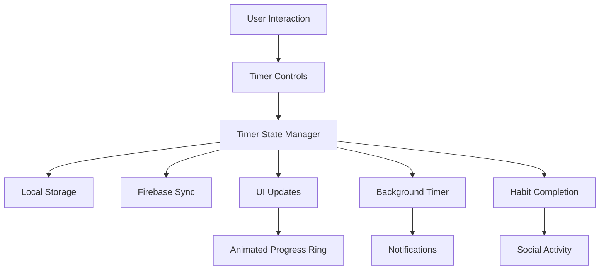

# Design Document

## Overview

The habit timer feature adds optional time-based tracking to habits through a visually integrated circular progress ring that surrounds the existing habit circle. This design maintains GoalStreak's established circular design language while providing intuitive timer functionality with clean, accessible controls.

The implementation leverages React Native Reanimated for smooth animations and integrates seamlessly with the existing Firebase data structure and social features.

## Architecture

### Component Architecture

```typescript
// Timer-enhanced habit card structure
HabitCard (Enhanced)
├── TimerProgressRing (New)
│   ├── AnimatedCircularProgress
│   ├── TimerDisplay
│   └── TimerControls
├── ExistingHabitCircle (Modified)
├── HabitInfo (Existing)
└── TimerConfigModal (New)

// Timer management system
TimerManager
├── TimerState (Context)
├── TimerService (Firebase integration)
├── BackgroundTimer (Background handling)
└── NotificationService (Timer notifications)
```

### Data Flow Architecture



## Components and Interfaces

### 1. Enhanced Habit Data Model

```typescript
interface Habit {
  // Existing fields
  id: string;
  userId: string;
  name: string;
  category: HabitCategory;
  frequency: 'daily' | 'weekly' | 'monthly';
  isPublic: boolean;
  createdAt: Date;
  updatedAt: Date;
  
  // New timer fields
  timer?: {
    enabled: boolean;
    durationMinutes: number; // Total duration in minutes
    autoComplete: boolean; // Auto-complete habit when timer finishes
  };
}

interface TimerState {
  habitId: string;
  isActive: boolean;
  isPaused: boolean;
  startTime: Date | null;
  pausedTime: number; // Accumulated paused time in ms
  remainingTime: number; // Remaining time in ms
  progress: number; // 0-1 progress value
}

interface TimerSession {
  id: string;
  habitId: string;
  userId: string;
  startTime: Date;
  endTime?: Date;
  duration: number; // Actual duration spent
  completed: boolean;
  pausedDuration: number; // Total time paused
}
```

### 2. TimerProgressRing Component

```typescript
interface TimerProgressRingProps {
  habit: Habit;
  timerState: TimerState | null;
  size: number;
  strokeWidth: number;
  onTimerStart: () => void;
  onTimerPause: () => void;
  onTimerReset: () => void;
  onTimerComplete: () => void;
}

// Visual specifications
const TimerRingDesign = {
  // Ring positioning - surrounds existing habit circle
  outerRadius: habitCircleRadius + 20,
  innerRadius: habitCircleRadius + 15,
  strokeWidth: 5,
  
  // Colors following design system
  inactiveColor: '#E8E8E8', // Light gray
  activeColor: '#FF7F3E',   // Energetic Orange
  completedColor: '#37B5B6', // Teal Green
  backgroundColor: 'transparent',
  
  // Animation properties
  animationDuration: 300,
  progressUpdateInterval: 100, // Update every 100ms for smooth animation
};
```

### 3. Timer Configuration Interface

```typescript
interface TimerConfigProps {
  habit: Habit;
  isVisible: boolean;
  onSave: (timerConfig: TimerConfig) => void;
  onCancel: () => void;
}

interface TimerConfig {
  enabled: boolean;
  hours: number;
  minutes: number;
  autoComplete: boolean;
}

// Timer input validation
const TimerValidation = {
  minDuration: 1, // 1 minute minimum
  maxDuration: 24 * 60, // 24 hours maximum
  allowedIncrements: [1, 5, 10, 15, 30, 45, 60], // Suggested minute increments
};
```

### 4. Timer Controls Component

```typescript
interface TimerControlsProps {
  timerState: TimerState;
  onStart: () => void;
  onPause: () => void;
  onReset: () => void;
  compact?: boolean; // For different display contexts
}

// Control button specifications
const TimerControlsDesign = {
  buttonSize: 44, // Minimum touch target
  iconSize: 24,
  spacing: 16,
  
  // Button states and colors
  primaryButton: {
    backgroundColor: '#FF7F3E', // Orange
    iconColor: '#FFFFFF',
  },
  secondaryButton: {
    backgroundColor: 'transparent',
    borderColor: '#80C4E9', // Soft Blue
    iconColor: '#001BB7', // Deep Blue
  },
  
  // Accessibility
  accessibilityLabels: {
    start: 'Start timer',
    pause: 'Pause timer',
    resume: 'Resume timer',
    reset: 'Reset timer',
  },
};
```

## Data Models

### Firebase Collections Structure

```typescript
// Enhanced habits collection
habits/{habitId} {
  // Existing fields...
  timer?: {
    enabled: boolean;
    durationMinutes: number;
    autoComplete: boolean;
    createdAt: Date;
    updatedAt: Date;
  }
}

// New timer sessions collection for analytics
timerSessions/{sessionId} {
  id: string;
  habitId: string;
  userId: string;
  startTime: Date;
  endTime?: Date;
  targetDuration: number; // Original timer duration
  actualDuration: number; // Time actually spent
  pausedDuration: number; // Total paused time
  completed: boolean;
  completionMethod: 'timer' | 'manual'; // How habit was completed
  createdAt: Date;
}

// Enhanced completions for timer data
completions/{completionId} {
  // Existing fields...
  timerSession?: {
    sessionId: string;
    duration: number;
    targetDuration: number;
    completedViaTimer: boolean;
  }
}
```

### Local Storage Schema

```typescript
// AsyncStorage keys for timer persistence
const StorageKeys = {
  ACTIVE_TIMERS: '@goalstreak/active_timers',
  TIMER_SESSIONS: '@goalstreak/timer_sessions',
  TIMER_PREFERENCES: '@goalstreak/timer_preferences',
};

interface StoredTimerState {
  habitId: string;
  startTime: string; // ISO string
  pausedTime: number;
  targetDuration: number;
  lastUpdate: string; // ISO string
}
```

## Error Handling

### Timer-Specific Error Scenarios

```typescript
enum TimerError {
  INVALID_DURATION = 'INVALID_DURATION',
  TIMER_ALREADY_ACTIVE = 'TIMER_ALREADY_ACTIVE',
  BACKGROUND_SYNC_FAILED = 'BACKGROUND_SYNC_FAILED',
  NOTIFICATION_PERMISSION_DENIED = 'NOTIFICATION_PERMISSION_DENIED',
  STORAGE_QUOTA_EXCEEDED = 'STORAGE_QUOTA_EXCEEDED',
}

interface TimerErrorHandler {
  handleInvalidDuration: (duration: number) => void;
  handleBackgroundSyncFailure: (error: Error) => void;
  handleNotificationFailure: (error: Error) => void;
  handleStorageError: (error: Error) => void;
}

// Error recovery strategies
const ErrorRecovery = {
  // Graceful degradation for background timer failures
  backgroundTimerFallback: 'foreground-only',
  
  // Notification permission handling
  notificationFallback: 'visual-only',
  
  // Storage failure handling
  storageFallback: 'memory-only',
  
  // Sync failure handling
  syncRetryStrategy: 'exponential-backoff',
};
```

### User-Friendly Error Messages

```typescript
const TimerErrorMessages = {
  [TimerError.INVALID_DURATION]: 'Timer duration must be between 1 minute and 24 hours',
  [TimerError.TIMER_ALREADY_ACTIVE]: 'A timer is already running for this habit',
  [TimerError.BACKGROUND_SYNC_FAILED]: 'Timer data will sync when connection is restored',
  [TimerError.NOTIFICATION_PERMISSION_DENIED]: 'Enable notifications to receive timer alerts',
  [TimerError.STORAGE_QUOTA_EXCEEDED]: 'Storage full. Some timer data may not be saved',
};
```

## Testing Strategy

### Unit Testing Focus Areas

```typescript
// Timer logic testing
describe('TimerService', () => {
  // Core timer functionality
  test('should calculate remaining time correctly');
  test('should handle pause and resume accurately');
  test('should detect timer completion');
  test('should persist state during app backgrounding');
  
  // Edge cases
  test('should handle system time changes');
  test('should recover from app crashes during timer');
  test('should handle multiple concurrent timers');
});

// Component testing
describe('TimerProgressRing', () => {
  test('should render progress accurately');
  test('should animate smoothly during updates');
  test('should handle touch interactions correctly');
  test('should display correct colors for different states');
});

// Integration testing
describe('Timer Integration', () => {
  test('should complete habit when timer finishes');
  test('should create social activity for timed completions');
  test('should sync timer data with Firebase');
  test('should handle offline timer scenarios');
});
```

### Performance Testing

```typescript
const PerformanceTargets = {
  // Animation performance
  timerRingFPS: 60, // Smooth 60fps animations
  progressUpdateLatency: 50, // <50ms update latency
  
  // Memory usage
  maxTimerMemoryUsage: 10, // <10MB for timer functionality
  backgroundMemoryImpact: 2, // <2MB additional when backgrounded
  
  // Battery impact
  backgroundBatteryDrain: 1, // <1% additional drain per hour
  
  // Storage efficiency
  timerDataSize: 1, // <1KB per timer session
};
```

## UI/UX Design Specifications

### Visual Design System Integration

```typescript
const TimerVisualDesign = {
  // Progress ring specifications
  progressRing: {
    strokeWidth: 6,
    strokeLinecap: 'round',
    shadowColor: 'rgba(0, 27, 183, 0.1)',
    shadowOffset: { width: 0, height: 2 },
    shadowRadius: 4,
  },
  
  // Timer display
  timerDisplay: {
    fontFamily: 'Montserrat_600SemiBold',
    fontSize: 14,
    color: '#001BB7', // Deep Blue
    textAlign: 'center',
    marginTop: 4,
  },
  
  // Control buttons
  controlButtons: {
    size: 44,
    borderRadius: 22,
    marginHorizontal: 8,
    elevation: 2, // Android shadow
    shadowColor: 'rgba(0, 0, 0, 0.1)', // iOS shadow
    shadowOffset: { width: 0, height: 2 },
    shadowRadius: 4,
  },
  
  // Animation curves
  animations: {
    progressUpdate: 'easeInOut',
    stateTransition: 'spring',
    colorTransition: 'linear',
  },
};
```

### Accessibility Specifications

```typescript
const AccessibilityFeatures = {
  // Screen reader support
  progressAnnouncement: 'Timer progress: {percentage}% complete',
  timeRemaining: '{minutes} minutes and {seconds} seconds remaining',
  timerComplete: 'Timer completed for {habitName}',
  
  // Voice control
  voiceCommands: [
    'Start timer',
    'Pause timer',
    'Resume timer',
    'Reset timer',
    'Check timer progress',
  ],
  
  // Visual accessibility
  highContrastMode: true,
  reducedMotionSupport: true,
  minimumTouchTargets: 44, // 44x44 minimum
  
  // Haptic feedback
  hapticPatterns: {
    timerStart: 'light',
    timerPause: 'medium',
    timerComplete: 'heavy',
    progressMilestone: 'light', // At 25%, 50%, 75%
  },
};
```

### Responsive Design

```typescript
const ResponsiveSpecs = {
  // Small screens (iPhone SE)
  small: {
    habitCircleSize: 60,
    timerRingOffset: 15,
    controlButtonSize: 40,
    fontSize: 12,
  },
  
  // Medium screens (iPhone 12)
  medium: {
    habitCircleSize: 80,
    timerRingOffset: 20,
    controlButtonSize: 44,
    fontSize: 14,
  },
  
  // Large screens (iPhone 12 Pro Max)
  large: {
    habitCircleSize: 100,
    timerRingOffset: 25,
    controlButtonSize: 48,
    fontSize: 16,
  },
  
  // Tablet screens
  tablet: {
    habitCircleSize: 120,
    timerRingOffset: 30,
    controlButtonSize: 52,
    fontSize: 18,
  },
};
```

## Implementation Phases

### Phase 1: Core Timer Infrastructure
- Timer state management system
- Basic timer logic and calculations
- Local storage persistence
- Background timer handling

### Phase 2: UI Components
- TimerProgressRing component
- Timer configuration modal
- Timer controls interface
- Integration with existing HabitCard

### Phase 3: Firebase Integration
- Enhanced habit data model
- Timer session tracking
- Real-time synchronization
- Offline support

### Phase 4: Advanced Features
- Notification system
- Social integration
- Analytics and insights
- Performance optimization

This design provides a comprehensive foundation for implementing the timer feature while maintaining GoalStreak's design excellence and user experience standards.