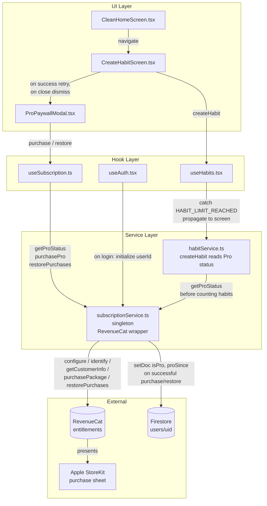
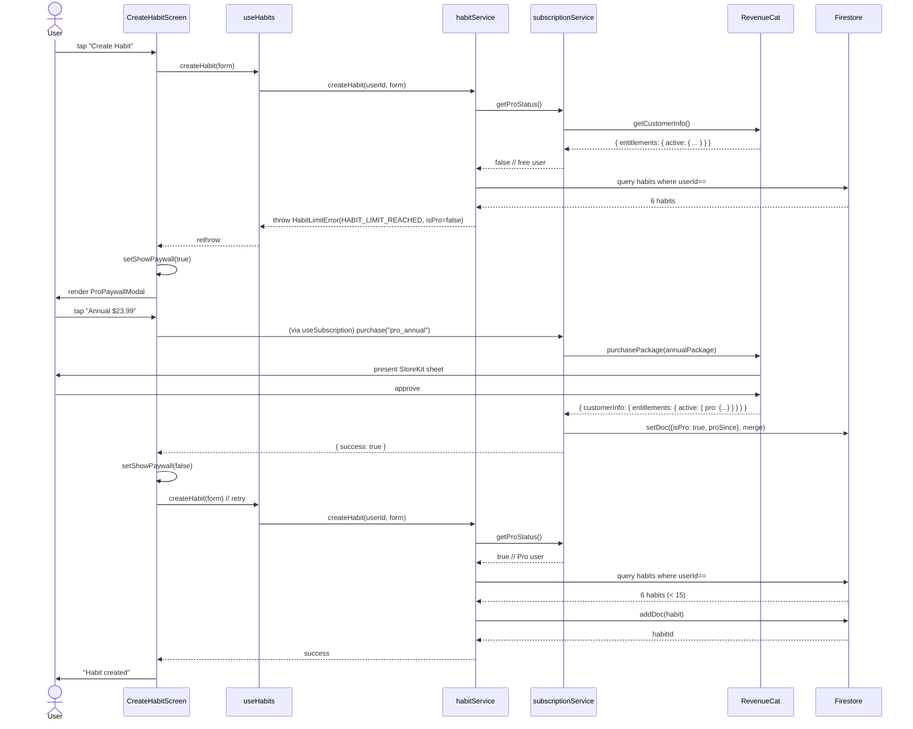

# Design Document: Goalfer Pro Subscription

## Overview

Goalfer Pro is the app's first paid subscription tier. The MVP raises the per-user habit limit from 6 (free) to 15 (Pro) by converting the existing silent habit-limit wall into a paywall moment. The paywall is presented when a free user attempts to create a 7th habit, offering monthly ($3.99) or annual ($23.99) subscriptions through the platform purchase sheet.

The implementation is delivered through [RevenueCat](https://www.revenuecat.com/) via the `react-native-purchases` SDK. RevenueCat is the **source of truth** for entitlements; Pro status is mirrored to Firestore for backend reference (analytics, server-side logic) but feature gating always reads from RevenueCat.

This MVP is **iOS only**. The design intentionally excludes Android configuration so the launch is not blocked on Google Play Billing setup. On non-iOS platforms (Android, web, simulators without StoreKit), the user is treated as a free user and purchase APIs are not invoked.

### Key Design Decisions

1. **RevenueCat as the entitlement source of truth** — Firestore is a mirror, not the gate. This avoids drift between client and server when subscriptions renew, refund, or expire on the App Store side.

2. **Service layer enforces the limit, not hooks or screens** — `habitService.createHabit` reads Pro status from `subscriptionService` and rejects with the typed error code `HABIT_LIMIT_REACHED`. The hook (`useHabits`) and the two existing client-side checks (`useHabits.tsx`, `CleanHomeScreen.tsx`) defer to the service. This collapses the dual-enforcement-points issue into a single authority and makes the paywall trigger uniform across all entry points.

3. **`HABIT_LIMIT_REACHED` is a typed error code, not an Alert string** — the existing limit alert has been the only feedback for free users at 6 habits. We replace the string-based check with a structured error so the screen layer can route it to the paywall instead of `Alert.alert`.

4. **Paywall lives in `components/common/`, not `components/subscription/`** — there is exactly one paywall surface in the MVP. A dedicated subdirectory is unjustified per the "modify, don't multiply" rule. If additional Pro UI surfaces ship later, the directory can be created at that point.

5. **`useSubscription` is a thin hook over the service singleton** — it does not duplicate state. It holds a single `isPro` boolean derived from `subscriptionService.getProStatus()` and re-reads after every purchase or restore.

6. **`proSince` is write-once** — Firestore writes use a merge that explicitly preserves any existing `proSince` value. This protects against re-writes after restore, accidental downgrades, or analytics queries depending on the original conversion timestamp.

7. **Backwards compatibility via `LIMITS.MAX_HABITS`** — existing call sites that read `LIMITS.MAX_HABITS` continue to compile. The constant is kept equal to `MAX_HABITS_FREE = 6`. New call sites read `MAX_HABITS_FREE` / `MAX_HABITS_PRO` directly.

## Architecture



### Data Flow Summary

1. **App startup / login**: `useAuth` resolves a Firebase user → calls `subscriptionService.initialize(userId)` → SDK is configured with `EXPO_PUBLIC_REVENUECAT_IOS_KEY` and identified to RevenueCat.
2. **Habit creation (limit not reached)**: `CreateHabitScreen.handleCreateHabit` → `useHabits.createHabit` → `habitService.createHabit` → reads Pro status → counts habits → creates habit.
3. **Habit creation (limit reached)**: same path → `habitService.createHabit` throws `HabitLimitError({ code: 'HABIT_LIMIT_REACHED', isPro })` → `useHabits` rethrows → `CreateHabitScreen` catches, sets `showPaywall = true`, renders `ProPaywallModal`.
4. **Purchase**: user taps a price option → `useSubscription.purchase(productId)` → `subscriptionService.purchasePro(productId)` → RevenueCat presents StoreKit sheet → on success, mirrors `{ isPro: true, proSince }` to Firestore → returns `{ success: true }` → `useSubscription` re-reads `getProStatus` → `ProPaywallModal.onSuccess` fires → `CreateHabitScreen` dismisses paywall and retries `createHabit`.
5. **Restore**: user taps "Restore purchases" → `useSubscription.restore()` → `subscriptionService.restorePurchases()` → RevenueCat returns active entitlements → if Pro present, mirrors to Firestore and returns `true`.

### Habit Limit Enforcement Flow



## Components and Interfaces

### New Types (added to `src/types/subscription.ts`)

```typescript
// src/types/subscription.ts

/** RevenueCat entitlement identifier used for all Pro feature gates */
export const PRO_ENTITLEMENT_ID = 'pro' as const;

/** RevenueCat offering identifier containing monthly + annual packages */
export const DEFAULT_OFFERING_ID = 'default' as const;

/** RevenueCat / App Store product identifiers */
export const PRO_PRODUCT_IDS = {
  monthly: 'goalfer_pro_monthly',
  annual: 'goalfer_pro_annual',
} as const;

export type ProProductId = typeof PRO_PRODUCT_IDS[keyof typeof PRO_PRODUCT_IDS];

/** Tier-specific habit limits */
export type HabitLimitTier = 'free' | 'pro';

/** Result of a purchase or restore attempt */
export type PurchaseErrorCode =
  | 'PURCHASE_CANCELLED'
  | 'NO_NETWORK'
  | 'PRODUCT_NOT_FOUND'
  | 'PAYMENT_PENDING'
  | 'STORE_PROBLEM'
  | 'UNKNOWN';

export type PurchaseResult =
  | { success: true }
  | { success: false; error: PurchaseErrorCode; message?: string };

/** Error code surfaced from habitService.createHabit when the tier limit is hit */
export const HABIT_LIMIT_REACHED = 'HABIT_LIMIT_REACHED' as const;

export class HabitLimitError extends Error {
  readonly code: typeof HABIT_LIMIT_REACHED = HABIT_LIMIT_REACHED;
  readonly isPro: boolean;
  readonly limit: number;
  constructor(isPro: boolean, limit: number) {
    super(
      isPro
        ? `You've reached the maximum of ${limit} habits.`
        : `Free users can create up to ${limit} habits. Upgrade to Pro for ${15} habits.`
    );
    this.isPro = isPro;
    this.limit = limit;
    this.name = 'HabitLimitError';
  }
}
```

### Service: `src/services/subscriptionService.ts`

A class-based singleton wrapping `react-native-purchases`, mirroring the pattern in `friendService.ts` and `habitService.ts`.

```typescript
import Purchases, {
  CustomerInfo,
  PurchasesOffering,
  PurchasesPackage,
} from 'react-native-purchases';
import { Platform } from 'react-native';
import { doc, getDoc, setDoc, serverTimestamp } from 'firebase/firestore';
import { db } from './firebase';
import {
  PRO_ENTITLEMENT_ID,
  DEFAULT_OFFERING_ID,
  PRO_PRODUCT_IDS,
  ProProductId,
  PurchaseResult,
  PurchaseErrorCode,
} from '../types/subscription';

class SubscriptionService {
  private initialized = false;
  private currentUserId: string | null = null;

  /** Configure RevenueCat with the iOS key and identify the user. iOS-only. */
  async initialize(userId: string): Promise<void>;

  /** True iff RevenueCat active entitlements include the Pro entitlement. */
  async getProStatus(): Promise<boolean>;

  /** Returns the default offering's monthly + annual packages, or null if unavailable. */
  async getOfferings(): Promise<{
    monthly: PurchasesPackage | null;
    annual: PurchasesPackage | null;
  }>;

  /**
   * Initiate a purchase for the given product id.
   * - If the user already has Pro, returns { success: true } without a new transaction.
   * - On user cancel, returns { success: false, error: 'PURCHASE_CANCELLED' }.
   * - On network failure, returns { success: false, error: 'NO_NETWORK' }.
   * - On success, mirrors Pro status to Firestore.
   */
  async purchasePro(productId: ProProductId): Promise<PurchaseResult>;

  /**
   * Trigger RevenueCat restore. Returns true iff Pro entitlement is active after restore.
   * On success, mirrors Pro status to Firestore.
   */
  async restorePurchases(): Promise<boolean>;

  // ── Internal helpers ──

  /** Returns true if the platform is iOS and a key is configured. */
  private isPlatformSupported(): boolean;

  /** Maps a RevenueCat error to a typed PurchaseErrorCode. */
  private mapPurchaseError(error: unknown): PurchaseErrorCode;

  /** Read CustomerInfo from RevenueCat; returns null on network failure. */
  private async fetchCustomerInfo(): Promise<CustomerInfo | null>;

  /** Returns true if the given CustomerInfo contains the Pro entitlement. */
  private hasProEntitlement(info: CustomerInfo | null): boolean;

  /**
   * Mirror Pro status to users/{uid}. Sets isPro: true and writes proSince ONLY
   * if no proSince value already exists on the document. Failures are logged
   * but do not propagate to the caller because RevenueCat is the source of truth.
   */
  private async mirrorProToFirestore(userId: string): Promise<void>;
}

export const subscriptionService = new SubscriptionService();
export default subscriptionService;
```

#### Method Details

**`initialize(userId)`**
- Guards on `Platform.OS === 'ios'` and presence of `process.env.EXPO_PUBLIC_REVENUECAT_IOS_KEY`. If either fails, marks `initialized = false`, logs a descriptive error, and returns. All subsequent calls treat the user as free.
- Calls `Purchases.configure({ apiKey, appUserID: userId })`.
- Stores `currentUserId` for later Firestore writes.
- Idempotent: repeated calls with the same userId are no-ops; calls with a different userId call `Purchases.logIn(userId)`.

**`getProStatus()`**
- Returns `false` immediately if `!isPlatformSupported() || !this.initialized`.
- Calls `Purchases.getCustomerInfo()`, returns `hasProEntitlement(info)`.
- On network error, returns `false` and logs.

**`purchasePro(productId)`**
- Pre-check: if `getProStatus()` is already true, returns `{ success: true }` without invoking the purchase sheet (Req 7.3).
- Fetches the default offering, selects the package matching `productId`.
- Calls `Purchases.purchasePackage(pkg)`.
- On `userCancelled`, returns `{ success: false, error: 'PURCHASE_CANCELLED' }`.
- On network failure, returns `{ success: false, error: 'NO_NETWORK' }`.
- On other errors, returns `{ success: false, error: mapPurchaseError(e), message }`.
- On success, calls `mirrorProToFirestore(currentUserId)` and returns `{ success: true }`.

**`restorePurchases()`**
- Calls `Purchases.restorePurchases()`.
- Returns `hasProEntitlement(info)`.
- On true, calls `mirrorProToFirestore`.
- Network failure throws a typed error caught by the hook.

**`mirrorProToFirestore(userId)`**
- Reads the current `users/{uid}` document.
- If `proSince` already exists, writes only `{ isPro: true }` with merge.
- If `proSince` is absent, writes `{ isPro: true, proSince: serverTimestamp() }` with merge.
- Wraps the write in try/catch; logs failures, never throws.

### Hook: `src/hooks/useSubscription.ts`

```typescript
interface UseSubscriptionReturn {
  /** True iff RevenueCat reports an active Pro entitlement. */
  isPro: boolean;

  /** True while initial status read, a purchase, or a restore is in flight. */
  isLoading: boolean;

  /** Last error from a purchase or restore attempt, if any. Cleared on next attempt. */
  error: PurchaseErrorCode | null;

  /** Initiate a purchase for the given product id. Resolves with the result. */
  purchase: (productId: ProProductId) => Promise<PurchaseResult>;

  /** Trigger restore. Resolves with true iff Pro entitlement is active after restore. */
  restore: () => Promise<boolean>;

  /** Force re-read of Pro status from the service. */
  refresh: () => Promise<void>;
}

export function useSubscription(): UseSubscriptionReturn;
```

**Behavior**:
- On mount, calls `subscriptionService.getProStatus()` once and writes the result to `isPro`.
- Wraps `purchase` and `restore` in `useCallback`.
- After every `purchase` or `restore` call (success or failure), re-reads `getProStatus` and updates `isPro`.
- Sets `isLoading` to `true` for the duration of the initial read, a purchase, or a restore call.

### Component: `src/components/common/ProPaywallModal.tsx`

```typescript
interface ProPaywallModalProps {
  /** Controls modal visibility. */
  visible: boolean;

  /** Called when the user dismisses via the close button. */
  onClose: () => void;

  /**
   * Called when a purchase or restore completes successfully and the user
   * now has the Pro entitlement. The screen should dismiss the modal and
   * retry the action that triggered the paywall.
   */
  onSuccess: () => void;
}

export default function ProPaywallModal(props: ProPaywallModalProps): JSX.Element;
```

**Internal state**:
- `selectedPlan: 'monthly' | 'annual'` — defaults to `'annual'` (the recommended plan).
- `inlineError: string | null` — the inline error message rendered below the buttons.

**Layout** (top to bottom, see Section 5 of requirements for exact copy):
1. Close button — top-right, 48×48 touch target, `Ionicons` close icon, `Colors.primaryText`.
2. Title "Goalfer Pro" — `Typography.h1`, `Colors.primaryText`.
3. Subtitle "Unlock your full potential" — `Typography.body`, `Colors.secondaryText`.
4. Benefits list — 5 rows, each with a teal checkmark (`Colors.accent3`) + body text. Order:
   - "Up to 15 habits"
   - "Streak freeze (2 per month)"
   - "Full analytics & insights"
   - "Up to 5 accountability groups"
   - "Custom themes & icons"
5. Plan selector — two cards side by side:
   - Monthly: "$3.99 / month", border `Colors.gray.light`.
   - Annual: "$23.99 / year", "Save 50%" badge, border `Colors.accent1` (purple) when selected (default), `borderRadius: 16`, `padding: 16`, `Shadows.sm`.
6. Continue button — full-width primary CTA, label `Subscribe for {selectedPrice}`, `Colors.accent1` background, disabled while `useSubscription.isLoading`.
7. Inline error text — rendered only when `inlineError !== null`, `Colors.error`.
8. Restore link — text "Restore purchases", `Colors.primaryText`, underlined.

**Behavior**:
- On Continue tap: call `useSubscription.purchase(selectedProductId)`. If `success: true`, call `props.onSuccess`. If `error: 'PURCHASE_CANCELLED'`, do nothing (modal stays open, no error shown). For other errors, set `inlineError` to the user-friendly message from the Error Handling table.
- On Restore tap: call `useSubscription.restore()`. If `true`, call `props.onSuccess`. If `false`, set `inlineError` to "No previous purchases found.".
- The component never unmounts itself on error; only `onClose` and `onSuccess` (handled by the parent) dismiss it.

### Modifications to Existing Files

#### `src/constants/limits.ts`

```typescript
export const LIMITS = {
  /** Maximum habits for free users. */
  MAX_HABITS_FREE: 6,
  /** Maximum habits for Pro users. */
  MAX_HABITS_PRO: 15,
  /** @deprecated Use MAX_HABITS_FREE. Kept for backwards compatibility. */
  MAX_HABITS: 6,
} as const;

/** Returns the applicable habit limit for a given Pro status. */
export function getHabitLimit(isPro: boolean): number {
  return isPro ? LIMITS.MAX_HABITS_PRO : LIMITS.MAX_HABITS_FREE;
}

export default LIMITS;
```

#### `src/services/habitService.ts` — `createHabit`

```typescript
async createHabit(userId: string, habitData: CreateHabitForm): Promise<string> {
  return withRetry(async () => {
    // 1. Read Pro status from the source of truth.
    const isPro = await subscriptionService.getProStatus();
    const limit = getHabitLimit(isPro);

    // 2. Count existing habits for this user.
    const existing = await this.getUserHabits(userId);
    if (existing.length >= limit) {
      throw new HabitLimitError(isPro, limit);
    }

    // 3. Existing creation logic (validation, write, streak init, achievements,
    //    notifications) is unchanged.
    // ...
  }, RETRY_CONFIGS.habitCreation);
}
```

#### `src/hooks/useHabits.tsx` — `createHabit`

The local `if (habits.length >= LIMITS.MAX_HABITS)` check is removed. The hook simply calls `habitService.createHabit` and rethrows any error so the screen can identify `HABIT_LIMIT_REACHED`.

```typescript
const createHabit = useCallback(async (habitData: CreateHabitForm) => {
  if (!user) throw new Error('User not authenticated');
  try {
    setIsCreating(true);
    await habitService.createHabit(user.id, habitData);
    await loadHabits();
  } catch (error) {
    // Rethrow so CreateHabitScreen can branch on HabitLimitError.
    throw error;
  } finally {
    setIsCreating(false);
  }
}, [user, loadHabits]);
```

#### `src/screens/CreateHabitScreen.tsx`

Adds:
- `const [showPaywall, setShowPaywall] = useState(false);`
- `const [pendingForm, setPendingForm] = useState<CreateHabitForm | null>(null);` — preserves the form payload across the purchase flow so retry uses the exact same data.
- The pre-mount `useEffect` that fires the "Habit Limit Reached" alert is removed (the paywall replaces it).
- The validation hook's `isAtHabitLimit` check no longer alerts; submission proceeds and the service decides.

```typescript
const handleCreateHabit = async () => {
  if (!validateForm()) return;
  try {
    await createHabit(form);
    Alert.alert('Success', 'Habit created successfully!', [...]);
  } catch (error) {
    if (error instanceof HabitLimitError && !error.isPro) {
      setPendingForm(form);
      setShowPaywall(true);
      return;
    }
    if (error instanceof HabitLimitError && error.isPro) {
      Alert.alert('Habit Limit Reached', error.message);
      return;
    }
    Alert.alert('Error', (error as Error).message || 'Failed to create habit');
  }
};

const handlePaywallSuccess = async () => {
  setShowPaywall(false);
  if (pendingForm) {
    try {
      await createHabit(pendingForm);
      setPendingForm(null);
      Alert.alert('Success', 'Habit created successfully!', [...]);
    } catch (error) {
      Alert.alert('Error', (error as Error).message || 'Failed to create habit');
    }
  }
};

// In JSX:
<ProPaywallModal
  visible={showPaywall}
  onClose={() => setShowPaywall(false)}
  onSuccess={handlePaywallSuccess}
/>
```

#### `src/screens/CleanHomeScreen.tsx`

The pre-navigation `if (uniqueDailyHabits.length >= LIMITS.MAX_HABITS) Alert.alert(...)` block in `navigateToCreateHabit` is **removed**. The user is always allowed to navigate to `CreateHabitScreen`, where the service-side check fires and either creates the habit or shows the paywall.

The "Add Habit" button visibility check (`uniqueDailyHabits.length < LIMITS.MAX_HABITS`) and the "All Set!" limit-reached card are **kept** for free users only — they are now driven by `useSubscription().isPro`:

```typescript
const { isPro } = useSubscription();
const limit = getHabitLimit(isPro);
// ...
{uniqueDailyHabits.length < limit && <AddHabitButton .../>}
{uniqueDailyHabits.length >= limit && <AllSetCard limit={limit} .../>}
```

This keeps the visual affordance correct for both tiers without re-introducing a client-side gate.

#### `src/hooks/useAuth.tsx`

In the `onAuthStateChanged` callback, after the `appUser` is built and `setAuthState` is called, fire-and-forget the subscription initialization:

```typescript
// After setAuthState(...) for an authenticated user:
subscriptionService.initialize(appUser.id).catch((err) => {
  console.error('Failed to initialize subscription service:', err);
  // Treat as free user; not a fatal error.
});
```

The call is intentionally non-blocking. If RevenueCat is slow or fails, the user is treated as free until the next `getProStatus` call resolves.

### Component / Hook File Map

| File | Action | Purpose |
|------|--------|---------|
| `src/types/subscription.ts` | new | Constants, error class, result types |
| `src/services/subscriptionService.ts` | new | RevenueCat singleton wrapper |
| `src/hooks/useSubscription.ts` | new | Hook exposing `isPro`, `purchase`, `restore` |
| `src/components/common/ProPaywallModal.tsx` | new | Paywall modal |
| `src/constants/limits.ts` | modify | Add `MAX_HABITS_FREE`, `MAX_HABITS_PRO`, `getHabitLimit` |
| `src/services/habitService.ts` | modify | `createHabit` reads Pro status, throws `HabitLimitError` |
| `src/hooks/useHabits.tsx` | modify | Remove local limit check, propagate errors |
| `src/screens/CreateHabitScreen.tsx` | modify | Catch `HabitLimitError`, show paywall, retry |
| `src/screens/CleanHomeScreen.tsx` | modify | Remove pre-nav alert, gate UI on Pro tier |
| `src/hooks/useAuth.tsx` | modify | Initialize `subscriptionService` on login |

## Data Models

### Firestore: `users/{uid}` — added fields

```
users/{uid}/
├── ... existing fields ...
├── isPro: boolean              # mirrored from RevenueCat; backend reference only
└── proSince: Timestamp         # write-once; first transition from free → pro
```

**Rules**:
- `isPro` is set to `true` after a successful purchase or successful restore that surfaces the Pro entitlement.
- `proSince` is **never overwritten**. It records the first conversion timestamp for analytics. If a Pro user lapses and re-subscribes, `proSince` retains the original value.
- `isPro` is **never** read for feature gating. RevenueCat is queried directly. The Firestore field is for backend dashboards, server-side analytics, and any future Cloud Functions that need to filter Pro users.

### RevenueCat Configuration

| Item | Value |
|------|-------|
| iOS API key (env) | `EXPO_PUBLIC_REVENUECAT_IOS_KEY` |
| Entitlement id | `pro` |
| Default offering id | `default` |
| Monthly product id | `goalfer_pro_monthly` |
| Annual product id | `goalfer_pro_annual` |
| Monthly price | $3.99 USD |
| Annual price | $23.99 USD |

The default offering must contain exactly two packages, one per product id. The entitlement `pro` is attached to both products on the RevenueCat dashboard.

### Firestore Security Rules — addition

The existing `users/{userId}` rule allows the authenticated user to read/write their own document. The Pro-mirror write reuses the existing rule; no rule changes are required for the MVP. (A follow-up hardening pass should restrict `isPro` and `proSince` to writes that originate from a Cloud Function fed by RevenueCat webhooks; that is out of scope for this MVP.)

<!-- prework will be inserted here before the Correctness Properties section -->
