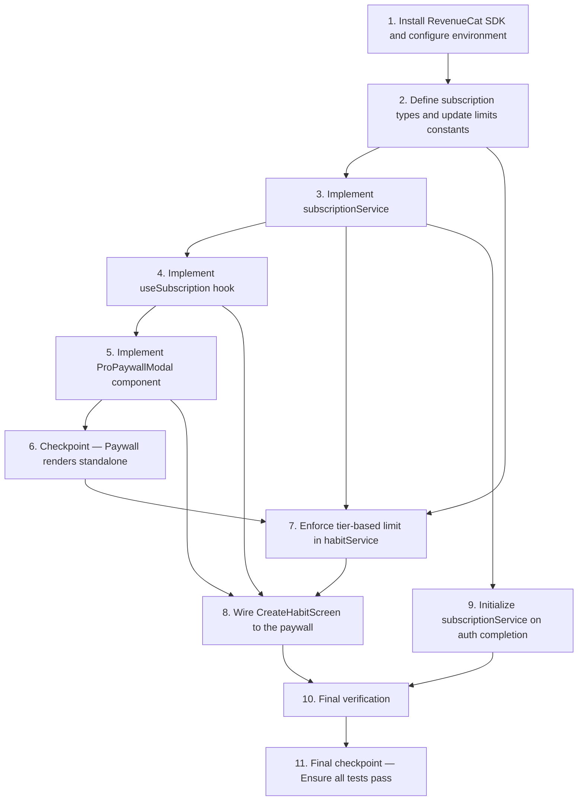

# Implementation Plan: Goalfer Pro Subscription

## Overview

Implement the Goalfer Pro paid subscription tier (iOS only) using RevenueCat to gate the habit creation limit (6 free → 15 Pro). The implementation converts the existing silent habit-limit wall into a paywall moment with monthly ($3.99) and annual ($23.99) plans. RevenueCat is the source of truth for entitlements; Pro status is mirrored to Firestore for backend reference but feature gating always reads from RevenueCat.

Tasks are ordered by dependency: SDK + env → constants → types → service → hook → paywall UI → service-layer enforcement → screen wiring → auth bootstrap → final verification. The implementation follows the existing class-based service pattern (`habitService.ts`, `friendService.ts`), the `useFriends` hook pattern, and the design system in `theme.ts` (8pt grid, Montserrat, `#154D71` / `#B771E5` / `#4A90A4` palette).

## Task Dependency Graph



```json
{
  "waves": [
    { "wave": 1, "tasks": ["1"] },
    { "wave": 2, "tasks": ["2"] },
    { "wave": 3, "tasks": ["3"] },
    { "wave": 4, "tasks": ["4", "9"] },
    { "wave": 5, "tasks": ["5", "7"] },
    { "wave": 6, "tasks": ["6"] },
    { "wave": 7, "tasks": ["8"] },
    { "wave": 8, "tasks": ["10"] },
    { "wave": 9, "tasks": ["11"] }
  ]
}
```

Sequential dependencies (top-level):

- **Task 1** (SDK install + env) is the foundation; nothing else can run without `react-native-purchases` and the API key wired in.
- **Task 2** (types + `LIMITS`) depends on 1 and provides `HabitLimitError`, `PRO_PRODUCT_IDS`, and `getHabitLimit` used by 3, 5, 7, and 8.
- **Task 3** (`subscriptionService`) depends on 1 and 2 and is consumed by 4, 7, and 9.
- **Task 4** (`useSubscription`) depends on 3 and is consumed by 5 and 8.
- **Task 5** (`ProPaywallModal`) depends on 4 and 2; rendered by 8.
- **Task 6** is a checkpoint after 5.
- **Task 7** (service-layer enforcement) depends on 2 and 3; required before 8 so the screen can branch on `HabitLimitError`.
- **Task 8** (screen wiring) depends on 4, 5, and 7.
- **Task 9** (auth bootstrap) depends on 3; independent of 4–8 in code paths but required for first-run Pro status reads.
- **Task 10** (final verification) runs after 8 and 9.
- **Task 11** is the final checkpoint after 10.

## Tasks

- [x] 1. Install RevenueCat SDK and configure environment
  - [x] 1.1 Install `react-native-purchases` via expo
    - Run `npx expo install react-native-purchases` from the `GoalStreakApp/` directory
    - Verify the package is added to `GoalStreakApp/package.json` dependencies
    - Verify iOS pod is picked up automatically by Expo prebuild (no manual `pod install` required for managed workflow)
    - _Requirements: 1.2, 11.1_

  - [x] 1.2 Add `EXPO_PUBLIC_REVENUECAT_IOS_KEY` to env files
    - Add `EXPO_PUBLIC_REVENUECAT_IOS_KEY=` to `GoalStreakApp/.env`, `.env.development`, and `.env.production`
    - Leave the value blank in `.env` and `.env.development` for local development; production value will be set via EAS secrets
    - Do NOT add any Android RevenueCat key (iOS-only scope)
    - _Requirements: 1.2, 11.1, 11.2_

- [x] 2. Define subscription types and update limits constants
  - [x] 2.1 Create `src/types/subscription.ts`
    - Export `PRO_ENTITLEMENT_ID = 'pro'`, `DEFAULT_OFFERING_ID = 'default'`
    - Export `PRO_PRODUCT_IDS` const object with `monthly: 'goalfer_pro_monthly'` and `annual: 'goalfer_pro_annual'`
    - Export `ProProductId`, `HabitLimitTier`, `PurchaseErrorCode`, `PurchaseResult` types
    - Export `HABIT_LIMIT_REACHED = 'HABIT_LIMIT_REACHED'` constant
    - Export `HabitLimitError` class extending `Error` with `code`, `isPro`, and `limit` properties
    - _Requirements: 2.1, 6.1, 7.1, 7.2, 7.3, 7.4_

  - [x] 2.2 Update `src/constants/limits.ts`
    - Add `MAX_HABITS_FREE: 6` and `MAX_HABITS_PRO: 15` to the `LIMITS` object
    - Keep `MAX_HABITS: 6` for backwards compatibility (mark as `@deprecated` in JSDoc, equal to `MAX_HABITS_FREE`)
    - Export a `getHabitLimit(isPro: boolean): number` helper that returns the applicable limit
    - _Requirements: 3.6_

- [x] 3. Implement subscription service (`src/services/subscriptionService.ts`)
  - [x] 3.1 Create `SubscriptionService` class scaffold
    - Class with `initialized: boolean` and `currentUserId: string | null` private fields
    - Default-export a singleton instance: `export const subscriptionService = new SubscriptionService()`
    - Add private helpers: `isPlatformSupported()` (returns true only on `Platform.OS === 'ios'` with API key configured), `mapPurchaseError(error)`, `fetchCustomerInfo()`, `hasProEntitlement(info)`
    - _Requirements: 1.2, 11.1, 11.3_

  - [x] 3.2 Implement `initialize(userId)`
    - Guard on `Platform.OS === 'ios'` and presence of `EXPO_PUBLIC_REVENUECAT_IOS_KEY`; if either fails, log a descriptive error, set `initialized = false`, and return without throwing
    - Call `Purchases.configure({ apiKey, appUserID: userId })` on first call
    - On repeated calls with a different `userId`, call `Purchases.logIn(userId)` instead of re-configuring
    - Store `currentUserId` for later Firestore writes
    - _Requirements: 1.1, 1.2, 1.3, 1.4, 11.1, 11.3_

  - [x] 3.3 Implement `getProStatus()`
    - Return `false` immediately when `!isPlatformSupported() || !this.initialized`
    - Call `Purchases.getCustomerInfo()` and return `hasProEntitlement(info)`
    - On network error, return `false` and log; do NOT read Pro status from Firestore
    - _Requirements: 2.1, 2.2, 2.3, 11.3_

  - [x] 3.4 Implement `getOfferings()`
    - Fetch `Purchases.getOfferings()` and read the `default` offering
    - Return `{ monthly, annual }` packages by matching `PRO_PRODUCT_IDS` against `offering.availablePackages`
    - Return `{ monthly: null, annual: null }` when offerings are unavailable
    - _Requirements: 6.2_

  - [x] 3.5 Implement `purchasePro(productId)`
    - Pre-check: if `getProStatus()` is already true, return `{ success: true }` without invoking the purchase sheet
    - Fetch offerings, locate the package matching the requested `productId`; if not found, return `{ success: false, error: 'PRODUCT_NOT_FOUND' }`
    - Call `Purchases.purchasePackage(pkg)`
    - On `userCancelled` flag, return `{ success: false, error: 'PURCHASE_CANCELLED' }`
    - On network failure, return `{ success: false, error: 'NO_NETWORK' }`
    - On other errors, return `{ success: false, error: mapPurchaseError(e), message }`
    - On success, call `mirrorProToFirestore(currentUserId)` and return `{ success: true }`
    - _Requirements: 6.1, 6.2, 6.3, 7.1, 7.2, 7.3, 7.4, 11.3_

  - [x] 3.6 Implement `restorePurchases()`
    - Call `Purchases.restorePurchases()` and check the resulting active entitlements
    - Return `true` only when the Pro entitlement is active after restore
    - On `true`, call `mirrorProToFirestore(currentUserId)`
    - On network failure, throw a typed error so the hook can surface it
    - _Requirements: 8.1, 8.2, 8.3, 8.4, 8.5_

  - [x] 3.7 Implement `mirrorProToFirestore(userId)` private method
    - Read the current `users/{uid}` document via `getDoc`
    - If `proSince` already exists on the document, write only `{ isPro: true }` with `setDoc(..., { merge: true })`
    - If `proSince` is absent, write `{ isPro: true, proSince: serverTimestamp() }` with merge
    - Wrap the write in try/catch; log failures and return normally (never propagate to caller, since RevenueCat is the source of truth)
    - _Requirements: 9.1, 9.2, 9.3, 9.4_

  - [x] 3.8 Write unit tests for `subscriptionService` core logic
    - Mock `react-native-purchases` and `firebase/firestore`
    - Test: `getProStatus` returns `false` when not initialized, when `Platform.OS !== 'ios'`, and when API key is missing
    - Test: `purchasePro` returns `{ success: true }` without calling `purchasePackage` when user already has Pro
    - Test: `purchasePro` maps `userCancelled` to `'PURCHASE_CANCELLED'`
    - Test: `mirrorProToFirestore` does NOT overwrite an existing `proSince` value
    - _Requirements: 2.1, 2.2, 6.3, 7.1, 7.3, 9.3, 11.3_

- [x] 4. Implement `useSubscription` hook (`src/hooks/useSubscription.ts`)
  - [x] 4.1 Build the hook around `subscriptionService` singleton
    - Expose `{ isPro, isLoading, error, purchase, restore, refresh }`
    - On mount, call `subscriptionService.getProStatus()` once and write to `isPro` (set `isLoading` true while reading)
    - Wrap `purchase(productId)` and `restore()` in `useCallback`
    - After every `purchase` or `restore` call (success or failure), re-read `getProStatus` and update `isPro`
    - Set `isLoading` to `true` for the duration of any purchase or restore call
    - Clear `error` at the start of each new attempt; populate it with the `PurchaseErrorCode` on failure
    - _Requirements: 10.1, 10.2, 10.3, 10.4, 10.5, 10.6_

- [x] 5. Implement `ProPaywallModal` component (`src/components/common/ProPaywallModal.tsx`)
  - [x] 5.1 Build the modal layout
    - Props: `visible: boolean`, `onClose: () => void`, `onSuccess: () => void`
    - Use React Native `Modal` with `animationType="slide"` and `presentationStyle="pageSheet"`
    - Internal state: `selectedPlan: 'monthly' | 'annual'` (defaults to `'annual'`), `inlineError: string | null`
    - Layout (top to bottom): close button (X, top-right, 48×48 touch target), `"Goalfer Pro"` heading using `Typography.h1` and `Colors.primaryText`, `"Unlock your full potential"` subtitle using `Typography.body` and `Colors.secondaryText`, benefits checklist, two side-by-side plan cards, full-width Continue CTA, inline error text (when present), Restore link
    - Import all colors, fonts, spacing, and shadows from `src/constants/theme.ts`; do NOT hardcode design values
    - _Requirements: 5.1, 5.5, 5.6, 5.7_

  - [x] 5.2 Render the benefits checklist
    - Five rows in this exact order with teal (`Colors.accent3`) checkmark icons + body text:
      1. "Up to 15 habits"
      2. "Streak freeze (2 per month)"
      3. "Full analytics & insights"
      4. "Up to 5 accountability groups"
      5. "Custom themes & icons"
    - Use 8pt grid spacing between rows (`gap: 8` or `marginBottom: 8`)
    - _Requirements: 5.4_

  - [x] 5.3 Render the side-by-side plan cards
    - Monthly card: label "$3.99 / month", border `Colors.gray.light` when unselected
    - Annual card: label "$23.99 / year", "Save 50%" badge in top-right of the card
    - Selected card uses `Colors.accent1` (`#B771E5`) as border and shows a filled background tint
    - Default selection is `'annual'`
    - Both cards use `borderRadius: 16`, `padding: 16`, and `Shadows.sm`
    - Tapping a card sets `selectedPlan` and clears `inlineError`
    - _Requirements: 5.2, 5.3, 5.8_

  - [x] 5.4 Wire the Continue CTA to `useSubscription.purchase`
    - Button label: `Subscribe for {selectedPrice}` where `selectedPrice` reflects the chosen plan
    - Background `Colors.accent1`, `minHeight: 56`, `borderRadius: 12`
    - On tap, call `subscription.purchase(productId)` for the selected plan
    - On `success: true`, call `props.onSuccess()`
    - On `error: 'PURCHASE_CANCELLED'`, do nothing (modal stays open, no error shown)
    - On `error: 'NO_NETWORK'`, set `inlineError` to "No internet connection. Please try again."
    - On any other error, set `inlineError` to a user-friendly message containing the descriptive text
    - Disable both plan cards and the Continue button while `subscription.isLoading` is true
    - _Requirements: 6.1, 6.2, 6.4, 6.5, 6.6, 7.1, 7.2, 7.3, 7.4, 7.5_

  - [x] 5.5 Wire the "Restore purchases" link
    - Underlined text link near the bottom of the modal, `Colors.primaryText`, 48px touch target
    - On tap, call `subscription.restore()`
    - On `true`, call `props.onSuccess()`
    - On `false`, set `inlineError` to "No previous purchases found."
    - On network failure, set `inlineError` to "No internet connection. Please try again."
    - Disabled while `subscription.isLoading` is true
    - _Requirements: 8.1, 8.3, 8.4, 8.5_

  - [x] 5.6 Wire the close button
    - 48×48 touch target in the top-right with an `Ionicons` close icon, `Colors.primaryText`
    - On tap, call `props.onClose()`
    - Modal MUST NOT crash, navigate away, or unmount itself when a purchase or restore error occurs
    - _Requirements: 5.6, 7.5_

- [x] 6. Checkpoint — Paywall renders standalone
  - Render `ProPaywallModal` from a sandbox screen or storybook entry to confirm layout matches the design system
  - Ensure all tests pass, ask the user if questions arise.

- [x] 7. Enforce tier-based limit in `habitService.ts`
  - [x] 7.1 Update `habitService.createHabit` to read Pro status and enforce the tier limit
    - At the start of the method, call `subscriptionService.getProStatus()` and resolve the limit via `getHabitLimit(isPro)`
    - Count existing habits for the user via the existing `getUserHabits(userId)` method
    - If the user is at or above the limit, throw `new HabitLimitError(isPro, limit)` (returns the typed `HABIT_LIMIT_REACHED` code)
    - Leave the rest of the existing creation logic unchanged (validation, write, streak init, achievements, notifications)
    - _Requirements: 3.1, 3.2, 3.3, 3.4, 3.5_

  - [x] 7.2 Remove the local `LIMITS.MAX_HABITS` check from `useHabits.tsx`
    - Delete the `if (habits.length >= LIMITS.MAX_HABITS)` pre-check inside `createHabit`
    - Ensure `createHabit` rethrows any error caught from `habitService.createHabit` so the screen can branch on `HabitLimitError`
    - Preserve `setIsCreating(true)` / `finally setIsCreating(false)` semantics
    - _Requirements: 3.5, 4.1, 4.2_

  - [x] 7.3 Write unit tests for `habitService.createHabit` tier enforcement
    - Mock `subscriptionService.getProStatus` and the habits collection
    - Test: free user with 6 habits → throws `HabitLimitError` with `isPro: false` and `limit: 6`
    - Test: Pro user with 15 habits → throws `HabitLimitError` with `isPro: true` and `limit: 15`
    - Test: free user with 5 habits → succeeds and creates the habit
    - Test: Pro user with 14 habits → succeeds and creates the habit
    - _Requirements: 3.1, 3.2, 3.3, 3.4_

- [x] 8. Wire `CreateHabitScreen.tsx` to the paywall
  - [x] 8.1 Add paywall state and form preservation
    - Add `const [showPaywall, setShowPaywall] = useState(false)`
    - Add `const [pendingForm, setPendingForm] = useState<CreateHabitForm | null>(null)` so the retry uses the exact same payload
    - Remove the existing pre-mount "Habit Limit Reached" alert effect (the paywall replaces it)
    - Remove or relax any `isAtHabitLimit` validation check that blocks submission; let the service decide
    - _Requirements: 4.1, 4.2, 4.3_

  - [x] 8.2 Branch on `HabitLimitError` in the submit handler
    - In `handleCreateHabit`, wrap the `createHabit(form)` call in try/catch
    - If `error instanceof HabitLimitError && !error.isPro`: capture the form via `setPendingForm(form)` and `setShowPaywall(true)`
    - If `error instanceof HabitLimitError && error.isPro`: show `Alert.alert('Habit Limit Reached', error.message)` (Pro user at 15 habits)
    - For any other error, fall through to the existing error alert
    - _Requirements: 4.1, 4.2_

  - [x] 8.3 Render `ProPaywallModal` and handle close/success
    - Render `<ProPaywallModal visible={showPaywall} onClose={...} onSuccess={...} />`
    - `onClose`: set `showPaywall` to `false`, keep `pendingForm` so the form contents stay preserved on the screen
    - `onSuccess`: set `showPaywall` to `false`, then call `createHabit(pendingForm)` to retry the original request, clear `pendingForm` on success, surface any retry error via the existing alert path
    - _Requirements: 4.3, 4.4, 6.5_

  - [x] 8.4 Update `CleanHomeScreen.tsx` "Add Habit" affordances to use Pro tier
    - Remove the pre-navigation `if (uniqueDailyHabits.length >= LIMITS.MAX_HABITS) Alert.alert(...)` block in `navigateToCreateHabit` so the user can always reach `CreateHabitScreen`
    - Read `const { isPro } = useSubscription()` and resolve `const limit = getHabitLimit(isPro)`
    - Drive the "Add Habit" button visibility via `uniqueDailyHabits.length < limit`
    - Drive the "All Set!" limit-reached card via `uniqueDailyHabits.length >= limit`, passing `limit` so the copy reflects the user's tier
    - _Requirements: 3.6, 4.1_

- [x] 9. Initialize `subscriptionService` on auth completion
  - [x] 9.1 Bootstrap RevenueCat in `useAuth.tsx` (or `initializationService.ts`)
    - Inside the `onAuthStateChanged` handler, after `setAuthState(...)` for an authenticated user, fire-and-forget `subscriptionService.initialize(appUser.id)`
    - Wrap the call in `.catch((err) => console.error('Failed to initialize subscription service:', err))` so a failure does not block sign-in
    - Do NOT await the call; it must not delay auth completion or the first render of the home screen
    - Ensure the call runs before any habit creation request is allowed (this is naturally satisfied because it runs at auth completion)
    - _Requirements: 1.1, 1.2, 1.3, 1.4_

- [x] 10. Final verification
  - [x] 10.1 Verify TypeScript compiles cleanly
    - Run `npx tsc --noEmit` from `GoalStreakApp/` and confirm there are no errors
    - Resolve any type issues introduced by the new types, service, hook, modal, or screen changes
    - _Requirements: all_

  - [x] 10.2 Run the existing test suite
    - Run the project's existing test command (e.g., `npm test -- --run` or the configured Jest command)
    - Confirm previously passing habits tests still pass after the `habitService.createHabit` and `useHabits` changes
    - Address any regressions caused by the new tier-based limit logic before considering the spec done
    - _Requirements: 3.1, 3.2, 3.3, 3.4, 3.5_

- [x] 11. Final checkpoint — Ensure all tests pass
  - Ensure all tests pass, ask the user if questions arise.

## Notes

- Tasks marked with `*` are optional and can be skipped for a faster MVP
- Each task references specific requirements for traceability
- Checkpoints ensure incremental validation
- The design has no formal "Correctness Properties" section, so testing relies on unit and integration tests rather than property-based tests
- RevenueCat is the source of truth for entitlements; Firestore `isPro` and `proSince` are mirrors used only for backend/analytics reference
- `proSince` is write-once and never overwritten by subsequent purchases or restores
- The implementation is iOS-only; on non-iOS platforms the user is treated as Free and purchase APIs are not invoked
- Existing call sites that read `LIMITS.MAX_HABITS` continue to compile because the constant is preserved (equal to `MAX_HABITS_FREE = 6`)
- All UI in `ProPaywallModal` uses the 8pt grid, Montserrat fonts, and the existing color palette via imports from `theme.ts`

---

**This workflow is complete once tasks.md is created.** To begin execution, open `tasks.md` and click "Start task" next to any task item.
