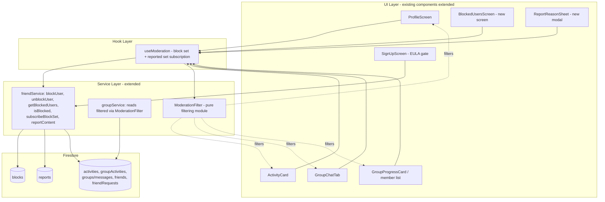

# Design Document

## Overview

This feature adds report + block moderation to Goalfer to satisfy Apple App Review Guideline 1.2 (block abusive users, report objectionable content, and a zero-tolerance EULA). The central correctness guarantee is the **filter-everywhere invariant**: once two users are in a block relationship, neither party sees the other's content, presence, or interactions on any social surface — bidirectionally.

The design follows the project's "modify, don't multiply" rule. It extends the existing `friendService` and `groupService` rather than adding parallel services, adds moderation actions to existing social components (`ActivityCard`, `GroupChatTab`, `GroupProgressCard`/member list, `ProfileScreen`), and reuses the shared design system from `src/constants/theme.ts`. No Cloud Functions are introduced — the app is a client-only Firebase (Firestore) app, so moderation is enforced through a combination of Firestore security rules and a client-side filtering layer.

### Key design challenge

Firestore cannot efficiently answer "give me all documents whose author is NOT in this set." There is no server-side `not-in` that scales, and the block set is per-user and unbounded. The design resolves this with a **client-side moderation filter**: each client loads its own moderation state once (the set of users it is in a block relationship with, plus the set of content it has reported), keeps it live with a Firestore subscription, and runs every social read through a single pure filter function before rendering. Reads stay simple and index-friendly; exclusion happens in memory.

### Requirements-to-mechanism map

| Requirement area | Mechanism |
| --- | --- |
| Block a user (R1) | `friendService.blockUser` writes a `blocks` doc + tears down friendship/requests in one batch |
| Filter everywhere bidirectional (R2) | `ModerationFilter` (client) loads a bidirectional block set and filters all social reads |
| Unblock + manage list (R3) | `friendService.unblockUser`, `getBlockedUsers`, block-set subscription |
| Report user/content (R4) | `friendService.reportContent` writes an immutable `reports` doc |
| Auto-hide reported content (R5) | `ModerationFilter` also loads the reporter's own reported-content ids and filters them out |
| Security rules (R6) | New `blocks` and `reports` rules blocks in `firestore.rules` |
| EULA zero-tolerance (R7) | Acceptance checkbox gate on `SignUpScreen`, persisted on the `users` doc, plus in-app terms link |

## Architecture

### Component layers



### The client-side moderation filter

`ModerationFilter` is a pure module (no I/O) that holds two in-memory sets for the current user:

- `blockedUserIds: Set<string>` — the **bidirectional** block set: the union of users the current user has blocked and users who have blocked the current user.
- `reportedContentIds: Set<string>` — content ids the current user has reported (for auto-hide, R5).

Every social read result is passed through `ModerationFilter.filter*` helpers before it reaches the UI. Because the sets are already in memory, filtering is O(n) over the page of results and requires no extra round-trips.

#### Loading the bidirectional block set

A single `blocks` collection stores one document per block action with the required fields `{ blockerId, blockedUserId, createdAt }` (R1.4). To make the set bidirectional (R2.7, R2.8) the client issues two queries at load time and unions the results:

1. `where('blockerId', '==', uid)` → users I blocked (also the Block_List for management, R3.2).
2. `where('blockedUserId', '==', uid)` → users who blocked me.

```
blockedUserIds = { doc.blockedUserId | blockerId == uid }  ∪  { doc.blockerId | blockedUserId == uid }
```

Both are single-field equality queries, which Firestore auto-indexes — no composite index is required.

> **Design decision (requirement and design agree).** Requirement 6.4/6.6 permits a client to read a Block_Relationship record when the authenticated uid equals **either** the `blockerId` or the `blockedUserId`, while keeping **create and delete owner-only** (`blockerId == uid`, satisfying R6.3/R6.5) and denying updates (R6.8). This is exactly what query (2) needs: the blocked party's client can learn a block exists and hide the blocker, satisfying the central bidirectional invariant in Requirement 2 (2.7, 2.8). The requirements' Privacy Note documents that this exposes only the two opaque UIDs and a timestamp (no reason/free-text), and that a block is never surfaced in the Blocked_User's UI (silent hide). The design and requirements are aligned on this point — no reconciliation is outstanding.

#### Keeping the set correct and consistent

- **Subscription, not one-shot.** `friendService.subscribeBlockSet(uid, cb)` attaches an `onSnapshot` listener to the two block queries (mirroring the existing `subscribeFriends` pattern). When a block/unblock happens on any device, the set updates and the UI re-filters live.
- **Load-before-render.** `useModeration` exposes a `ready` flag. Social surfaces wait for the first block-set snapshot before rendering a page, so a blocked user is never briefly visible on cold start (fail-closed).
- **Optimistic local add.** On `blockUser`, the id is added to the local set immediately so the UI hides the target without waiting for the round-trip; the subscription reconciles the authoritative state.
- **Reported set** is loaded the same way via `where('reporterId', '==', uid)` and kept live so auto-hide (R5) survives app restarts.

#### Why filter client-side rather than server-side

Firestore's `in`/`array-contains` operators cap at 10 values and there is no scalable `not-in`. The existing feed already reads by author (`getActivityFeed` uses `where('userId','in', friendIds.slice(0,10))`) and group reads read by `groupId`. Layering block filtering on top of these existing reads — rather than trying to encode exclusion in the query — keeps queries unchanged, avoids new composite indexes, and centralizes the invariant in one testable module.

### Block teardown

When A blocks B, `blockUser` runs a single `writeBatch` that:

1. Creates the `blocks` doc `{ blockerId: A, blockedUserId: B, createdAt: serverTimestamp() }`.
2. Deletes both friendship docs between A and B (reusing the query shape from `removeFriend`: `userId==A && friendId==B` and `userId==B && friendId==A`) (R1.8).
3. Deletes any pending `friendRequests` in either direction (`fromUserId==A && toUserId==B`, and the reverse) (R1.9).

Doing this in one batch guarantees the block and the teardown commit atomically (R1.7 — on failure nothing changes). Group membership is intentionally **not** torn down: blocking a co-member hides them but does not remove either user from the shared group; group content is handled by the filter.

## Components and Interfaces

### Service layer (extends `friendService`)

```typescript
// New moderation types (added to src/types/social.ts)
export interface Block {
  id: string;
  blockerId: string;
  blockedUserId: string;
  createdAt: Date;
}

export type ReportContentType = 'user' | 'activity' | 'group_activity' | 'group_message';
export type ReportReason =
  | 'harassment' | 'spam' | 'inappropriate' | 'hate_speech' | 'impersonation' | 'other';
export type ReportStatus = 'pending' | 'reviewed' | 'actioned';

export interface Report {
  id: string;
  reporterId: string;
  reportedUserId: string;
  contentType: ReportContentType;
  contentId: string;
  reason: ReportReason;
  timestamp: Date;
  status: ReportStatus;
}

export interface ModerationState {
  blockedUserIds: Set<string>;   // bidirectional
  reportedContentIds: Set<string>;
}
```

New `friendService` methods:

```typescript
// Blocks
async blockUser(blockerId: string, blockedUserId: string): Promise<void>;   // batch: create block + teardown (R1.4, R1.7-1.9); idempotent (R1.5)
async unblockUser(blockerId: string, blockedUserId: string): Promise<void>; // delete own block doc (R3.3)
async getBlockedUsers(userId: string): Promise<Block[]>;                    // blockerId==uid (R3.2)
async isBlocked(userAId: string, userBId: string): Promise<boolean>;        // either-direction existence check
subscribeBlockSet(userId: string, cb: (ids: Set<string>) => void): () => void; // bidirectional, live (R2.7)

// Reports
async reportContent(params: {
  reporterId: string;
  reportedUserId: string;
  contentType: ReportContentType;
  contentId: string;           // for contentType 'user', equals reportedUserId (R4.9)
  reason: ReportReason;
}): Promise<void>;             // create-only, status defaults 'pending' (R4.5); repeatable (R4.8)
async getReportedContentIds(userId: string): Promise<Set<string>>;          // reporterId==uid (R5.2)
subscribeReportedContent(userId: string, cb: (ids: Set<string>) => void): () => void;
```

`reportUser(reporterId, reportedUserId, reason)` is a thin convenience wrapper that calls `reportContent` with `contentType: 'user'` and `contentId: reportedUserId`.

### The `ModerationFilter` module (pure, `src/services/moderationFilter.ts`)

```typescript
// All functions are pure: no Firestore, no auth, no time.
function isHidden(state: ModerationState, authorId: string, contentId?: string): boolean;

function filterActivities(state, activities: SocialActivity[]): SocialActivity[];
function filterGroupActivities(state, activities: GroupActivity[]): GroupActivity[];
function filterMessages(state, messages: GroupMessage[]): GroupMessage[];
function filterSearchResults(state, results: UserSearchResult[]): UserSearchResult[];
function filterFriendRequests(state, requests: FriendRequest[]): FriendRequest[];
function filterMembers(state, members: GroupMember[]): GroupMember[];

// Reactions: strip entries authored by blocked users before counting.
function filterReactions(state, reactions?: Reactions): Reactions;
```

`isHidden` returns true if `authorId ∈ blockedUserIds` OR (`contentId` is provided and `contentId ∈ reportedContentIds`). All list filters are `list.filter(item => !isHidden(...))`. `filterReactions` returns a new `Reactions` map omitting blocked user keys, so `getReactionCounts` (unchanged) yields blocked-free counts (R2.6). These pure functions are the primary target of property-based testing.

### Hook layer (`useModeration`, `src/hooks/useModeration.ts`)

Exposes `{ state: ModerationState, ready: boolean, blockUser, unblockUser, reportContent }`. Subscribes to `subscribeBlockSet` and `subscribeReportedContent` on mount and merges them into a single `ModerationState`. Social screens (`ActivityFeedTab`, `GroupChatTab`, `GroupsTab`, `AddFriendModal`, `FriendsTab`) consume this hook and pass `state` into the matching `ModerationFilter.filter*` call after each read/subscription callback.

### UI surfaces (existing components extended with props)

| Surface | Component (existing) | Change |
| --- | --- | --- |
| Profile block/report | `ProfileScreen.tsx` | Add overflow (`⋯`) menu with "Block user" and "Report user" for other users' profiles (R1.1, R4.1) |
| Activity item report | `ActivityCard.tsx` | Add `onReport`/`onBlock` via a long-press or `⋯` action; report targets `contentType: 'activity'` (R4.2) |
| Group activity report | `GroupFeedCard.tsx` | `⋯` action → report `group_activity` (R4.3) |
| Group chat message | `GroupChatTab.tsx` | Long-press a message bubble → block author / report `group_message` (R1.3, R4.4) |
| Group member list | `GroupProgressCard.tsx` | Per-member `⋯` → block (not for self) (R1.2) |
| Blocked list management | **new** `BlockedUsersScreen.tsx` | Lists Block_List with unblock buttons (R3); linked from `ProfileScreen`/Settings |
| Report reason picker | **new** `ReportReasonSheet.tsx` | Modal `ActionSheet`-style reason picker + confirm (R4.5) |
| EULA gate | `SignUpScreen.tsx` | Acceptance checkbox with zero-tolerance clause; "Create Account" disabled until checked (R7.2, R7.4) |

All new UI uses `Colors`, `Typography`, `Spacing`, `Layout`, `BorderRadius`, `Shadows` from `theme.ts`: destructive actions use `Colors.error` (`#FF4444`), confirmations use `Colors.success` (`#4A90A4`), CTAs use `Colors.accent1` (`#B771E5`), primary text `#154D71`. Touch targets ≥ 48px, spacing on the 8pt grid, list rows follow the standard list recipe (`paddingVertical: 16`, `paddingHorizontal: 24`, `minHeight: 56`, `borderBottomColor: '#E8E8E8'`). Destructive block/unblock actions are separated from confirm buttons per the UX standards and always require a confirmation dialog (R1.6, R3.4).

### Confirmation & feedback flow

- Block: confirm dialog ("Block {name}? You'll stop seeing each other.") → on success a toast/`Alert` "You blocked {name}" (R1.6); on failure "Couldn't block user. Please try again." with no state change (R1.7).
- Unblock: confirm dialog → success removes the row + confirmation (R3.4); failure keeps the row + error (R3.5).
- Report: reason sheet → success "Thanks for reporting. We'll review this." (R4.6); failure error message (R4.7). On success for content types the item is removed from the reporter's view (R5.1).

### EULA

The zero-tolerance clause lives with the existing terms content:

- Canonical text is added to `app-store-assets/metadata/terms-of-service.md` (existing terms doc) and served at `https://goalstreak.co/terms` (already linked by `openTermsOfService` in `linkingUtils.ts`) (R7.1, R7.3).
- `SignUpScreen` adds a required acceptance checkbox next to the existing terms text: "I agree to the Terms of Service, including zero tolerance for objectionable content and abusive behavior." `handleSignUp` is blocked (button disabled + guard) until the box is checked (R7.4).
- On successful signup, `useAuth.signUp` records acceptance on the `users` doc: `eulaAcceptedAt: serverTimestamp()`, `eulaVersion: '1.0'`. In-app, the existing terms link surfaces the same content (R7.3).

## Data Models

### New collections

`blocks/{blockId}` (one document per block action, directional):

```
{
  blockerId:     string,     // uid of the user who blocked
  blockedUserId: string,     // uid of the user who was blocked
  createdAt:     Timestamp   // serverTimestamp()
}
```

`reports/{reportId}` (immutable once created):

```
{
  reporterId:     string,
  reportedUserId: string,
  contentType:    'user' | 'activity' | 'group_activity' | 'group_message',
  contentId:      string,     // == reportedUserId when contentType === 'user'
  reason:         'harassment' | 'spam' | 'inappropriate' | 'hate_speech' | 'impersonation' | 'other',
  timestamp:      Timestamp,  // serverTimestamp()
  status:         'pending'   // default on create
}
```

### Modified documents

`users/{uid}`: add `eulaAcceptedAt: Timestamp` and `eulaVersion: string` (written by `useAuth.signUp`).

### Composite indexes

The block and report reads are all **single-field equality** queries (`blockerId==uid`, `blockedUserId==uid`, `reporterId==uid`), which Firestore auto-indexes. **No new composite indexes are required** for this feature, so `firestore.indexes.json` is unchanged. (If a future admin/moderation query needs `reporterId + timestamp desc` ordering, a composite index would be added then; it is not needed by the client.)

### Firestore security rules (added to `firestore.rules`)

```
// ── Blocks ──
// Create/delete are owner-only (blockerId). Read is allowed for either party
// so both clients can build the bidirectional filter set (see design decision).
match /blocks/{blockId} {
  allow read: if isAuthenticated()
    && (request.auth.uid == resource.data.blockerId
        || request.auth.uid == resource.data.blockedUserId);
  allow create: if isAuthenticated()
    && request.auth.uid == request.resource.data.blockerId;
  allow delete: if isAuthenticated()
    && request.auth.uid == resource.data.blockerId;
  allow update: if false;   // blocks are never mutated
}

// ── Reports ──
// Create-only, reporterId must be the caller. Reporter can read their own
// reports (for auto-hide). Never updatable or deletable (immutable).
match /reports/{reportId} {
  allow read: if isAuthenticated() && request.auth.uid == resource.data.reporterId;
  allow create: if isAuthenticated()
    && request.auth.uid == request.resource.data.reporterId;
  allow update, delete: if false;   // R6.7
}
```

These satisfy R6.1–R6.9 exactly. In particular, the block read rule (either party may read: `blockerId == uid || blockedUserId == uid`) matches R6.4/R6.6, while create/delete stay owner-only (R6.3/R6.5/R6.7) and updates are denied (R6.8) — see the requirements' Privacy Note and the Architecture design-decision note. Requirement and design are aligned; nothing here is a pending refinement.

## Correctness Properties

*A property is a characteristic or behavior that should hold true across all valid executions of a system — essentially, a formal statement about what the system should do. Properties serve as the bridge between human-readable specifications and machine-verifiable correctness guarantees.*

The moderation logic in this feature is dominated by pure functions — the `ModerationFilter` list/map transforms, the block-set transition functions, the teardown-selection logic, and report construction. These are ideal for property-based testing. Security rules and per-surface UI presence are verified separately (rules tests and example tests) and are not expressed as properties here. The properties below were derived from the prework analysis and consolidated to remove redundancy (the per-surface exclusion criteria 2.1–2.5, 2.7, 2.8 collapse into a single filter-everywhere invariant).

### Property 1: Filter-everywhere (bidirectional exclusion, exact)

*For any* collection of authored items (activities, group activities, messages, search results, or friend requests) and *any* bidirectional block set, the filtered collection contains exactly those items whose author is not in the block set — every blocked-authored item is removed and every non-blocked item is retained, regardless of which user initiated the block.

**Validates: Requirements 2.1, 2.2, 2.3, 2.4, 2.5, 2.7, 2.8, 3.6**

### Property 2: Reactions exclude blocked authors

*For any* reactions map and *any* bidirectional block set, `filterReactions` returns a map with no keys belonging to a blocked user, and the resulting reaction counts equal the counts computed over only the non-blocked reactions.

**Validates: Requirements 2.6**

### Property 3: Reported content is excluded from the reporter's view

*For any* collection of content items and *any* set of reported content ids, the filtered collection contains no item whose `contentId` is in the reported set, and adding a newly reported item's id to the set removes exactly that item on the next filter.

**Validates: Requirements 5.1, 5.2**

### Property 4: Report auto-hide is scoped to the reporting user

*For any* content item, a moderation state whose `reportedContentIds` contains that item's id excludes it, while a different user's moderation state that does not contain that id (and has no block relationship with the author) retains it.

**Validates: Requirements 5.3**

### Property 5: No false exclusions

*For any* collection of authored items, *any* bidirectional block set, and *any* reported-content set, every item whose author is not in the block set and whose `contentId` is not in the reported set survives filtering.

**Validates: Requirements 3.6**

### Property 6: Block is idempotent

*For any* block set and *any* ordered pair of distinct users (A, B), applying `block(A, B)` twice produces the same block set as applying it once, and the set grows by at most one record.

**Validates: Requirements 1.5**

### Property 7: Block then unblock is an identity round trip

*For any* block set that does not already contain (A → B), applying `block(A, B)` followed by `unblock(A, B)` yields the original block set, and `unblock(A, B)` removes exactly the record where `blockerId == A` and `blockedUserId == B`.

**Validates: Requirements 3.3**

### Property 8: Block_List is exactly the user's outgoing blocks

*For any* blocks dataset and *any* user id `u`, `getBlockedUsers(u)` returns exactly the records whose `blockerId == u` — no records where `u` is only the blocked party, and none belonging to other blockers.

**Validates: Requirements 3.2**

### Property 9: Teardown selects exactly the records between the two users

*For any* dataset of directional relationship records (friendships or friend requests) and *any* ordered pair (A, B), the set of records selected for deletion on `block(A, B)` is exactly the records that link A and B in either direction; no record involving any third party is selected.

**Validates: Requirements 1.8, 1.9**

### Property 10: Report construction maps all fields

*For any* valid report inputs, the constructed report record carries `reporterId`, `reportedUserId`, `contentType`, `contentId`, and `reason` equal to the inputs, `status` equal to `pending`, and a populated `timestamp`; and when `contentType` is `user`, `contentId` equals `reportedUserId`.

**Validates: Requirements 4.5, 4.9**

### Property 11: Block action self-exclusion

*For any* group member list and *any* current user, the set of members offered a block action equals the full member set minus the current user.

**Validates: Requirements 1.2**

## Error Handling

- **Block/unblock atomicity.** `blockUser` performs the block write and all teardown deletes in a single `writeBatch`. If the commit fails, nothing is persisted (R1.7); the service rethrows and the UI shows "Couldn't block user. Please try again." The optimistic local addition is rolled back when the subscription reconciles (or immediately on the thrown error).
- **Idempotent block.** Before writing, `blockUser` checks for an existing (A → B) record; if present it returns success without a second write (R1.5). This keeps the operation safe under double-taps and retries.
- **Unblock failure.** If the delete fails, the row remains in the displayed Block_List and an error is shown (R3.5). The subscription is the source of truth, so a failed delete never desyncs the list.
- **Report failure.** `reportContent` surfaces persistence errors to the caller; the reason sheet shows "Couldn't submit report. Please try again." (R4.7) and the item is not auto-hidden (auto-hide is driven by the reported-set subscription, which only updates on a successful write).
- **Repeated reports.** Reports are append-only; submitting a duplicate simply creates another record and resolves successfully (R4.8). No uniqueness check is enforced client- or server-side.
- **Cold-start fail-closed.** Social surfaces gate rendering on `useModeration.ready`. Until the first block-set snapshot arrives, feeds are not shown, so a blocked user is never briefly visible during load.
- **Subscription/network errors.** Block-set and reported-set subscriptions log and retain the last known set on transient errors (mirroring the existing `subscribeToActivityFeed` error handling), so filtering degrades to the last good state rather than failing open.
- **EULA gate.** If the acceptance box is unchecked, "Create Account" is disabled and `handleSignUp` guards early (R7.4); no auth call is made.

## Testing Strategy

### Dual approach

- **Property-based tests** cover the pure moderation logic (Properties 1–11). This is where input variation finds real bugs: unusual block-set shapes, self-authored items, third-party items, empty maps, and mixed block/report state.
- **Unit / example tests** cover UI presence and wiring (block/report actions on each surface, contentType targeting), confirmation and error feedback, and the EULA gate.
- **Integration tests** cover Firestore writes and security rules.

### Property-based testing

- Library: **fast-check** with Jest (the project already uses Jest; see `src/__tests__`). Do not hand-roll generators for shrinking.
- Each property test runs **minimum 100 iterations** (`fc.assert(..., { numRuns: 100 })`).
- Each test is tagged with a comment referencing its design property, format: **Feature: report-and-block, Property {number}: {property_text}**.
- Each of Properties 1–11 is implemented by a **single** property-based test. Generators produce: arbitrary user-id pools, authored items (with author ids drawn from the pool), reaction maps keyed by user id, blocks datasets, and report inputs. The bidirectional block set is generated from a set of unordered user pairs so both directions are exercised (covers 2.7).
- Refactor target: extract `ModerationFilter` and the block-set/teardown/report-construction transitions as pure functions so they can be tested without Firestore.

### Example / unit tests (Jest + React Native Testing Library)

- Report action present with correct `contentType` on `ProfileScreen`, `ActivityCard`, `GroupFeedCard`, `GroupChatTab` (R4.1–R4.4).
- Block action present on profile, member list (not self), and chat messages (R1.1–R1.3).
- Confirmation shown on block/unblock/report success; error shown on failure (R1.6, R1.7, R3.4, R3.5, R4.6, R4.7).
- Blocked-list screen renders each Block_List entry and removes a row on unblock (R3.1, R3.4).
- Repeated report resolves without error (R4.8).
- EULA: acceptance control present, "Create Account" blocked until accepted, terms clause text present, terms link opens (R7.1–R7.4).

### Security rules tests (Firebase emulator, `@firebase/rules-unit-testing`)

- `reports`: create allowed only when `reporterId == uid`; denied when unauthenticated; update and delete always denied; reporter can read own report, others cannot (R6.1, R6.2, R6.7).
- `blocks`: create/delete allowed only when `blockerId == uid`; read allowed for both blocker and blocked party; unrelated third party cannot read or delete; update always denied (R6.3, R6.4, R6.5, R6.6, R6.7, R6.8).

### Integration tests (Firebase emulator)

- `blockUser` writes the block doc with correct fields and, in the same batch, removes both friendship docs and pending requests between the pair (R1.4, R1.8, R1.9), leaving third-party relationships intact.
- `reportContent` persists a record with `status: 'pending'` and a server timestamp (R4.5).
- After a successful block on one client, the other party's block-set subscription updates (bidirectional propagation).

## Open Questions / Requirements Follow-up

1. **Block read rule (R6.4/R6.6) — RESOLVED.** The requirements now permit reading a Block_Relationship record when the authenticated uid equals **either** the `blockerId` or the `blockedUserId` (R6.4/R6.6), with create/delete owner-only (R6.3/R6.5/R6.7) and updates denied (R6.8). This matches the design's client-side bidirectional filter, which needs the blocked party to read the block to hide the blocker (R2.7/R2.8). The requirements' Privacy Note documents the minimal-exposure tradeoff (only opaque UIDs + timestamp, no reason field, silent hide). Requirement and design are aligned; no reconciliation is outstanding.
2. **Report reason set — RESOLVED.** The design uses a fixed reason enum (`harassment`, `spam`, `inappropriate`, `hate_speech`, `impersonation`, `other`), which the user accepted. The requirements' "Reporter-provided reason" is satisfied by selecting one of these enum values.

## Future Enhancements

The requirements document a "Future Enhancements (out of scope)" section covering post-launch fast-follows that are **not** part of this spec:

- **Server-side moderation filtering via Cloud Functions** — moving block/report filtering server-side so blocked-authored content is stripped before reaching the other client, removing the client-side exposure of Block_Relationship records (and the need for R6.4). This client-only design does not use Cloud Functions.
- **Admin review and auto-actioning of reports** — moderator tooling to review Report_Records and transition `status` beyond `pending`. This spec only persists reports with `status: 'pending'`.

See the requirements' Future Enhancements section for the full text. These are not required for Apple Guideline 1.2 in this release.
