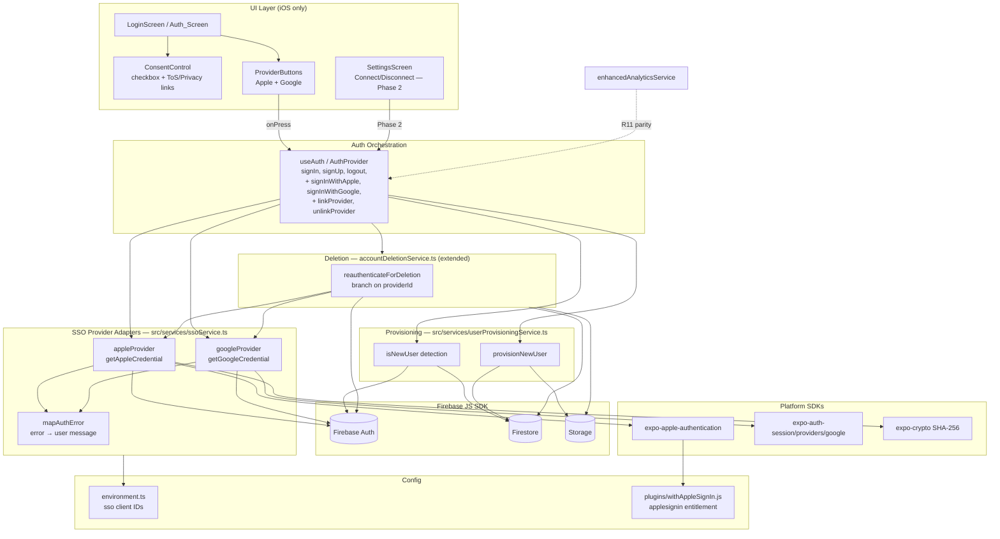

# Design Document

## Overview

This feature adds Single Sign-On (SSO) — "Continue with Apple" and "Continue with Google" — to the Goalfer app alongside the existing email/password authentication, iOS-first. It is built entirely on the **Firebase JS SDK** credential pattern already in use (`src/services/firebase.ts` initializes `initializeAuth(app, { persistence: getReactNativePersistence(AsyncStorage) })`), **not** React Native Firebase. Apple and Google ship together to satisfy App Store Guideline 4.8.

The core engineering challenge is not the sign-in call itself (a one-line `signInWithCredential`) but the three existing single-path seams that SSO breaks. Each maps to a specific requirement group:

1. **Provisioning** (R5) — first-time-user record creation currently lives *inside* `signUp()` in `useAuth.tsx`. A first-time SSO user would authenticate with zero Firestore records. The fix is to extract a shared `provisionNewUser()` that both email sign-up and first-time SSO call.
2. **EULA gate** (R2) — the Terms acceptance checkbox lives on `SignUpScreen` and blocks `createUserWithEmailAndPassword`. SSO bypasses that screen entirely. The fix is a consent-before-auth control on the auth screen that keeps SSO buttons disabled until Terms/Privacy are accepted, and provisioning that persists `eulaAcceptedAt` + `eulaVersion` for SSO users too (Guideline 1.2).
3. **Deletion re-auth** (R6) — `accountDeletionService.reauthenticate(password)` is password-only via `EmailAuthProvider`. An SSO user has no password, breaking in-app deletion (Guideline 5.1.1(v)). The fix is provider-aware re-authentication that branches on `user.providerData[0].providerId`.

Account linking is phased: **Phase 1** (R7) delivers full Apple + Google sign-in with a friendly collision message; **Phase 2** (R8) adds `linkWithCredential` in-flow linking plus a Settings connect/disconnect surface.

**Design principles carried from the codebase and steering rules:**
- *Modify, don't multiply.* Extend `useAuth`, `accountDeletionService`, and the environment config rather than forking parallel systems. New files are added only where a genuinely new responsibility exists (the SSO provider adapters, the provisioning routine, the config plugin, and UI components).
- *Firebase JS SDK only.* Every credential is produced with `OAuthProvider`/`GoogleAuthProvider` and consumed by `signInWithCredential` / `reauthenticateWithCredential` / `linkWithCredential`.
- *iOS-first.* Android renders neither SSO control (R1.4); the buttons are gated behind `Platform.OS === 'ios'`.

### Research findings informing the design

- **Apple + Firebase JS SDK nonce handling.** `expo-apple-authentication`'s `signInAsync` accepts a `nonce` option and returns an `identityToken`. Apple hashes the nonce it embeds in the token. Firebase's `OAuthProvider('apple.com').credential({ idToken, rawNonce })` expects the **raw** (unhashed) nonce and verifies that `sha256(rawNonce)` matches the token's embedded nonce. Therefore we generate a random raw nonce, pass `sha256(rawNonce)` to Apple via `expo-crypto`'s `digestStringAsync`, and pass the raw nonce to Firebase. (`expo-crypto` is already installed.)
- **Apple name/email are first-authorization-only.** Apple returns `fullName`/`email` only on the *first* consent; subsequent authorizations return null for these. This must be captured at first sign-in and persisted during provisioning (R3.3, R3.4).
- **Google via `expo-auth-session/providers/google`.** The `useAuthRequest` hook returns a `response` with an `id_token` (using `responseType: 'id_token'`), which feeds `GoogleAuthProvider.credential(idToken)`. Client IDs (iOS + web) come from config (R9.1). `expo-auth-session` and `expo-crypto` are already installed; only `expo-apple-authentication` is net-new.
- **Collision behavior.** Firebase raises `auth/account-exists-with-different-credential` when an SSO email already belongs to a different provider. `fetchSignInMethodsForEmail(auth, email)` names the existing method for a friendly message (R7.1).
- **`getAdditionalUserInfo(result).isNewUser`** reliably distinguishes first-time SSO users, with a `getDoc(users/{uid})` existence check as a fallback (R5.2, R5.3).

## Architecture

The SSO subsystem is layered so that the **provider adapters** (platform SDK calls that yield a Firebase `AuthCredential`) are cleanly separated from **auth orchestration** (`useAuth`), **provisioning** (shared record creation), and **UI**. This separation lets deletion re-authentication reuse the exact same adapters that sign-in uses (R6.2, R6.3) — the credential-producing code is written once.



### Proposed new modules

| Module | Responsibility | Requirements |
|--------|----------------|--------------|
| `src/services/ssoService.ts` | Provider adapters: `getAppleCredential()`, `getGoogleCredential()`, availability checks, `mapAuthError()`. Produces Firebase `AuthCredential`s; does not touch Firestore. | R3, R4, R9 |
| `src/services/userProvisioningService.ts` | Shared `provisionNewUser()` extracted from `signUp()`; `isNewUser()` detection. Creates `users/{uid}`, reserves username, creates `userProfiles`, persists EULA fields. | R5, R2.6 |
| `src/hooks/useAuth.tsx` (extended) | New context methods `signInWithApple()`, `signInWithGoogle()`, and Phase 2 `linkProvider()`/`unlinkProvider()`. `signUp()` refactored to call `provisionNewUser()`. | R3, R4, R5, R8 |
| `src/services/accountDeletionService.ts` (extended) | New `reauthenticateForDeletion()` branching on `providerId`; `deleteAccount()` cleanup unchanged. | R6 |
| `src/components/auth/ConsentControl.tsx` | Checkbox + ToS/Privacy links gating SSO buttons. Mirrors the existing `SignUpScreen` accept-row pattern. | R2 |
| `src/components/auth/ProviderButtons.tsx` | Apple + Google buttons; Apple prominence + iOS-only rendering; disabled state bound to consent. | R1, R2.1 |
| `plugins/withAppleSignIn.js` | Expo config plugin adding `com.apple.developer.applesignin` entitlement, mirroring `withFullAppIcons.js`. | R9.4 |
| `src/config/environment.ts` (extended) | `sso` config block with `appleClientId`, `googleIosClientId`, `googleWebClientId` sourced from env/EAS secrets. | R9.1, R9.2, R9.3 |

### Google auth-session constraint

`expo-auth-session/providers/google` exposes `Google.useAuthRequest()` — a **hook**, so the request object must be created in a React component/hook, not in a plain service function. The design therefore splits Google's flow: the `useAuthRequest` hook lives in `useAuth` (or a small `useGoogleAuth` helper hook it composes), while `ssoService.getGoogleCredential(idToken)` remains a pure function that converts an id token into a credential. Apple has no such constraint (`AppleAuthentication.signInAsync` is a plain async call), so its adapter is fully contained in `ssoService`.

## Components and Interfaces

### 1. SSO provider adapters (`src/services/ssoService.ts`)

```typescript
import * as AppleAuthentication from 'expo-apple-authentication';
import * as Crypto from 'expo-crypto';
import {
  OAuthProvider,
  GoogleAuthProvider,
  AuthCredential,
} from 'firebase/auth';

export type SsoProviderId = 'apple.com' | 'google.com';

/** Profile fields a provider may supply on first authorization (R3.3, R5.8–R5.10). */
export interface SsoProfile {
  displayName?: string;
  email?: string;
  photoURL?: string;
}

export interface SsoCredentialResult {
  credential: AuthCredential;      // fed to signInWithCredential / reauthenticate / link
  profile: SsoProfile;             // captured for provisioning
  providerId: SsoProviderId;
}

/** Discriminated error so callers can branch cancel vs network vs generic (R3.5–R3.7, R4.5–R4.8). */
export type SsoErrorKind =
  | 'cancelled'
  | 'network'
  | 'timeout'
  | 'collision'
  | 'unavailable'
  | 'missing-config'
  | 'generic';

export class SsoError extends Error {
  kind: SsoErrorKind;
  existingMethod?: string;         // populated for 'collision' via fetchSignInMethodsForEmail
  constructor(kind: SsoErrorKind, message: string, existingMethod?: string);
}

/** True only on iOS with an available Apple auth service (R1.2, R1.5). */
export async function isAppleAvailable(): Promise<boolean>;

/**
 * Apple flow (R3.1–R3.4):
 *  1. rawNonce = Crypto.randomUUID()  (or random hex)
 *  2. hashedNonce = Crypto.digestStringAsync(SHA256, rawNonce)
 *  3. AppleAuthentication.signInAsync({ requestedScopes: [FULL_NAME, EMAIL], nonce: hashedNonce })
 *  4. credential = new OAuthProvider('apple.com').credential({ idToken, rawNonce })
 * Rejects with SsoError('cancelled') on ERR_REQUEST_CANCELED, ('timeout') past 30s,
 * ('network') on network failure, ('generic') otherwise.
 */
export async function getAppleCredential(): Promise<SsoCredentialResult>;

/**
 * Google credential construction (R4.2). The id token is obtained by the
 * useAuthRequest hook in the hook layer; this pure function converts it.
 */
export function getGoogleCredential(idToken: string): SsoCredentialResult;

/** Maps a raw Firebase/SDK error to an SsoError, resolving collision method names. */
export async function mapAuthError(error: unknown, email?: string): Promise<SsoError>;

/** Validates required client IDs are present, else SsoError('missing-config') naming the missing id (R9.2). */
export function assertSsoConfig(provider: SsoProviderId): void;
```

### 2. Shared provisioning (`src/services/userProvisioningService.ts`)

Extracted verbatim-in-spirit from the current `signUp()` body so email and SSO share one code path (R5.1).

```typescript
import { User } from 'firebase/auth';

export interface ProvisionInput {
  firebaseUser: User;              // the authenticated user (uid, email, displayName, photoURL)
  displayName?: string;            // provider- or form-supplied name (R5.8)
  photoURL?: string;               // provider-supplied photo (R5.10)
  eulaVersion: string;             // current EULA_Version ('1.0')
}

export interface ProvisionResult {
  username: string;
  created: boolean;                // false when the user already existed (R5.12)
}

/**
 * New-user detection (R5.2, R5.3): prefer getAdditionalUserInfo(result).isNewUser;
 * fall back to a users/{uid} doc-existence check when unavailable/false.
 */
export async function isNewUser(
  firebaseUser: User,
  additionalUserInfoIsNew?: boolean | null,
): Promise<boolean>;

/**
 * Idempotent provisioning (R5.4–R5.12, R2.6). When the user already has a
 * users/{uid} doc, returns { created: false } without duplicating records.
 * For a new user, within a best-effort transactional flow:
 *   - generate username, retry up to 5 times on collision (R5.5)
 *   - reserve username (R5.6)
 *   - write users/{uid}: { username, displayName, hasCompletedOnboarding: false,
 *       createdAt, updatedAt, eulaAcceptedAt: serverTimestamp(), eulaVersion,
 *       profilePicture? } (R5.4, R5.8–R5.10, R2.6)
 *   - create userProfiles via friendService.createUserProfile (R5.7)
 * On partial failure, throws so no successful sign-in reports provisioning
 * complete; records already written are safe to overwrite on retry (R5.11).
 * displayName falls back to the generated username when absent (R5.9).
 */
export async function provisionNewUser(input: ProvisionInput): Promise<ProvisionResult>;
```

### 3. `useAuth` extensions (`src/hooks/useAuth.tsx`)

```typescript
interface AuthContextType {
  // ... existing: user, isLoading, isAuthenticated, signIn, signUp, logout,
  //     resetPassword, updateUserProfile
  deleteAccount: () => Promise<void>;          // CHANGED: no longer takes a password (R6.1)

  // New (Phase 1)
  signInWithApple: () => Promise<void>;        // R3
  signInWithGoogle: () => Promise<void>;       // R4
  ssoAvailability: { apple: boolean; google: boolean };  // drives R1.5 button omission

  // New (Phase 2)
  linkProvider: (provider: SsoProviderId) => Promise<void>;    // R8.1, R8.2
  unlinkProvider: (provider: SsoProviderId) => Promise<void>;  // R8.6, R8.7
  connectedProviders: SsoProviderId[] | 'password'[];          // R8.3
}
```

Flow for `signInWithApple()` (Google is analogous, using the hook-obtained id token):
1. `assertSsoConfig('apple.com')` → surfaces `missing-config` (R9.2).
2. `getAppleCredential()` → `{ credential, profile, providerId }`.
3. `result = await signInWithCredential(auth, credential)` (R3.2).
4. `newUser = await isNewUser(result.user, getAdditionalUserInfo(result)?.isNewUser)` (R5.2, R5.3).
5. If `newUser`: `provisionNewUser({ firebaseUser, displayName: profile.displayName, photoURL: profile.photoURL, eulaVersion: '1.0' })` (R5, R2.6).
6. Emit analytics: `login_completed` always, plus `signup_completed` when `newUser`, each with `provider: providerId` (R11.1, R11.2); analytics failures are swallowed (R11.3).
7. On `SsoError`: `cancelled` → silent idle reset (R3.5); `network`/`timeout`/`generic` → mapped message + idle reset (R3.6, R3.7); `collision` → collision message naming `existingMethod` (R7).

`onAuthStateChanged` (existing) continues to hydrate `AppUser` from `users/{uid}`. The existing username backfill block remains for legacy accounts; new SSO users are already provisioned so the backfill is a no-op for them.

### 4. Deletion re-auth strategy (`src/services/accountDeletionService.ts`)

```typescript
/**
 * Provider-aware re-authentication (R6.1–R6.4). Reads providerId from
 * auth.currentUser.providerData[0].providerId and re-runs the matching flow:
 *   - 'password'   → existing EmailAuthProvider path (unchanged); needs password
 *   - 'apple.com'  → getAppleCredential() then reauthenticateWithCredential (R6.2)
 *   - 'google.com' → getGoogleCredential(idToken) then reauthenticateWithCredential (R6.3)
 * Throws SsoError('unavailable') when providerId is absent/unsupported (R6.7).
 * A 120s ceiling / user cancel aborts with data retained (R6.6).
 */
export async function reauthenticateForDeletion(
  password?: string,                 // required only for the 'password' branch
  getIdTokenForGoogle?: () => Promise<string>,  // supplied by hook layer for google.com
): Promise<void>;

// reauthenticateAndDeleteAccount(password?) now delegates to reauthenticateForDeletion,
// then calls the UNCHANGED deleteAccount() cleanup (Firestore user-owned + per-user docs,
// friend data, group invitations, username release, Storage photo, AsyncStorage, then
// deleteUser last) (R6.5, R6.9).
```

`deleteAccount(password)` in `useAuth` becomes `deleteAccount()`; for the password branch the UI still collects a password (unchanged UX for email users). Error mapping additions: `requires-recent-login`, `auth/user-mismatch`, `unavailable` (R6.7, R6.8).

### 5. UI components

`ConsentControl` (`src/components/auth/ConsentControl.tsx`) — reuses the checkbox + link markup already in `SignUpScreen` (accessibilityRole="checkbox", ToS/Privacy links via `linkingUtils`). Emits `checked: boolean` upward (R2.1–R2.4).

`ProviderButtons` (`src/components/auth/ProviderButtons.tsx`):
```typescript
interface ProviderButtonsProps {
  consentAccepted: boolean;               // disabled while false (R2.1)
  availability: { apple: boolean; google: boolean };  // omit unavailable (R1.5)
  loadingProvider: SsoProviderId | null;  // shows spinner on the active button
  onApple: () => void;
  onGoogle: () => void;
  onBlockedPress: () => void;             // fired when tapped while consent unchecked (R2.5)
}
```
- Rendered only when `Platform.OS === 'ios'` (R1.4).
- Apple button height/width ≥ Google's and positioned at or above Google (R1.2), using theme touch-target sizes (≥56px primary).
- Both start unselected/unfocused (R1.3).
- Accessible provider labels (R1.1).
- Disabled state visually distinct while consent is unchecked (R2.1); tapping while disabled invokes `onBlockedPress` → dismissible prompt without starting auth (R2.5).

### 6. Config plugin (`plugins/withAppleSignIn.js`)

Mirrors `withFullAppIcons.js` structure using `withEntitlementsPlist` from `expo/config-plugins`:
```javascript
const { withEntitlementsPlist } = require('expo/config-plugins');
module.exports = function withAppleSignIn(config) {
  return withEntitlementsPlist(config, (config) => {
    config.modResults['com.apple.developer.applesignin'] = ['Default'];
    return config;
  });
};
```
Added to `app.json` `plugins` array alongside `./plugins/withFullAppIcons` (R9.4).

## Data Models

### `users/{uid}` document

Existing fields (from `signUp()` and `onAuthStateChanged`) plus SSO-relevant handling. No schema change beyond what email sign-up already writes — SSO reuses the same shape (R5.4).

| Field | Type | Source | Notes |
|-------|------|--------|-------|
| `email` | string | provider / form | May be a `Private_Relay_Email` for Apple (`<token>@privaterelay.appleid.com`) — never used as identity key (R8.4). |
| `displayName` | string | provider name, else generated username | R5.8, R5.9 |
| `username` | string | `generateUsername()` + collision retry | R5.5, R5.6 |
| `profilePicture` | string \| undefined | provider `photoURL` (Google) | Apple supplies none (R5.10). |
| `hasCompletedOnboarding` | boolean | provisioning | Always `false` at creation. |
| `createdAt` | Date | provisioning | |
| `updatedAt` | Date | provisioning | |
| `eulaAcceptedAt` | serverTimestamp | provisioning (SSO) / signup (email) | R2.6 |
| `eulaVersion` | string (`'1.0'`) | provisioning | `EULA_Version`. R2.6 |

### `usernames/{username}` — unchanged
`{ userId, createdAt }`. Reserved during provisioning (R5.6), released during deletion (R6.5).

### `userProfiles/{uid}` — unchanged
Created via `friendService.createUserProfile(uid, email, name)` (R5.7).

### Provider identity (not persisted by us)

`Provider_Id` is read at runtime from `auth.currentUser.providerData[0].providerId` (`apple.com` | `google.com` | `password`). Used for deletion re-auth branching (R6.1) and Phase 2 connected-provider display (R8.3). Firebase owns the provider linkage; we never mirror it into Firestore, and we never treat email equality as identity for private-relay addresses (R8.4).

### SSO configuration (`config.sso`)

```typescript
interface SsoConfig {
  appleClientId: string;       // Apple Services ID (for Firebase provider match)
  googleIosClientId: string;   // EXPO_PUBLIC_GOOGLE_IOS_CLIENT_ID
  googleWebClientId: string;   // EXPO_PUBLIC_GOOGLE_WEB_CLIENT_ID (Firebase audience)
}
```
Sourced from `EXPO_PUBLIC_*` env vars provided as EAS secrets, never committed (R9.1, R9.3). The Apple sign-in key and Services ID are configured in the Firebase Console (R9.5); an attempt against a provider disabled there yields `auth/operation-not-allowed` → `unavailable` (R9.6).

## Correctness Properties

*A property is a characteristic or behavior that should hold true across all valid executions of a system — essentially, a formal statement about what the system should do. Properties serve as the bridge between human-readable specifications and machine-verifiable correctness guarantees.*

These property-based tests apply to the **pure logic** of this feature: error classification, provisioning invariants, new-user detection, the deletion re-auth strategy mapping, provider-set guards, and predicates. The platform SDK calls (`AppleAuthentication.signInAsync`, `expo-auth-session`, `signInWithCredential`) and the console/build-process requirements are covered by example, integration, and smoke tests instead (see Testing Strategy). Firestore writes in the provisioning/deletion properties are tested against an in-memory/mocked Firestore so the logic is exercised without external I/O cost.

### Property 1: Error classification is total and correct

*For any* raw error drawn from the known SDK/Firebase error space (Apple `ERR_REQUEST_CANCELED`, Google dismiss/cancel, `auth/network-request-failed`, timeouts, `auth/account-exists-with-different-credential`, `auth/operation-not-allowed`, `auth/invalid-credential`, `auth/requires-recent-login`, and arbitrary unknown errors), `mapAuthError` returns exactly one `SsoErrorKind`, and the classification obeys: cancellations → `cancelled`, network failures → `network`, no-token timeouts → `timeout`, account-exists → `collision`, provider-not-enabled → `unavailable`, everything else → `generic`.

**Validates: Requirements 3.5, 3.6, 3.7, 4.5, 4.6, 4.7, 4.8, 6.8, 9.6**

### Property 2: Failed or cancelled authentication has no side effects

*For any* authentication attempt that ends in an `SsoError` of any kind (including `cancelled` and `collision`), the system creates no Firebase user identity, performs no Firestore writes, persists no EULA fields, and leaves any pre-existing account and its data unchanged, and the resulting state is unauthenticated.

**Validates: Requirements 2.7, 7.2, 7.3**

### Property 3: A provisioned new user has a complete, well-formed record set

*For any* new user and any provider profile, after `provisionNewUser` succeeds the `users/{uid}` document contains a non-empty `username`, `hasCompletedOnboarding === false`, `createdAt`, `updatedAt`, `eulaAcceptedAt` (server timestamp), and `eulaVersion === EULA_Version`; the same `username` is reserved in the `usernames` collection; a `userProfiles/{uid}` document is created; the persisted `displayName` equals the provider display name when supplied and the generated username otherwise; and `profilePicture` is set if and only if the provider supplied a photo URL.

**Validates: Requirements 2.6, 5.4, 5.6, 5.7, 5.8, 5.9, 5.10**

### Property 4: Username collision retry is bounded and correct

*For any* sequence of username-availability outcomes, if at least one generated username is available within 5 attempts then provisioning reserves an available username using no more than 5 attempts; if all 5 attempts collide then provisioning fails and reserves no username.

**Validates: Requirements 5.5**

### Property 5: Provisioning is idempotent and retry-safe

*For any* uid, running `provisionNewUser` more than once — or re-running it after a prior attempt failed partway — converges to a single complete, valid record set with no duplicate users, usernames, or profiles, and a run against an already-provisioned user makes no additional writes and reports `created === false`.

**Validates: Requirements 5.11, 5.12**

### Property 6: New-user detection follows a fixed precedence

*For any* combination of an `getAdditionalUserInfo` new-user flag (`true`, `false`, or unavailable) and a `users/{uid}` document existence state, `isNewUser` returns the flag when it is defined, and otherwise returns the negation of document existence.

**Validates: Requirements 5.2, 5.3**

### Property 7: Deletion selects the re-auth strategy from the primary provider id

*For any* value of `providerData[0].providerId`, `reauthenticateForDeletion` selects the matching strategy — `password` → email/password credential, `apple.com` → Apple credential re-auth, `google.com` → Google credential re-auth — and for an absent or unsupported provider id it aborts without attempting deletion.

**Validates: Requirements 6.1, 6.2, 6.3, 6.4, 6.7**

### Property 8: The Firebase Auth user is deleted only after all data cleanup

*For any* account-deletion execution that proceeds past re-authentication, the Firebase Auth user deletion (`deleteUser`) occurs only after every data-cleanup step (user-owned documents, per-user documents, friend data, group invitations, username release, Storage photo, AsyncStorage) has completed, and it is the final operation.

**Validates: Requirements 6.5**

### Property 9: Connection state reflects linked-provider membership

*For any* set of linked provider ids on the current user, each Settings connect option is shown as "connected" if and only if its provider id is a member of that set.

**Validates: Requirements 8.3**

### Property 10: At least one sign-in provider always remains linked

*For any* set of linked providers, an unlink request is permitted if and only if at least one provider would remain after removal; unlinking the only remaining provider is rejected and leaves the linked set unchanged.

**Validates: Requirements 8.6, 8.7**

### Property 11: Private-relay emails are never used as identity

*For any* string of the form `<token>@privaterelay.appleid.com`, it is detected as a private-relay email, and no identity-association decision treats email equality involving such an address as evidence that two accounts are the same identity.

**Validates: Requirements 8.4**

### Property 12: Only available providers render, email/password always renders

*For any* combination of Apple and Google availability flags on iOS, the Auth_Screen renders an SSO control if and only if that provider is available, and always renders the email/password controls regardless of SSO availability.

**Validates: Requirements 1.5**

### Property 13: SSO buttons are enabled exactly when consent is accepted

*For any* consent state, the "Continue with Apple" and "Continue with Google" controls are interactive if and only if the Consent_Control is checked.

**Validates: Requirements 2.1, 2.2**

### Property 14: Missing configuration blocks the affected flow

*For any* subset of the required OAuth client identifiers being absent or empty, `assertSsoConfig` for an affected provider throws a `missing-config` error naming a missing identifier and the corresponding SSO flow does not start.

**Validates: Requirements 9.2**

## Error Handling

Errors are normalized to `SsoError { kind, message, existingMethod? }` by `mapAuthError`, so both sign-in and deletion re-auth share one classification path. UI layers translate `kind` to behavior:

| Condition | `kind` | Source codes / triggers | UX behavior |
|-----------|--------|-------------------------|-------------|
| User cancels Apple sheet | `cancelled` | `ERR_REQUEST_CANCELED` | Silent return to idle, button re-enabled, no error (R3.5, R4.5). |
| User cancels/dismisses Google | `cancelled` | response `type: 'cancel'`/`'dismiss'` | Same as above. |
| Network failure | `network` | `auth/network-request-failed`, fetch failure | "Network error, please try again", idle, not signed in (R3.6, R4.6). |
| No token in time | `timeout` | Apple > 30s, Google > 60s no id token | "Request timed out, please try again", flow aborted (R3.7, R4.7). |
| Account collision | `collision` | `auth/account-exists-with-different-credential` | Resolve `existingMethod` via `fetchSignInMethodsForEmail`; message names the method + "sign in then link from Settings"; persists until dismissed (R7.1, R7.4). If lookup fails/empty → generic "sign in with your existing account" (R7.5). No data change (R7.2, R7.3). |
| Provider disabled in console | `unavailable` | `auth/operation-not-allowed` | "This sign-in option is unavailable" (R9.6). |
| Missing client id | `missing-config` | `assertSsoConfig` | Flow blocked before start; error names the missing id (R9.2); the provider button is omitted if detected at load (R1.5). |
| Token exchange / other | `generic` | `auth/invalid-credential`, unknown | "Authentication failed, please try again", idle, not signed in (R3.7, R4.8). |

**Deletion-specific handling:**
- Cancel or > 120s during re-auth → abort, retain all data, no cleanup begun (R6.6).
- Absent/unsupported `providerId` → `unavailable`, abort (R6.7).
- Re-auth failure (`invalid-credential`, `requires-recent-login`, `network`) → abort before any cleanup, "please try again" (R6.8).
- Failure after re-auth but mid-cleanup → surface error, preserve not-yet-deleted data, deletion is re-runnable (idempotent cleanup) so the user can retry (R6.9). Auth user is always deleted last (Property 8) so a mid-cleanup failure never orphans the auth account.

**Linking-specific handling (Phase 2):**
- Stale login (> 5 min) → `requires-recent-login` prompts re-auth, then retries `linkWithCredential` (R8.2).
- `auth/credential-already-in-use` → reject link, leave current providers unchanged, "already linked to another account" (R8.5).

**Analytics robustness:** analytics emission is wrapped so any thrown error is caught and logged only; it never blocks or surfaces in the auth/provisioning flow (R11.3), mirroring the existing fire-and-forget `subscriptionService.initialize` pattern in `useAuth`.

**Provisioning robustness:** provisioning runs after a successful `signInWithCredential`. If it throws, the sign-in is reported as failed to the UI but the Firebase session may exist; because provisioning is idempotent (Property 5) and `onAuthStateChanged` re-checks records, the next authentication completes the record set (R5.11).

## Testing Strategy

**Dual approach.** Property-based tests verify the universal logic (Properties 1–14); unit/example tests cover concrete flows and UI; integration and smoke tests cover the external and process-bound requirements that are not amenable to PBT.

**Property-based testing.** Use **fast-check** (already a devDependency, `fast-check@4.9.0`) with **Jest** (`jest-expo`). Each property test:
- Runs a minimum of **100 iterations**.
- Is tagged with a comment: `// Feature: sso-authentication, Property {n}: {property text}`.
- Implements exactly one design property.
- Mocks external boundaries: Firestore (`users`, `usernames`, `userProfiles` as in-memory maps), `expo-apple-authentication`, `expo-auth-session`, `expo-crypto`, and `firebase/auth` credential/session functions. This keeps 100+ iterations cheap and isolates *our* logic.

Property → target module:
- P1, P2 → `ssoService.mapAuthError` and the `useAuth` failure paths.
- P3, P4, P5, P6 → `userProvisioningService` (`provisionNewUser`, `isNewUser`) with mocked Firestore + `usernameUtils`.
- P7, P8 → `accountDeletionService.reauthenticateForDeletion` and `deleteAccount` (spy on ordering; assert `deleteUser` called last).
- P9, P10, P11 → pure helpers (connection membership, last-provider guard, `isPrivateRelayEmail`).
- P12, P13 → `ProviderButtons` / Auth_Screen via `@testing-library/react-native` with generated availability/consent inputs.
- P14 → `assertSsoConfig`.

**Example / unit tests** (specific behaviors and happy paths): Apple nonce contract (hashed nonce to Apple, raw nonce to Firebase — R3.1); Apple/Google credential construction and `signInWithCredential` calls (R3.2, R4.2, R4.3); first-authorization name/email capture (R3.3); subsequent-auth null-profile completion (R3.4); consent link rendering and openers (R2.3, R2.4); tap-while-disabled prompt without starting auth (R2.5); collision message content and persistence (R7.1, R7.4); linking happy path and stale-login re-auth (R8.1, R8.2); credential-already-in-use rejection (R8.5); analytics event names + provider property (R11.1, R11.2); analytics-failure swallowing (R11.3); Android hides SSO (R1.4); Apple prominence and initial unselected state (R1.2, R1.3, R1.1); config plugin entitlement output (R9.4) via applying `withAppleSignIn` to a config object and asserting the entitlement.

**Integration tests** (1–3 representative runs, real or emulated Firebase where practical): end-to-end Apple and Google sign-in provisioning a new user; end-to-end SSO-user deletion with re-auth; provider-not-enabled path (R9.6). Use the existing Firestore emulator harness (`npm run test:emulator`).

**Smoke / process checks** (single verification, not PBT): Firebase Console has Apple + Google enabled with Services ID and key (R9.5); EAS secrets configured and not committed (R9.3); `app.json` build number ≥ 22 when SSO is included and excluded from the build-21 submission (R10.1–R10.5). These are release-gating and configuration facts, verified by checklist/CI rather than property tests.

## Phase 1 vs Phase 2 delineation

To let tasks be sequenced and to honor the release gate (R10), the work splits into two phases on a feature branch, excluded from the build-21 submission.

**Phase 1 — Core SSO (ships first, build ≥ 22):**
- Config plugin `withAppleSignIn.js` + `app.json` wiring; `config.sso` env block (R9.1–R9.5).
- `ssoService.ts` adapters: `getAppleCredential`, `getGoogleCredential`, `isAppleAvailable`, `assertSsoConfig`, `mapAuthError`.
- `userProvisioningService.ts`; refactor `signUp()` to use it.
- `useAuth` `signInWithApple` / `signInWithGoogle`; new-user detection + provisioning; analytics parity (R11).
- `ConsentControl` + `ProviderButtons` on the auth screen; iOS-only, Apple-prominent, consent-gated (R1, R2).
- SSO-aware deletion: `reauthenticateForDeletion` branching; `deleteAccount()` signature change (R6).
- Collision handling with friendly message (R7).
- Properties P1–P8, P11–P14 and associated example/integration tests.

**Phase 2 — Account linking:**
- `linkProvider` / `unlinkProvider` in `useAuth` (`linkWithCredential` / `unlink`), stale-login re-auth (R8.1, R8.2, R8.5).
- Settings connect/disconnect surface with connection state and last-provider guard (R8.3, R8.6, R8.7).
- Private-relay-aware identity handling (R8.4).
- Properties P9, P10 and Phase 2 example tests.
