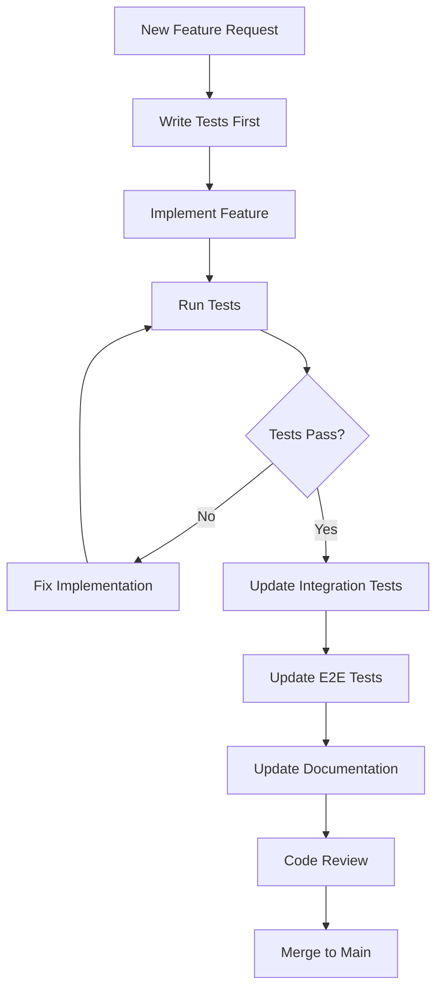

# Test Maintenance Procedures

## Overview

This document outlines the procedures for maintaining the GoalStreak testing suite to ensure it remains effective, efficient, and up-to-date as the application evolves. Regular maintenance prevents test debt and keeps the test suite reliable.

## Table of Contents

1. [Maintenance Schedule](#maintenance-schedule)
2. [Test Suite Health Monitoring](#test-suite-health-monitoring)
3. [Updating Tests with New Features](#updating-tests-with-new-features)
4. [Test Refactoring Procedures](#test-refactoring-procedures)
5. [Performance Monitoring](#performance-monitoring)
6. [Dependency Updates](#dependency-updates)
7. [Test Data Management](#test-data-management)
8. [Documentation Maintenance](#documentation-maintenance)

## Maintenance Schedule

### Daily Maintenance (Automated)

**CI/CD Pipeline Monitoring:**
- Monitor test execution times
- Track test failure rates
- Check coverage reports
- Verify security scans

**Automated Actions:**
```yaml
# .github/workflows/test-health-check.yml
name: Daily Test Health Check

on:
  schedule:
    - cron: '0 9 * * *'  # Daily at 9 AM UTC

jobs:
  test-health:
    runs-on: ubuntu-latest
    steps:
      - uses: actions/checkout@v3
      
      - name: Run Test Suite Health Check
        run: |
          npm run test:health-check
          npm run test:performance-benchmark
          npm run test:coverage-report
      
      - name: Generate Health Report
        run: |
          node scripts/generate-test-health-report.js
      
      - name: Notify Team if Issues
        if: failure()
        uses: ./.github/actions/notify-team
        with:
          message: "Test suite health check failed"
```

### Weekly Maintenance (Manual)

**Every Monday:**
1. **Review Test Metrics**
   - Analyze test execution times
   - Check for flaky tests
   - Review coverage trends
   - Identify slow-running tests

2. **Update Test Dependencies**
   - Check for testing library updates
   - Update mock data if needed
   - Refresh test fixtures

3. **Clean Up Test Data**
   - Remove obsolete test files
   - Update outdated test data
   - Clean up temporary test artifacts

### Monthly Maintenance (Comprehensive)

**First Monday of Each Month:**
1. **Comprehensive Test Review**
2. **Performance Optimization**
3. **Documentation Updates**
4. **Test Strategy Assessment**

### Quarterly Maintenance (Strategic)

**Every Quarter:**
1. **Test Architecture Review**
2. **Tool Evaluation**
3. **Training and Knowledge Sharing**
4. **Long-term Planning**

## Test Suite Health Monitoring

### Key Metrics to Track

```typescript
// scripts/test-health-metrics.ts
interface TestHealthMetrics {
  execution: {
    totalTests: number;
    passRate: number;
    averageExecutionTime: number;
    slowestTests: TestResult[];
    flakyTests: TestResult[];
  };
  coverage: {
    statements: number;
    branches: number;
    functions: number;
    lines: number;
    uncoveredFiles: string[];
  };
  maintenance: {
    lastUpdated: Date;
    outdatedTests: string[];
    duplicateTests: string[];
    unusedMocks: string[];
  };
}

export const generateHealthReport = async (): Promise<TestHealthMetrics> => {
  const testResults = await runTestSuite();
  const coverageReport = await generateCoverageReport();
  const maintenanceInfo = await analyzeTestMaintenance();

  return {
    execution: analyzeTestExecution(testResults),
    coverage: analyzeCoverage(coverageReport),
    maintenance: analyzeMaintenanceNeeds(maintenanceInfo)
  };
};
```

### Health Check Script

```javascript
// scripts/test-health-check.js
const { execSync } = require('child_process');
const fs = require('fs');

class TestHealthChecker {
  constructor() {
    this.thresholds = {
      passRate: 95,
      coverage: 80,
      executionTime: 30000, // 30 seconds for unit tests
      flakyTestThreshold: 3 // failures in last 10 runs
    };
  }

  async runHealthCheck() {
    console.log('🔍 Running test suite health check...');
    
    const results = {
      passRate: await this.checkPassRate(),
      coverage: await this.checkCoverage(),
      performance: await this.checkPerformance(),
      flakiness: await this.checkFlakiness(),
      maintenance: await this.checkMaintenance()
    };

    this.generateReport(results);
    return results;
  }

  async checkPassRate() {
    try {
      execSync('npm test -- --passWithNoTests', { stdio: 'pipe' });
      return { status: 'pass', rate: 100 };
    } catch (error) {
      const output = error.stdout.toString();
      const passRate = this.extractPassRate(output);
      return { 
        status: passRate >= this.thresholds.passRate ? 'pass' : 'fail',
        rate: passRate 
      };
    }
  }

  async checkCoverage() {
    const coverageReport = JSON.parse(
      fs.readFileSync('coverage/coverage-summary.json', 'utf8')
    );
    
    const totalCoverage = coverageReport.total;
    const issues = [];

    Object.entries(totalCoverage).forEach(([metric, data]) => {
      if (data.pct < this.thresholds.coverage) {
        issues.push(`${metric}: ${data.pct}% (threshold: ${this.thresholds.coverage}%)`);
      }
    });

    return {
      status: issues.length === 0 ? 'pass' : 'fail',
      coverage: totalCoverage,
      issues
    };
  }

  async checkPerformance() {
    const startTime = Date.now();
    
    try {
      execSync('npm run test:unit', { stdio: 'pipe' });
      const executionTime = Date.now() - startTime;
      
      return {
        status: executionTime <= this.thresholds.executionTime ? 'pass' : 'fail',
        executionTime,
        threshold: this.thresholds.executionTime
      };
    } catch (error) {
      return {
        status: 'fail',
        error: 'Tests failed to execute'
      };
    }
  }

  generateReport(results) {
    const report = {
      timestamp: new Date().toISOString(),
      status: this.getOverallStatus(results),
      results,
      recommendations: this.generateRecommendations(results)
    };

    fs.writeFileSync(
      'test-health-report.json',
      JSON.stringify(report, null, 2)
    );

    console.log('📊 Test Health Report Generated');
    console.log(`Overall Status: ${report.status}`);
    
    if (report.recommendations.length > 0) {
      console.log('\n🔧 Recommendations:');
      report.recommendations.forEach(rec => console.log(`- ${rec}`));
    }
  }
}

// Run health check
new TestHealthChecker().runHealthCheck();
```

## Updating Tests with New Features

### Feature Development Workflow



### Test Update Checklist

When adding new features, ensure:

**Unit Tests:**
- [ ] New functions have corresponding unit tests
- [ ] Edge cases are covered
- [ ] Error scenarios are tested
- [ ] Mock dependencies are updated

**Integration Tests:**
- [ ] Service interactions are tested
- [ ] Database operations are verified
- [ ] API endpoints are tested
- [ ] Firebase security rules are updated

**Component Tests:**
- [ ] New components have render tests
- [ ] User interactions are tested
- [ ] State management is verified
- [ ] Accessibility is tested

**E2E Tests:**
- [ ] Critical user paths are updated
- [ ] New workflows are tested
- [ ] Cross-platform compatibility is verified

### Automated Test Generation

```typescript
// scripts/generate-test-template.ts
interface FeatureConfig {
  name: string;
  type: 'component' | 'service' | 'hook' | 'util';
  dependencies: string[];
  hasAsync: boolean;
  hasState: boolean;
}

export const generateTestTemplate = (config: FeatureConfig): string => {
  const templates = {
    component: generateComponentTestTemplate,
    service: generateServiceTestTemplate,
    hook: generateHookTestTemplate,
    util: generateUtilTestTemplate
  };

  return templates[config.type](config);
};

const generateComponentTestTemplate = (config: FeatureConfig): string => `
import React from 'react';
import { render, fireEvent } from '../utils/testUtils';
import ${config.name} from '../../components/${config.name}';
import { createMock${config.name}Props } from '../factories/${config.name.toLowerCase()}Factory';

describe('${config.name}', () => {
  const defaultProps = createMock${config.name}Props();

  beforeEach(() => {
    jest.clearAllMocks();
  });

  describe('Rendering', () => {
    it('should render with default props', () => {
      const { getByTestId } = render(<${config.name} {...defaultProps} />);
      expect(getByTestId('${config.name.toLowerCase()}')).toBeTruthy();
    });
  });

  ${config.hasState ? `
  describe('State Management', () => {
    it('should handle state updates', () => {
      // TODO: Add state management tests
    });
  });
  ` : ''}

  describe('User Interactions', () => {
    it('should handle user interactions', () => {
      // TODO: Add interaction tests
    });
  });

  describe('Error Handling', () => {
    it('should handle error states', () => {
      // TODO: Add error handling tests
    });
  });
});
`;

// Usage
const componentConfig: FeatureConfig = {
  name: 'HabitStreakCard',
  type: 'component',
  dependencies: ['habitService', 'streakService'],
  hasAsync: true,
  hasState: true
};

const testTemplate = generateTestTemplate(componentConfig);
```

## Test Refactoring Procedures

### When to Refactor Tests

**Triggers for Test Refactoring:**
1. **Code Changes**: When implementation changes significantly
2. **Performance Issues**: When tests become slow or flaky
3. **Maintenance Burden**: When tests are hard to understand or maintain
4. **Duplication**: When similar test patterns are repeated
5. **Coverage Gaps**: When coverage drops below thresholds

### Refactoring Process

```typescript
// Example: Refactoring duplicate test setup
// Before - Duplicated setup in multiple test files
describe('HabitService', () => {
  let habitService: HabitService;
  let mockFirestore: jest.Mocked<FirestoreService>;

  beforeEach(() => {
    mockFirestore = {
      collection: jest.fn(() => ({
        doc: jest.fn(() => ({
          set: jest.fn(),
          get: jest.fn(),
          // ... many more mocks
        }))
      }))
    };
    habitService = new HabitService(mockFirestore);
  });
  // ... tests
});

// After - Extracted to reusable utility
// src/__tests__/utils/serviceTestUtils.ts
export const createHabitServiceTestSetup = () => {
  const mockFirestore = createMockFirestore();
  const habitService = new HabitService(mockFirestore);
  
  return { habitService, mockFirestore };
};

// Updated test file
describe('HabitService', () => {
  let habitService: HabitService;
  let mockFirestore: jest.Mocked<FirestoreService>;

  beforeEach(() => {
    ({ habitService, mockFirestore } = createHabitServiceTestSetup());
  });
  // ... tests
});
```

### Refactoring Checklist

**Before Refactoring:**
- [ ] Identify the refactoring goal
- [ ] Ensure all tests are passing
- [ ] Document current test behavior
- [ ] Plan the refactoring approach

**During Refactoring:**
- [ ] Make small, incremental changes
- [ ] Run tests after each change
- [ ] Maintain test coverage
- [ ] Update related documentation

**After Refactoring:**
- [ ] Verify all tests still pass
- [ ] Check performance improvements
- [ ] Update team on changes
- [ ] Document new patterns

## Performance Monitoring

### Performance Benchmarks

```typescript
// scripts/performance-benchmarks.ts
interface PerformanceBenchmark {
  testSuite: string;
  maxExecutionTime: number;
  maxMemoryUsage: number;
  flakinessThreshold: number;
}

const benchmarks: PerformanceBenchmark[] = [
  {
    testSuite: 'unit',
    maxExecutionTime: 30000, // 30 seconds
    maxMemoryUsage: 512, // 512 MB
    flakinessThreshold: 2 // Max 2% flaky tests
  },
  {
    testSuite: 'integration',
    maxExecutionTime: 120000, // 2 minutes
    maxMemoryUsage: 1024, // 1 GB
    flakinessThreshold: 5 // Max 5% flaky tests
  },
  {
    testSuite: 'e2e',
    maxExecutionTime: 300000, // 5 minutes
    maxMemoryUsage: 2048, // 2 GB
    flakinessThreshold: 10 // Max 10% flaky tests
  }
];

export const runPerformanceBenchmarks = async () => {
  const results = [];

  for (const benchmark of benchmarks) {
    console.log(`Running ${benchmark.testSuite} performance benchmark...`);
    
    const startTime = Date.now();
    const startMemory = process.memoryUsage().heapUsed;

    try {
      await runTestSuite(benchmark.testSuite);
      
      const executionTime = Date.now() - startTime;
      const memoryUsed = process.memoryUsage().heapUsed - startMemory;
      
      const result = {
        testSuite: benchmark.testSuite,
        executionTime,
        memoryUsed: memoryUsed / 1024 / 1024, // Convert to MB
        passed: executionTime <= benchmark.maxExecutionTime &&
                memoryUsed <= benchmark.maxMemoryUsage * 1024 * 1024
      };
      
      results.push(result);
      
      if (!result.passed) {
        console.warn(`⚠️  ${benchmark.testSuite} benchmark failed:`);
        console.warn(`   Execution time: ${executionTime}ms (max: ${benchmark.maxExecutionTime}ms)`);
        console.warn(`   Memory used: ${result.memoryUsed}MB (max: ${benchmark.maxMemoryUsage}MB)`);
      }
      
    } catch (error) {
      console.error(`❌ ${benchmark.testSuite} benchmark failed:`, error.message);
      results.push({
        testSuite: benchmark.testSuite,
        error: error.message,
        passed: false
      });
    }
  }

  return results;
};
```

### Performance Optimization

```typescript
// scripts/optimize-test-performance.ts
export class TestPerformanceOptimizer {
  async analyzeSlowTests() {
    const testResults = await this.runTestsWithProfiling();
    const slowTests = testResults
      .filter(test => test.duration > 1000) // Tests taking > 1 second
      .sort((a, b) => b.duration - a.duration);

    return slowTests.map(test => ({
      name: test.name,
      duration: test.duration,
      suggestions: this.generateOptimizationSuggestions(test)
    }));
  }

  generateOptimizationSuggestions(test: TestResult): string[] {
    const suggestions = [];

    if (test.hasAsyncOperations) {
      suggestions.push('Consider mocking async operations');
    }

    if (test.hasLargeDataSets) {
      suggestions.push('Reduce test data size or use pagination');
    }

    if (test.hasExpensiveSetup) {
      suggestions.push('Move expensive setup to beforeAll');
    }

    if (test.hasUnmockedDependencies) {
      suggestions.push('Mock external dependencies');
    }

    return suggestions;
  }

  async optimizeTestSuite() {
    const slowTests = await this.analyzeSlowTests();
    
    console.log('🐌 Slow tests found:');
    slowTests.forEach(test => {
      console.log(`  ${test.name}: ${test.duration}ms`);
      test.suggestions.forEach(suggestion => {
        console.log(`    - ${suggestion}`);
      });
    });

    // Generate optimization report
    const report = {
      timestamp: new Date().toISOString(),
      slowTests,
      recommendations: this.generateGlobalRecommendations(slowTests)
    };

    fs.writeFileSync('test-performance-report.json', JSON.stringify(report, null, 2));
  }
}
```

## Dependency Updates

### Testing Library Updates

```bash
#!/bin/bash
# scripts/update-test-dependencies.sh

echo "🔄 Updating test dependencies..."

# Update Jest and related packages
npm update jest @types/jest jest-environment-node

# Update React Native Testing Library
npm update @testing-library/react-native @testing-library/jest-native

# Update Detox
npm update detox

# Update Firebase testing tools
npm update @firebase/rules-unit-testing firebase-functions-test

# Update security testing tools
npm update eslint-plugin-security

echo "✅ Test dependencies updated"

# Run tests to ensure compatibility
echo "🧪 Running tests to verify compatibility..."
npm test

if [ $? -eq 0 ]; then
  echo "✅ All tests pass with updated dependencies"
else
  echo "❌ Tests failed with updated dependencies"
  echo "Please review and fix any compatibility issues"
  exit 1
fi
```

### Compatibility Testing

```typescript
// scripts/test-compatibility.ts
export const testCompatibility = async () => {
  const compatibilityTests = [
    {
      name: 'Jest Configuration',
      test: () => verifyJestConfig()
    },
    {
      name: 'React Native Testing Library',
      test: () => verifyRNTLCompatibility()
    },
    {
      name: 'Detox Configuration',
      test: () => verifyDetoxConfig()
    },
    {
      name: 'Firebase Emulators',
      test: () => verifyFirebaseEmulators()
    },
    {
      name: 'Mock Compatibility',
      test: () => verifyMockCompatibility()
    }
  ];

  const results = [];

  for (const compatTest of compatibilityTests) {
    try {
      await compatTest.test();
      results.push({ name: compatTest.name, status: 'pass' });
    } catch (error) {
      results.push({ 
        name: compatTest.name, 
        status: 'fail', 
        error: error.message 
      });
    }
  }

  return results;
};
```

## Test Data Management

### Test Data Lifecycle

```typescript
// scripts/manage-test-data.ts
export class TestDataManager {
  async cleanupTestData() {
    console.log('🧹 Cleaning up test data...');

    // Remove old test artifacts
    await this.removeOldTestArtifacts();
    
    // Clean up test databases
    await this.cleanupTestDatabases();
    
    // Remove temporary files
    await this.removeTemporaryFiles();
    
    // Update test fixtures
    await this.updateTestFixtures();
  }

  async removeOldTestArtifacts() {
    const artifactDirs = [
      'coverage',
      'test-results',
      'e2e/artifacts',
      'e2e/reports'
    ];

    for (const dir of artifactDirs) {
      if (fs.existsSync(dir)) {
        const files = fs.readdirSync(dir);
        const oldFiles = files.filter(file => {
          const stats = fs.statSync(path.join(dir, file));
          const daysSinceModified = (Date.now() - stats.mtime.getTime()) / (1000 * 60 * 60 * 24);
          return daysSinceModified > 7; // Remove files older than 7 days
        });

        oldFiles.forEach(file => {
          fs.unlinkSync(path.join(dir, file));
        });

        console.log(`Removed ${oldFiles.length} old files from ${dir}`);
      }
    }
  }

  async updateTestFixtures() {
    const fixtureFiles = [
      'src/__tests__/fixtures/users.json',
      'src/__tests__/fixtures/habits.json',
      'src/__tests__/fixtures/completions.json'
    ];

    for (const fixture of fixtureFiles) {
      if (fs.existsSync(fixture)) {
        const data = JSON.parse(fs.readFileSync(fixture, 'utf8'));
        
        // Update timestamps to current date
        const updatedData = this.updateTimestamps(data);
        
        fs.writeFileSync(fixture, JSON.stringify(updatedData, null, 2));
        console.log(`Updated fixture: ${fixture}`);
      }
    }
  }

  updateTimestamps(data: any): any {
    if (Array.isArray(data)) {
      return data.map(item => this.updateTimestamps(item));
    }

    if (typeof data === 'object' && data !== null) {
      const updated = { ...data };
      
      // Update common timestamp fields
      if (updated.createdAt) {
        updated.createdAt = new Date().toISOString();
      }
      if (updated.updatedAt) {
        updated.updatedAt = new Date().toISOString();
      }
      if (updated.completedAt) {
        updated.completedAt = new Date().toISOString();
      }

      // Recursively update nested objects
      Object.keys(updated).forEach(key => {
        if (typeof updated[key] === 'object') {
          updated[key] = this.updateTimestamps(updated[key]);
        }
      });

      return updated;
    }

    return data;
  }
}
```

## Documentation Maintenance

### Documentation Update Schedule

**Weekly:**
- Update test metrics in README
- Review and update troubleshooting guides
- Update performance benchmarks

**Monthly:**
- Review and update testing patterns
- Update contribution guidelines
- Review and update examples

**Quarterly:**
- Comprehensive documentation review
- Update testing strategy
- Review and update best practices

### Automated Documentation Updates

```typescript
// scripts/update-test-docs.ts
export class TestDocumentationUpdater {
  async updateTestMetrics() {
    const metrics = await this.generateCurrentMetrics();
    
    // Update README with current metrics
    const readmePath = 'src/__tests__/README.md';
    let readmeContent = fs.readFileSync(readmePath, 'utf8');
    
    // Replace metrics section
    const metricsSection = this.generateMetricsSection(metrics);
    readmeContent = readmeContent.replace(
      /<!-- METRICS_START -->[\s\S]*<!-- METRICS_END -->/,
      `<!-- METRICS_START -->\n${metricsSection}\n<!-- METRICS_END -->`
    );
    
    fs.writeFileSync(readmePath, readmeContent);
  }

  generateMetricsSection(metrics: TestMetrics): string {
    return `
## Current Test Metrics

- **Total Tests**: ${metrics.totalTests}
- **Pass Rate**: ${metrics.passRate}%
- **Coverage**: ${metrics.coverage.statements}%
- **Average Execution Time**: ${metrics.averageExecutionTime}ms
- **Last Updated**: ${new Date().toISOString()}

### Coverage by Category
- **Statements**: ${metrics.coverage.statements}%
- **Branches**: ${metrics.coverage.branches}%
- **Functions**: ${metrics.coverage.functions}%
- **Lines**: ${metrics.coverage.lines}%
    `;
  }

  async updateExamples() {
    // Update code examples in documentation
    const docFiles = [
      'docs/TESTING_GUIDE.md',
      'docs/TESTING_PATTERNS.md',
      'docs/TESTING_CONTRIBUTION_GUIDELINES.md'
    ];

    for (const docFile of docFiles) {
      await this.updateCodeExamples(docFile);
    }
  }

  async updateCodeExamples(filePath: string) {
    let content = fs.readFileSync(filePath, 'utf8');
    
    // Find and update code examples
    const codeBlocks = content.match(/```typescript[\s\S]*?```/g) || [];
    
    for (const block of codeBlocks) {
      const updatedBlock = await this.validateAndUpdateCodeBlock(block);
      content = content.replace(block, updatedBlock);
    }
    
    fs.writeFileSync(filePath, content);
  }
}
```

## Maintenance Automation

### Automated Maintenance Tasks

```yaml
# .github/workflows/test-maintenance.yml
name: Test Maintenance

on:
  schedule:
    # Weekly maintenance on Mondays at 9 AM UTC
    - cron: '0 9 * * 1'
  workflow_dispatch: # Allow manual trigger

jobs:
  maintenance:
    runs-on: ubuntu-latest
    steps:
      - uses: actions/checkout@v3
      
      - name: Setup Node.js
        uses: actions/setup-node@v3
        with:
          node-version: '18'
          cache: 'npm'
      
      - name: Install dependencies
        run: npm ci
      
      - name: Run test health check
        run: npm run test:health-check
      
      - name: Clean up test data
        run: npm run test:cleanup
      
      - name: Update test documentation
        run: npm run test:update-docs
      
      - name: Generate maintenance report
        run: npm run test:maintenance-report
      
      - name: Create PR if changes needed
        uses: peter-evans/create-pull-request@v5
        with:
          token: ${{ secrets.GITHUB_TOKEN }}
          commit-message: 'chore: automated test maintenance'
          title: 'Automated Test Maintenance'
          body: |
            This PR contains automated test maintenance updates:
            
            - Updated test documentation
            - Cleaned up test data
            - Performance optimizations
            - Dependency updates
            
            Please review the changes before merging.
          branch: automated-test-maintenance
```

### Maintenance Scripts

```json
{
  "scripts": {
    "test:health-check": "node scripts/test-health-check.js",
    "test:cleanup": "node scripts/cleanup-test-data.js",
    "test:update-docs": "node scripts/update-test-docs.js",
    "test:maintenance-report": "node scripts/generate-maintenance-report.js",
    "test:performance-benchmark": "node scripts/performance-benchmarks.js",
    "test:optimize": "node scripts/optimize-test-performance.js"
  }
}
```

This comprehensive test maintenance procedure ensures that the GoalStreak testing suite remains healthy, efficient, and effective as the application continues to evolve. Regular maintenance prevents technical debt and keeps the development team productive.